# Architecture

> Deep technical documentation of every subsystem in the Distributed Task Platform.

---

## System Overview

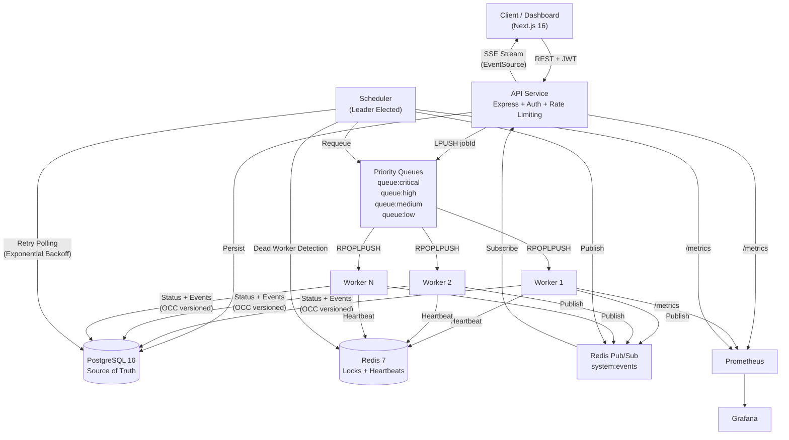

---

## 1. Priority Queue Architecture

The platform uses **4 separate Redis lists** instead of a single FIFO queue. Workers check queues in strict priority order.

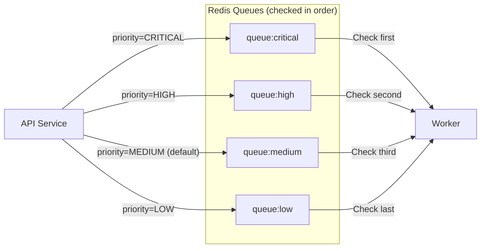

---

## 2. Worker Recovery Architecture

This is the most complex subsystem. It handles the scenario where a worker dies mid-execution.

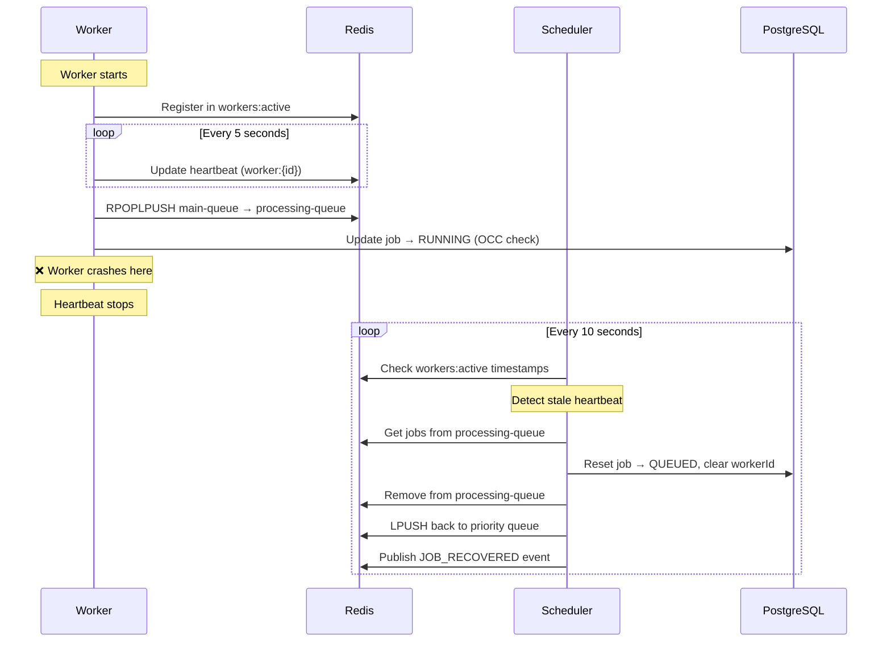

---

## 3. Operations Lab & Lab Service

The platform includes a dedicated testing harness to visually demonstrate resilience. This avoids exposing dangerous orchestration commands inside the main API.

### Lab Architecture

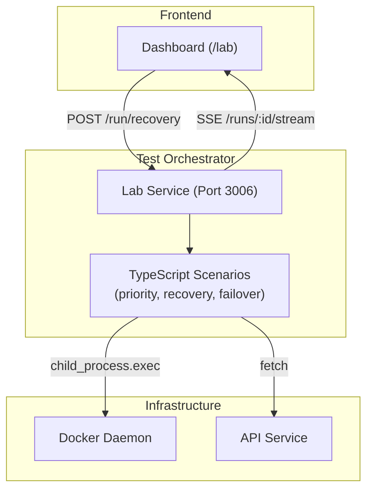

### LabRun Execution Tracking

The `lab-service` maintains execution state for testing scenarios.

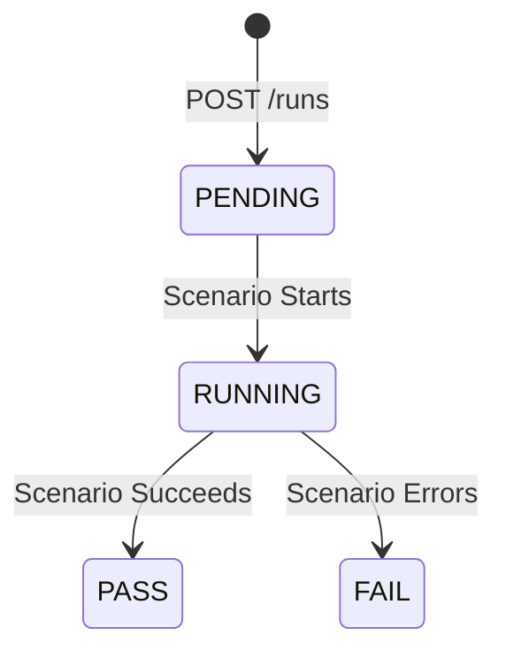

### Real-Time Run Streaming

When the dashboard initiates a scenario, it connects to an SSE stream on the `lab-service` (`GET /runs/:id/stream`). The TypeScript Scenario Engine yields string execution logs and progress updates which are piped directly into an embedded terminal UI within the dashboard.

---

## 4. Optimistic Concurrency Control

Prevents zombie workers from corrupting state after recovery.

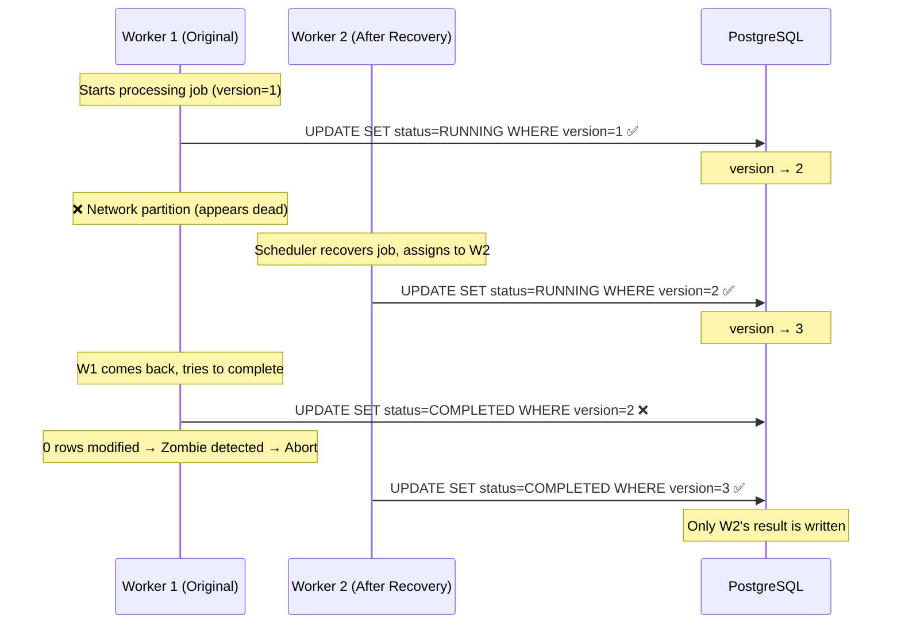

---

## 5. Leader Election

Only one scheduler instance coordinates the cluster at any time.

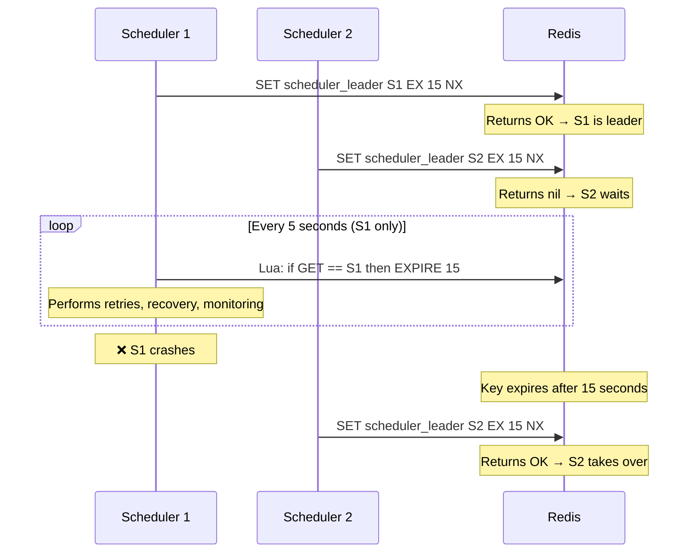

---

## 6. Real-Time Telemetry (SSE)

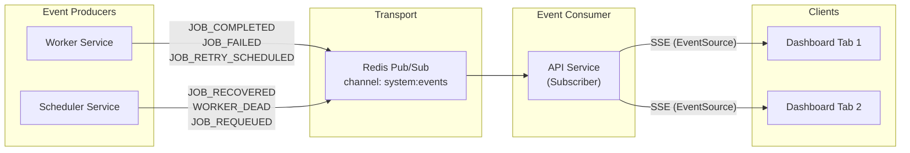

---

## 7. Job State Machine

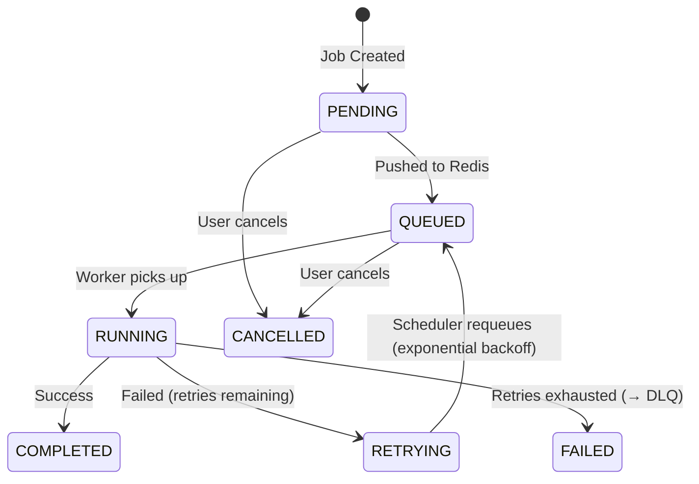

---

## 8. Multi-Tenant Isolation

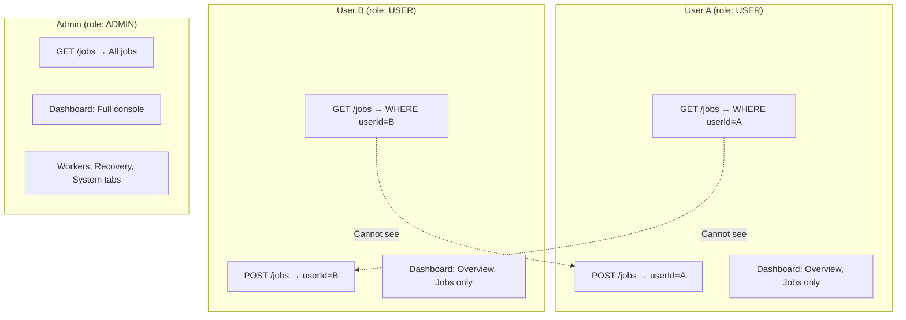

---

## 9. CI/CD Pipeline

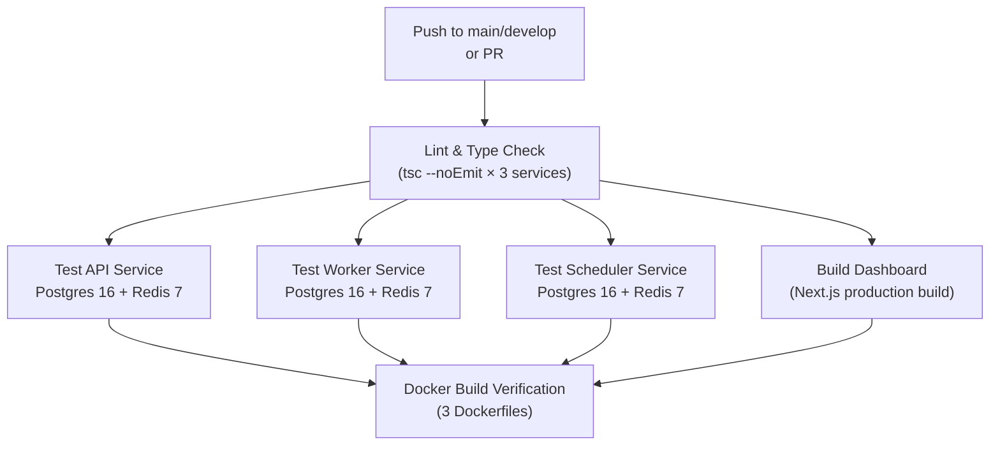
