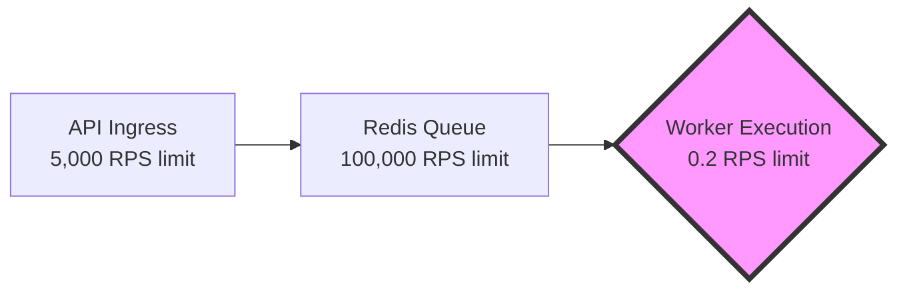
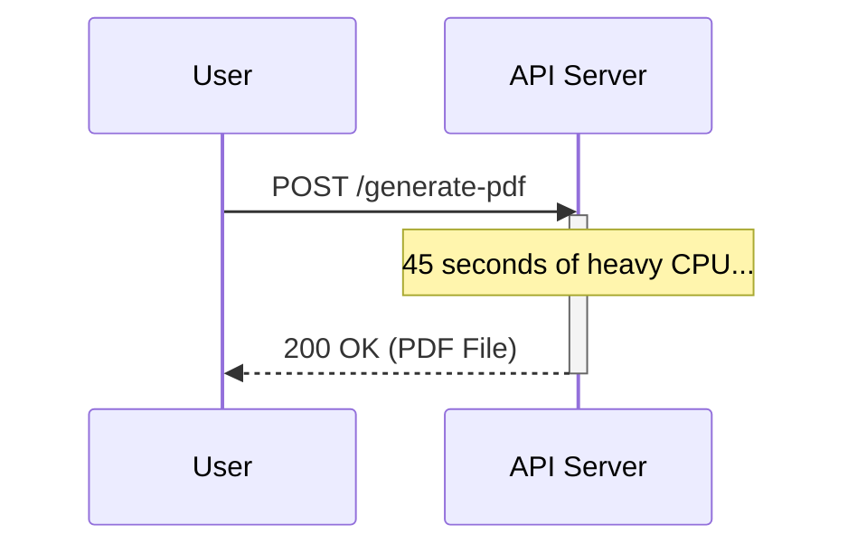
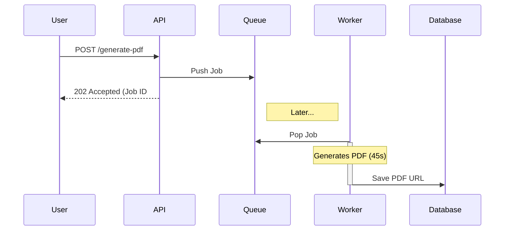
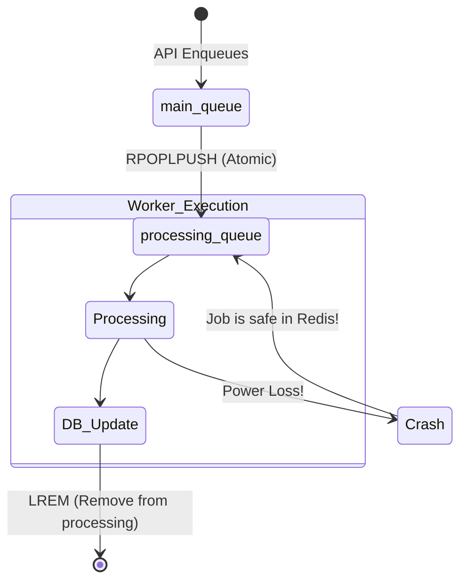
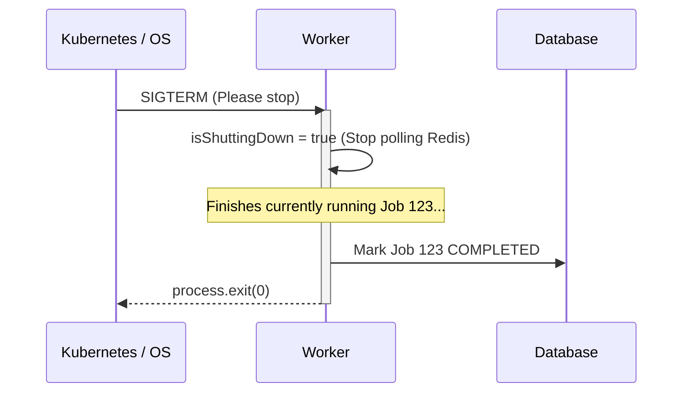
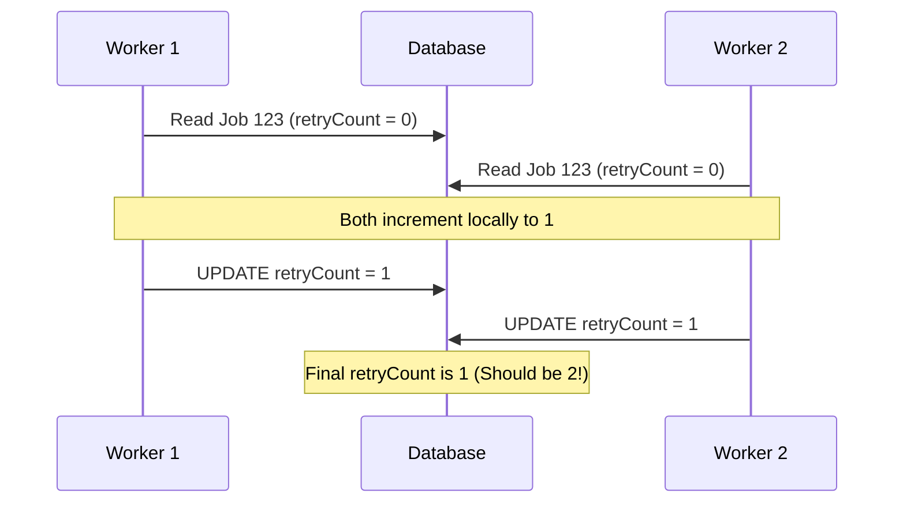
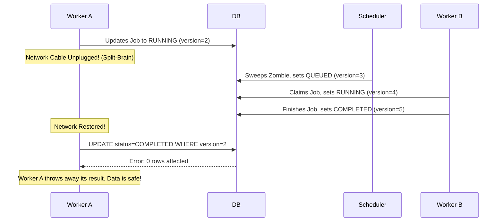
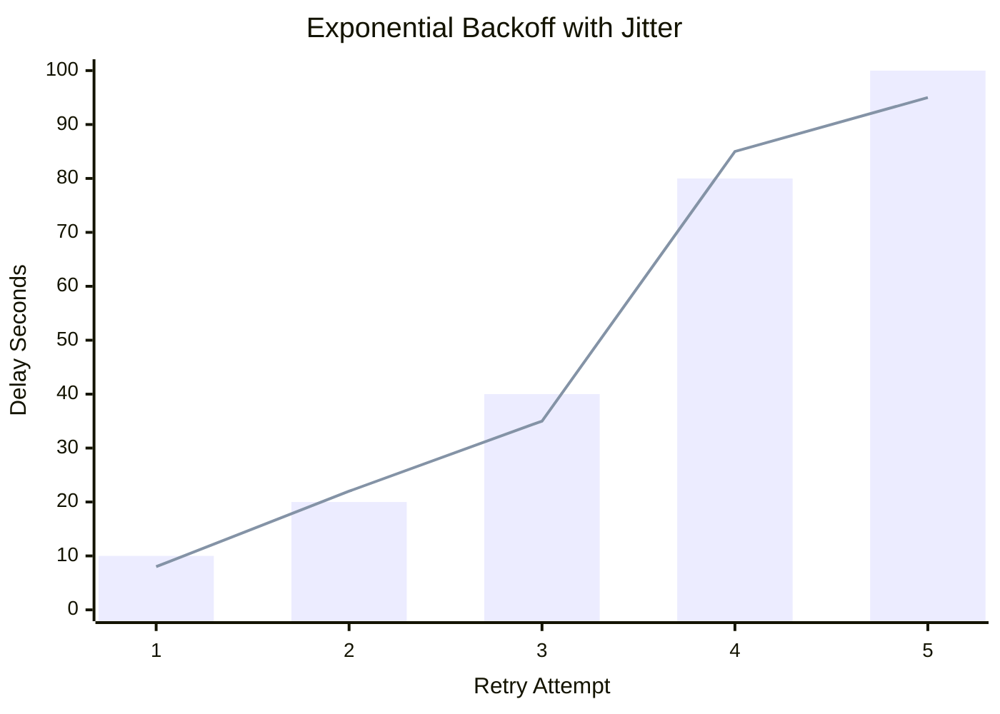
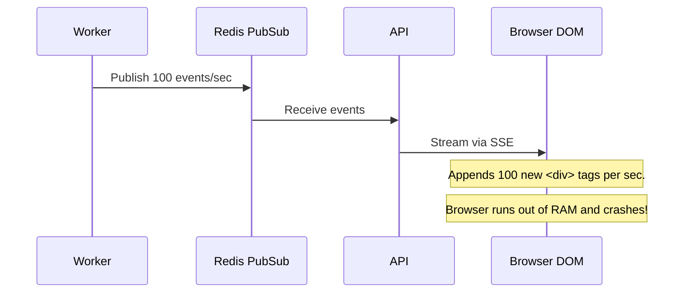
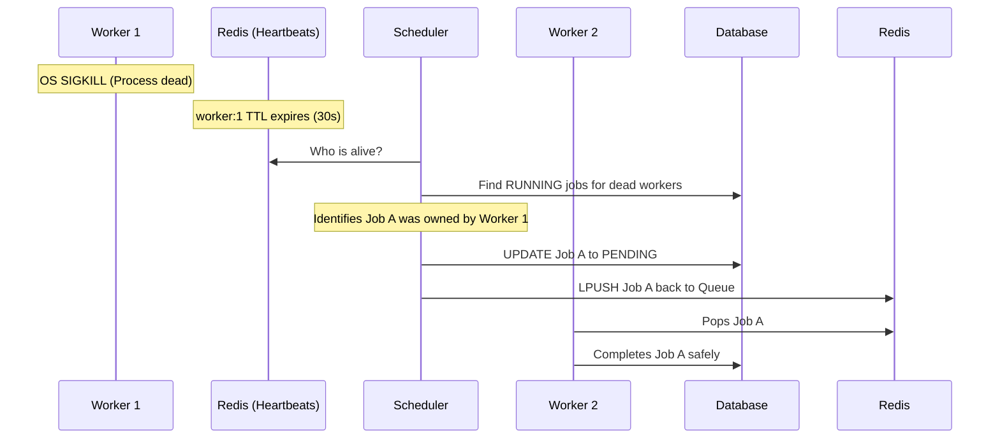

# The Definitive Guide to Distributed Systems

*A practical textbook built from first principles, analyzing the architecture of a custom Distributed Task Platform.*

---

# Chapter 0: Foundations of Distributed Computing

Software engineering is fundamentally about managing complexity. In the beginning, we managed complexity by putting all our code into a single executable and running it on a single server. But as the internet grew, single servers could no longer hold the weight of global traffic. We were forced to split our code across multiple machines, connecting them with network cables. 

By doing so, we solved the problem of scale, but we introduced a nightmare of new complexities. Welcome to Distributed Systems.

---

## 1. The Monolith vs. Distributed Architecture

### The Monolith
A monolithic application is a single, unified unit. The User Interface, Business Logic, and Database connections are compiled into one codebase and deployed to one server.

**Mental Model: The Solo Chef**
> Think of a food truck. There is one chef. They take the order, cook the burger, plate the fries, and hand it to the customer. Communication is instant (it happens entirely inside the chef's brain). If the chef gets sick, the entire food truck shuts down.

### The Distributed System
A distributed system splits the application into independent services that communicate over a network. 

**Mental Model: The Commercial Kitchen**
> Think of a massive Michelin-star restaurant. You have a Hostess (API Gateway), a Sous-Chef for meat (Service A), a Pastry Chef for desserts (Service B), and Expeditors running food between them (Message Broker). If the Pastry Chef calls in sick, you can't serve dessert, but the restaurant stays open and can still serve steak. 

### Architecture Evolution Timeline
How did we arrive at modern distributed systems?
- **1990s (The Monolith):** C++ and Java executables running on massive mainframe servers. 
- **2000s (Service-Oriented Architecture - SOA):** Large XML-based web services communicating over enterprise service buses (ESB). Heavy, rigid, and slow.
- **2010s (Microservices):** Lightweight JSON/REST APIs communicating over HTTP, popularized by Netflix and AWS. Docker containers made deploying 100 small services feasible.
- **2020s (Serverless & Event-Driven):** AWS Lambda and Kafka. Code only runs when an event triggers it. Servers are abstracted away completely.

---

## 2. Why Choose a Distributed System?

If distributed systems are so complex, why do companies use them?

1. **Scalability:** You can scale individual bottlenecks. If the Pastry Chef is overwhelmed, you hire a second Pastry Chef. You don't need to hire a second Hostess.
2. **Availability:** Single Points of Failure (SPOF) are eliminated. If one server crashes, the load balancer routes traffic to a healthy server.
3. **Development Velocity:** In a 2,000-person engineering org, having everyone commit code to the same Monolith causes merge conflicts and deployment gridlock. Distributed systems allow 50 different teams to deploy 50 different services independently.

---

## 3. The Fallacies of Distributed Computing

When transitioning from Monoliths to Distributed Systems, engineers often make catastrophic assumptions because they are used to code executing locally in RAM. In 1994, L. Peter Deutsch outlined the 8 Fallacies of Distributed Computing. The top three are:

1. **The network is reliable:** (It isn't. Cables get cut, routers restart, AWS US-East-1 goes down).
2. **Latency is zero:** (It isn't. A local function call takes nanoseconds. A network call takes milliseconds—a 1,000,000x increase in time).
3. **Bandwidth is infinite:** (It isn't. Sending a 5GB file over a REST API will crash the connection).

---

## 4. The CAP Theorem

In 2000, Eric Brewer formulated the CAP Theorem. It states that in a distributed data store, you can only guarantee **two out of three** of the following properties simultaneously:

- **Consistency (C):** Every read receives the most recent write. (If I update my password, my next login immediately uses the new password).
- **Availability (A):** Every request receives a non-error response. (The system never goes down).
- **Partition Tolerance (P):** The system continues to operate despite network failures dropping messages between nodes.

### The Reality of CAP
Because networks *will* fail (Partition Tolerance is mandatory), you must actually choose between **CP** (Consistency) and **AP** (Availability).
- **CP Systems (Banking):** If the network fails, the ATM refuses to give you money (sacrificing Availability) to guarantee you can't overdraft your account (Consistency).
- **AP Systems (Twitter):** If the network fails, Twitter will still let you load your timeline (Availability), but you might not see a tweet that was posted 5 seconds ago (sacrificing Consistency).

---

## 5. 📍 Our Project: The Distributed Task Platform

How does this textbook's project map to these concepts?
Our Distributed Task Platform is an **AP System**. 
If a user submits a job, we guarantee the API will accept it (High Availability). However, if the Redis queue temporarily disconnects from the Worker, the user's dashboard might incorrectly say "PENDING" for a few seconds longer than reality (Eventual Consistency). We chose to keep the API online rather than freezing the entire system when internal network partitions occur.

---

## Interview & Design Discussion

**Interview Question:** *"We are building a startup that processes 500 orders a day. Should we use a microservices architecture?"*

**Expected Discussion:**
- **Weak Answer:** "Yes, microservices are modern and let us scale to millions of users like Netflix."
- **Strong Answer:** "Absolutely not. At 500 orders a day, the operational overhead of Kubernetes, distributed tracing, and managing network partitions will bankrupt the startup's engineering time. We should build a Majestic Monolith using PostgreSQL. We only split into microservices when team size or scaling bottlenecks force us to."

**Common Misconceptions:**
- *"Microservices make applications faster."* -> **False.** Microservices make applications *slower* due to network latency. They make *development teams* faster.

---

## Further Reading
- *Fallacies of Distributed Computing* by L. Peter Deutsch.
- *CAP Twelve Years Later: How the "Rules" Have Changed* by Eric Brewer.
- *Designing Data-Intensive Applications* by Martin Kleppmann (The holy grail of distributed systems books).


<div style="page-break-after: always;"></div>

# Chapter 1: System Design Process

Before writing a single line of code, senior engineers spend a significant amount of time planning. In distributed systems, mistakes made at the architectural level are astronomically more expensive to fix than bugs in business logic. You can easily refactor a badly written loop; you cannot easily refactor a fundamentally flawed database schema once production data is flowing through it.

This chapter breaks down *how senior engineers think*. We will walk through the industry-standard System Design Process and explore how we arrived at the initial architecture for our Distributed Task Platform.

---

## 1. Understanding Requirements

The first step in any system design is defining what the system must actually do, and perhaps more importantly, what it *doesn't* have to do. We divide these into Functional and Non-Functional requirements.

### Functional Requirements
These are the business use-cases. What are the explicit features the system must provide?
- *Example:* "Users must be able to upload a video."

**📍 Our Project's Functional Requirements:**
1. A client can submit a background job via an API.
2. The client can view the status of their jobs.
3. The platform must execute the jobs asynchronously.

### Non-Functional Requirements (NFRs)
These define the *quality* of the system. How fast, secure, and reliable must it be?
- *Example:* "The video must finish uploading in under 5 seconds."

**📍 Our Project's Non-Functional Requirements:**
1. **High Availability:** The API must remain available to accept jobs even if all worker nodes are currently down.
2. **Reliability:** No jobs can be lost if a worker node crashes mid-execution (At-least-once delivery).
3. **Real-time Observability:** State changes must reflect in the UI with sub-second latency.

---

## 2. Capacity Estimation (Back-of-the-Envelope Math)

Before choosing databases, engineers estimate the sheer volume of data the system will handle. 

### Scale Changes Everything
Let's analyze how capacity estimation dictates architecture at different scales.

**At 100 Users (The Prototype):**
- 100 jobs / day.
- Throughput: 0.001 Requests Per Second (RPS).
- *Decision:* A SQLite database on a single $5/month DigitalOcean droplet is perfectly fine.

**At 10,000 Users (Our Target Scale):**
- 100,000 jobs / day.
- Storage: 100,000 * 13 KB = 1.3 GB/day (~475 GB/year).
- Throughput: ~1.15 RPS.
- *Decision:* 1.15 RPS is incredibly low. A single Node.js process and a single PostgreSQL instance will easily handle this traffic for years. No distributed NoSQL database is required.

**At 100 Million Users (Uber Scale):**
- 1 Billion jobs / day.
- Throughput: ~11,500 RPS.
- *Decision:* A single Postgres database will catch fire. You are forced into Database Sharding, Apache Kafka, and NoSQL solutions like Cassandra. 

*Conclusion:* Senior engineers do not over-engineer. They build for their calculated capacity tier, plus 1 order of magnitude.

---

## Architecture Decision Record (ADR): The Primary Database

### Problem
We need a durable store for our Job State Machine (PENDING -> RUNNING -> COMPLETED).

### Options Considered
- **Option A: MongoDB (NoSQL):** Flexible schemas, massive horizontal scale.
- **Option B: Cassandra (NoSQL):** Insane write throughput, masterless architecture.
- **Option C: PostgreSQL (SQL):** Strict relational schemas, strong ACID compliance.

### Decision
We chose **PostgreSQL**.

### Why this decision?
Our capacity estimation proved we will only hit 1.15 RPS. We do not need NoSQL's infinite write scalability. Our core NFR is *Reliability*. Background task platforms are strict state machines. We desperately need ACID compliance and relational integrity to prevent jobs from disappearing or transitioning illegally. 

### Trade-offs
PostgreSQL is harder to scale horizontally if our traffic suddenly spikes by 10,000x compared to MongoDB.

### What would make us choose differently?
If we pivot to becoming an IoT telemetry platform processing 100,000 sensor pings per second, we would drop PostgreSQL immediately for Cassandra.

---

## 3. Bottleneck Identification

Every system has a bottleneck. The goal of system design isn't to eliminate bottlenecks entirely (which is impossible), but to move them to acceptable places.

**Mental Model: Traffic on a Highway**
> If a 5-lane highway merges into a 1-lane tunnel, the tunnel is the bottleneck. Adding 10 more lanes to the highway does nothing to increase throughput. You must widen the tunnel.

Where is the bottleneck in our task platform?



If a job takes 5 seconds to process, 1 Worker can only handle 0.2 RPS. 
If our API accepts jobs at 1.15 RPS, the queue will grow infinitely. The Worker is our tunnel.

**The Solution:** We must scale the Worker execution.
By identifying the bottleneck early, we designed the Worker Service to be completely stateless, allowing us to spin up as many as we need to widen the tunnel and match the API ingress rate.

---

## Interview & Design Discussion

**Interview Question:** *"How would you design a system to generate PDF reports for our enterprise clients?"*

**Expected Discussion:**
The interviewer does not want you to start coding. They are looking for the System Design Process:
1. **Clarify Requirements:** Ask, "How many reports per day? How large is the PDF?"
2. **Estimate Capacity:** Calculate the RPS and total TB of storage needed per year.
3. **Identify Bottlenecks:** State explicitly, "PDF generation is CPU-bound. The worker nodes will be the bottleneck."
4. **Propose Architecture:** Introduce a Queue to protect the API from the heavy worker nodes.

**Strong Answer:** "Before I draw the architecture, let's establish the capacity. If we expect 10,000 PDFs a day, we can use a single Postgres DB and an SQS queue. But I'll design the workers to be stateless so we can horizontally scale them when PDF rendering bottlenecks our CPU."

---

## Lessons Learned

*If I were designing this platform again...*
I would spend less time worrying about how to scale the database to a million users, and more time focusing on exactly what data the business needs to report on. Changing a database schema to add an index is easy; migrating terabytes of data because you fundamentally misunderstood the business access patterns is a nightmare.

---

## Summary

Senior engineering is not just about writing code; it is about justifying *why* the code exists. By walking through Functional Requirements, Capacity Estimation, Bottleneck Identification, and ADRs, we have built a solid, defensible rationale for our architecture.

Next, we will look at the core problem our system is built to solve: why APIs shouldn't do heavy lifting, and the critical differences between synchronous and asynchronous execution.


<div style="page-break-after: always;"></div>

# Chapter 2: The Core Problem & Execution Models

To understand why we built this Distributed Task Platform, we must understand the fundamental limitations of the web. The web is built on the HTTP protocol, which enforces a strict **Request/Response lifecycle**. 

A client (browser) opens a connection, sends a request to a server, and waits. The server computes the answer and sends a response back down the exact same connection. 

This model works flawlessly when the server is fetching a user's profile from a database (which takes 5 milliseconds). But what happens when the request is to "Generate a 100-page PDF report"?

---

## 1. Synchronous vs Asynchronous Execution

### The Synchronous Trap
If the server attempts to generate the PDF *during* the HTTP request, it is executing **synchronously**. 



During this 45-second block:
1. The user is staring at a loading spinner.
2. If the user switches from Wi-Fi to Cellular, the connection drops, and the 45 seconds of server compute is entirely wasted.
3. If 1,000 users ask for PDFs simultaneously, the web server (like Express or Tomcat) runs out of worker threads and crashes.

### The Asynchronous Escape
To solve this, we decouple the *request* from the *execution*.



Behind the scenes, a completely separate process (a Worker) picks up ticket #12345, spends 45 seconds generating the PDF, and saves the file to S3.

**Mental Model: Fast Food vs Fine Dining**
> Synchronous execution is fine dining. The waiter takes your order and stands next to your table until the chef finishes cooking your steak.
> Asynchronous execution is McDonald's. You order at the register, they hand you a receipt with Order #45, and you step aside. You wait for the screen to ping #45.

---

## Architecture Decision Record (ADR): Asynchronous Infrastructure

### Problem
How do we decouple the API from the PDF generation?

### Options Considered
- **Option A: Spawn a Thread:** The API spins up a background thread (`new Thread(() -> generatePDF())`) and returns 202 instantly.
- **Option B: Cron Jobs:** The API saves the request to the DB. A Cron job runs every 5 minutes, finds new DB records, and processes them.
- **Option C: Message Queue:** The API pushes to Redis. Dedicated workers listen to Redis.

### Decision
We chose **Option C (Message Queue)**.

### Why this decision?
Option A (Threads) destroys the API server if traffic spikes. Option B (Cron) introduces up to 5 minutes of latency, which is terrible UX. A Message Queue gives us instant execution (low latency) while keeping the heavy compute completely isolated from the API servers.

### Trade-offs
We now have to run, monitor, and maintain a highly available Redis cluster and a fleet of worker containers, significantly increasing DevOps complexity.

---

## 2. CPU-Bound vs I/O-Bound Work

When designing worker systems, you must know what kind of work you are processing.

### CPU-Bound Work
The task requires heavy mathematical computation. The CPU is maxed out at 100%. (e.g., Video encoding, Cryptography).
- *Scalability Limit:* If you have a 4-core server, you can only process exactly 4 CPU-bound tasks simultaneously. 

### I/O-Bound Work (Input/Output)
The task spends most of its time *waiting* for the network or disk. (e.g., API calls, DB queries).
- *Scalability Limit:* A single CPU core can easily juggle 100 simultaneous network requests by utilizing an asynchronous event loop.

---

## 3. Queue-Based Architectures

To bridge the gap between the fast API and the slow Workers, we introduce a **Message Queue**.

The Queue acts as a massive shock absorber. If the API receives 10,000 requests in one minute, it simply dumps 10,000 messages into the Queue. The API survives. The Workers then drain those messages at their own steady, sustainable pace. 

### Evolution Timeline of Background Tasks
How did the industry solve this over time?
1. **1990s (Crontab):** OS-level scheduled scripts sweeping a database.
2. **2000s (RabbitMQ/ActiveMQ):** Heavy enterprise message brokers using the AMQP protocol.
3. **2010s (Redis / Sidekiq / Celery):** Lightweight, in-memory queues became the standard for web apps.
4. **2020s (Kafka / Temporal):** Event streaming and durable workflow orchestrators for massive distributed state.

---

## Interview & Design Discussion

**Interview Question:** *"We need to send 50,000 emails at midnight. Should we use an asynchronous queue or just execute it synchronously in a loop?"*

**Expected Discussion:**
- **Weak Answer:** "Just loop through them asynchronously in Node.js, it's non-blocking."
- **Strong Answer:** "If the server crashes on email 25,000, we have no way to know which emails were sent. We must enqueue 50,000 individual jobs into a Message Queue. This gives us individual retryability, dead-lettering for bad email addresses, and prevents the API memory from blowing up."

---

## Summary

APIs must remain fast and highly available. By decoupling long-running execution into asynchronous background workers via a message queue, we protect our user-facing servers from CPU exhaustion and connection timeouts.

In the next chapter, we will dive deeply into Queue Architectures, delivery guarantees, and why we chose Redis over Postgres for this critical infrastructure.


<div style="page-break-after: always;"></div>

# Chapter 3: Queue Architecture

In Chapter 2, we established that a message queue is the shock absorber that decouples a fast API from a slow worker. But "Message Queue" is a broad term. Not all queues are created equal. 

In this chapter, we will dissect the theoretical guarantees a queue can offer, and the devastating bugs that occur when queues are implemented incorrectly.

---

## 1. Delivery Guarantees

When an API places a job in a queue, what guarantee does the API have that the worker will actually execute it? 

### At-Most-Once Delivery (Fire and Forget)
The message is delivered 0 or 1 times. It will *never* be delivered twice, but it might be lost entirely.

### At-Least-Once Delivery
The message is delivered 1, 2, or N times. It will *never* be lost, but it might be executed duplicates times. (This is what our platform uses).

### Common Misconception: "Exactly-Once Delivery"
**Myth:** "Kafka guarantees exactly-once delivery, so we don't have to worry about duplicates."
**Reality:** True Exactly-Once delivery over a network is mathematically impossible (The Two Generals' Problem). Systems that claim Exactly-Once actually provide *Effectively-Once* delivery by combining At-Least-Once delivery with **Idempotent Consumers**. You must *always* write your worker logic assuming it will receive the same message twice.

---

## Architecture Decision Record (ADR): The Queue Infrastructure

### Problem
We need a highly reliable broker to hold jobs between the API and the Workers.

### Options Considered
- **Option A: PostgreSQL:** Just use the database as a queue (`SELECT * FROM jobs WHERE status = 'PENDING'`).
- **Option B: RabbitMQ:** A traditional AMQP message broker.
- **Option C: Redis:** An in-memory data structure store.

### Decision
We chose **Option C (Redis)**.

### Why this decision?
PostgreSQL (Option A) is a terrible queue. Having 50 workers constantly polling `SELECT FOR UPDATE` on a single table causes massive row-lock contention and destroys the database CPU. RabbitMQ (Option B) is fantastic, but it is heavy and lacks native distributed locks (which we need for the Scheduler). Redis is lightning-fast, and its atomic list operations give us everything we need for both queuing and locking.

### Trade-offs
Redis holds data in RAM. If our queue grows to 100 million jobs, it will cost thousands of dollars in AWS ElastiCache memory. RabbitMQ pages to disk much more efficiently.

---

## 2. The Reliable Queue Pattern (RPOPLPUSH)

### The Naive Approach (`LPOP`)
A junior engineer might implement a Redis queue like this:
1. Worker pops job: `LPOP queue:main`
2. Worker processes job.

**What can go wrong?** If the worker process crashes (OOM, power failure) between step 1 and 2, the job is deleted from Redis, but it was never processed. This is *At-Most-Once Delivery*, resulting in catastrophic data loss.

### The Professional Approach (`RPOPLPUSH`)
To achieve At-Least-Once delivery, we use `RPOPLPUSH main-queue processing-queue`.

This command is **Atomic**. In one indivisible step, Redis pops the job and moves it to a safe list.



**The Magic:** If the worker crashes, the job *still exists* inside `processing-queue`. Our Scheduler Service can later scan `processing-queue` for stale jobs and push them back into `main-queue`.

---

## 3. Connection Starvation (The BRPOP Bug)

If we constantly ask Redis `RPOPLPUSH` and the queue is empty, we burn CPU cycles in an infinite `while(true)` loop.
To solve this, we use `BRPOPLPUSH` (Blocking). Redis puts the connection to sleep and wakes it up the exact millisecond a job arrives.

### What can go wrong? (A Real Bug)
Our workers send a "Heartbeat" to Redis every 5 seconds. However, they were using the exact same Redis connection that was Blocked by `BRPOPLPUSH`. 
Because the connection was asleep, the Heartbeat was never sent. The Scheduler assumed the worker was dead!

**The Fix:** We instantiated two separate Redis clients. `redisClient` handles heartbeats, while `redisBlockingClient` sits in the blocked state.

---

## Interview & Design Discussion

**Interview Question:** *"Why not use Kafka for a background job queue?"*

**Expected Discussion:**
- **Weak Answer:** "Kafka is too complicated to set up."
- **Strong Answer:** "Kafka is an append-only log, not a traditional queue. If a worker fails a job in Kafka, it cannot easily say 'put this specific message back in the queue with a 10-minute delay.' Kafka is built for high-throughput stream processing, whereas Redis/SQS is built for discrete task routing and selective retries. Using Kafka for a simple task queue is a major anti-pattern."

---

## Summary

By utilizing Redis's atomic `RPOPLPUSH` operations, we built a highly reliable queue that prevents data loss even when workers are violently terminated. In the next chapter, we will dive deep into the Worker Engine, exploring the Node.js event loop and how we achieve massive concurrency without CPU exhaustion.


<div style="page-break-after: always;"></div>

# Chapter 4: The Worker Engine

The queue exists merely to hold instructions. The worker is the engine that actually executes those instructions. Designing a worker engine requires a deep understanding of how the operating system handles CPU scheduling, memory, and concurrency.

---

## 1. Concurrency Models

How do modern frameworks handle 1,000 simultaneous tasks?

### Thread Pools (Java, C#, Python)
Traditional web servers use Thread Pools. When 100 requests arrive, the server grabs 100 threads from a pre-warmed pool.
- **Complexity Analysis:** Each thread consumes RAM (e.g., 1MB stack size). $O(N)$ space complexity per concurrent connection. 10,000 connections = 10GB RAM just for overhead. This is the famous **C10K Problem**.

### The Event Loop (Node.js)
Node.js solves the C10K problem using **Single-Threaded Asynchronous I/O**.
Node.js runs your JavaScript code on exactly one thread. If a task needs to make a database query (I/O), Node.js offloads it to the OS. The single thread immediately moves on to the next task. 

**Mental Model: Waiter vs Fast Food**
> A Thread Pool is having 100 waiters. A waiter takes your order, walks to the kitchen, and stands there staring at the chef until the food is done. 
> The Event Loop is having exactly 1 hyper-efficient cashier at McDonald's. They take your order, hand the ticket to the kitchen, and immediately take the next customer's order. When the kitchen finishes, they hand you the tray.

---

## Architecture Decision Record (ADR): Worker Concurrency Model

### Problem
How do we maximize the throughput of our Worker containers?

### Options Considered
- **Option A: Horizontal Scaling Only:** Run 1 job per container, scale to 50 containers.
- **Option B: Node.js Cluster Module:** Fork the Node process across multiple CPU cores.
- **Option C: Event Loop Concurrency:** Configure a single Node process to pull multiple jobs simultaneously using `Promise.all()`.

### Decision
We chose **Option C (Event Loop Concurrency) combined with Horizontal Scaling**.

### Why this decision?
Our jobs are purely I/O bound (calling APIs, writing to DB). The Node event loop is practically built for this. By setting `WORKER_CONCURRENCY = 10`, a single Node process seamlessly handles 10 jobs at once with near-zero memory overhead. 

---

## 2. CPU Context Switching (The Cost of Over-Scaling)

If `WORKER_CONCURRENCY=10` is fast, is `10,000` faster? No. It is catastrophically slower.

When multiple processes compete for a single CPU core, the OS must juggle them. It pauses Thread A, saves its memory state, loads Thread B's memory state, and runs Thread B. This is a **Context Switch**.

**Scale Changes Everything:**
- 10 Concurrent Jobs: Event loop manages network sockets perfectly.
- 10,000 Concurrent Jobs: The OS runs out of file descriptors (sockets) and spends 90% of its CPU time context-switching between TCP connections rather than executing business logic. 

---

## 3. Graceful Shutdown (SIGINT & SIGTERM)

What happens if a worker is halfway through a 10-minute job, and Kubernetes terminates the container to deploy a new version?

If the container dies instantly, the job is orphaned. Professional workers implement **Graceful Shutdown**.



By intercepting the OS signal, we allow in-flight jobs to safely finish, preventing the Scheduler from having to execute expensive Zombie Sweeps.

---

## Interview & Design Discussion

**Interview Question:** *"You wrote a Node.js worker that generates massive 1GB PDF files. In production, throughput is terrible. Why?"*

**Expected Discussion:**
- **Junior:** "We need more memory, upgrade the AWS instance."
- **Senior/Principal:** "PDF generation is heavily CPU-bound. Node.js is single-threaded. When the PDF library runs, it blocks the Event Loop completely. No other jobs can be processed, and heartbeats can't be sent. For CPU-bound tasks, we cannot use Node's async concurrency. We must use worker threads, or better yet, rewrite the PDF worker in a multi-threaded language like Go or Rust, and scale it horizontally (1 job per CPU core)."

---

## Summary

The Worker Engine is the heart of throughput. By utilizing the Node.js Event Loop, we achieved massive I/O concurrency. However, all this concurrent execution introduces a terrifying new problem: what happens when two workers try to update the exact same database row at the exact same time? 

In Chapter 5, we will establish our source of truth: Database & State Management.


<div style="page-break-after: always;"></div>

# Chapter 5: Database & State Management

In a distributed system, servers are ephemeral. Worker nodes crash, Redis instances restart, and network connections drop. The only thing that truly matters is the **Source of Truth**—the system that reliably remembers what actually happened.

---

## 1. Why Do We Need a Database?

If we already have Redis acting as our queue, why do we need a separate database?

Redis is optimized for raw speed. It stores data in memory (RAM). While Redis can periodically flush to disk, it is fundamentally designed as a volatile cache and message broker. We need a system designed for **Durability** above all else. We need a database that guarantees that once it confirms a write, that data will survive a catastrophic hardware failure.

### Evolution Timeline of State Management
- **1980s (Flat Files):** Writing state to text files. Highly susceptible to corruption if two processes wrote at once.
- **1990s (SQL Databases):** Oracle and MySQL introduced ACID compliance, solving corruption via rigid schemas and locks.
- **2010s (NoSQL):** MongoDB and Cassandra dropped ACID guarantees to achieve massive horizontal scalability for the web.
- **2020s (NewSQL):** CockroachDB and Google Spanner use atomic clocks to offer both strict ACID compliance *and* massive horizontal scalability.

---

## Architecture Decision Record (ADR): The Database Engine

### Problem
We need to store the complex state lifecycle of millions of background jobs.

### Options Considered
- **Option A: MongoDB (NoSQL):** "Schema-less" flexibility. Massive horizontal scaling.
- **Option B: PostgreSQL (SQL):** Strict schemas, relational integrity, ACID compliance.

### Decision
We chose **Option B (PostgreSQL)**.

### Why this decision?
A background task platform is a massive **State Machine**. A job moves rigidly from `PENDING` -> `QUEUED` -> `RUNNING` -> `COMPLETED`. 
State machines require absolute strictness. PostgreSQL's rigid schemas (via Prisma ORM), strict Enum types for job statuses, and robust ACID guarantees ensure that our state transitions are flawless. 

### Why not MongoDB?
MongoDB's lack of schema enforcement means a buggy worker could change a job status from `"COMPLETED"` to `{ status: "COMPLETED" }`. MongoDB will happily save it, instantly crashing the dashboard that expects a string. Furthermore, many NoSQL databases use *Eventual Consistency*, meaning Worker B might read stale data immediately after Worker A updates it. We cannot tolerate that for task execution.

---

## 2. Designing the Schema (Event Sourcing)

We don't just store the current state of a job; we store its history.

### The `JobEvent` Table
Every time a job changes state, we append a new row to the `JobEvent` table.
If a job fails, the user needs to know *why*. By storing an append-only log of events (e.g., "Worker-1 picked up job", "Worker-1 failed: API timeout"), we create a complete audit trail.

**Mental Model: Bank Accounts**
> In modern banking (Event Sourcing), your balance is not stored as a single number (`$500`). It is calculated by summing an append-only log of every transaction you've ever made (`+$1000`, `-$500`). This makes the system perfectly auditable.

---

## 3. The State Machine Lifecycle

**Mental Model: A Board Game**
> In Chess, a Knight can only move in an L-shape. Moving diagonally is an illegal transition. State Machines apply these rigid rules to data.

**Legal Transitions:**
- `PENDING` -> `QUEUED` 
- `QUEUED` -> `RUNNING` 
- `RUNNING` -> `COMPLETED` 

**Illegal Transitions:**
- `COMPLETED` -> `RUNNING` (A finished job cannot be restarted accidentally).

By enforcing these transitions logically in our code and relying on Postgres to safely commit them, we build a deterministic system.

---

## Interview & Design Discussion

**Interview Question:** *"If we use PostgreSQL, what happens if our daily jobs grow from 100,000 to 100 Million? Won't the database crash?"*

**Expected Discussion:**
- **Junior:** "We would migrate to NoSQL like Cassandra."
- **Senior:** "Before rewriting the entire persistence layer, we would scale Postgres. We would add PgBouncer for connection pooling. We would spin up Read Replicas and route all Dashboard `SELECT` queries to the replicas, leaving the Primary database strictly for Worker `UPDATE`s. Only when write-throughput exceeds the largest AWS RDS instance would we consider Database Sharding or NoSQL."

---

## Summary

PostgreSQL serves as the unshakeable foundation of our platform. However, having a reliable database is not enough if the workers interacting with it are flawed. What happens if a network glitch causes two workers to think they own the exact same job, and both try to update Postgres at the exact same millisecond?

In Chapter 6, we will dive into Optimistic Concurrency Control (OCC).


<div style="page-break-after: always;"></div>

# Chapter 6: Optimistic Concurrency Control (OCC)

We now have Workers pulling jobs to process them and update PostgreSQL. But what happens if two workers accidentally pull the same job? Or worse, what if a worker crashes, the Scheduler gives its job to a new worker, and then the original worker wakes back up?

This is the most dangerous scenario in distributed systems: **The Split-Brain**. 

---

## 1. The Lost Update Problem

This is the anomaly that destroys task platforms. 



Worker 2's write overwrote Worker 1's write without knowing about it. The first update was permanently lost.

---

## Architecture Decision Record (ADR): Concurrency Strategy

### Problem
We must prevent Lost Updates when hundreds of workers access the database simultaneously.

### Options Considered
- **Option A: Serializable Isolation:** Tell the DB to run all queries sequentially. 
- **Option B: Pessimistic Locking:** Use `SELECT * FROM jobs FOR UPDATE`.
- **Option C: Optimistic Locking (OCC):** Use a `version` integer column.

### Decision
We chose **Option C (Optimistic Locking)**.

### Why not Pessimistic Locking?
If Worker A uses `FOR UPDATE`, it locks the database row. If Worker A then takes 10 seconds to generate a PDF, the row remains locked. If Worker A's network drops, the row remains locked indefinitely until a TCP timeout. This destroys database connection pools and severely limits throughput.

### How OCC Works
**Mental Model: Editing a Google Doc**
> Imagine you and a coworker open the same Google Doc. You type a paragraph and hit Save. The system sees you had version 1, and saves it as version 2. Your coworker, who was also looking at version 1, hits Save. Google Docs stops them: "Someone else edited this while you were looking at it. Please refresh before saving."

1. Worker 1 reads Job X (`version = 1`).
2. Worker 1 processes the job.
3. Worker 1 saves the job: 
```sql
UPDATE jobs SET status = 'COMPLETED', version = 2 
WHERE id = 123 AND version = 1;
```

If the `UPDATE` returns `1 row affected`, it was successful. If it returns `0 rows affected`, someone else modified the row (the version is no longer 1). Worker 1 safely aborts.

---

## 2. 📍 Our Project: OCC in Action

Let's look at exactly how OCC prevents the Split-Brain scenario in our platform.



---

## Interview & Design Discussion

**Interview Question:** *"When is Optimistic Concurrency Control a BAD choice?"*

**Expected Discussion:**
- **Weak Answer:** "OCC is always better because it doesn't use locks."
- **Strong Answer:** "OCC is terrible in environments with extremely high contention. If 1,000 workers are constantly trying to update the exact same database row, 999 of them will get OCC validation failures and have to retry. In a high-contention scenario (like a flash sale for concert tickets), Pessimistic Locking or queuing the requests through a single thread is actually more efficient because it prevents thousands of wasted retry computations."

---

## Summary

Optimistic Concurrency Control shifts the burden of synchronization away from the database engine and into the application logic. This allows for massive horizontal scale because workers never block each other. 

In the next chapter, we will look at Scheduling Algorithms.


<div style="page-break-after: always;"></div>

# Chapter 7: Scheduling Algorithms

In any system where work exceeds capacity, decisions must be made. Which job runs first? Which worker gets the job? When should a failed job be tried again? 

The component responsible for making these decisions is the Scheduler.

---

## 1. Task Scheduling Algorithms

### First-In, First-Out (FIFO)
Jobs are processed in the exact order they arrive.
- **Flaw:** Susceptible to "Head-of-Line Blocking." If the first job takes 20 minutes, the 100 fast jobs behind it must wait.

### Priority Scheduling
Jobs are assigned a priority (High, Medium, Low).
- **Flaw:** **Starvation**. If a constant stream of High-priority jobs arrives, the Low-priority jobs will *never* execute. 
- **📍 Our Project:** We explicitly use Priority Scheduling and accept the risk of starvation for `LOW` jobs, because critical system jobs must never be delayed.

---

## Architecture Decision Record (ADR): Worker Assignment

### Problem
How does the Scheduler physically get the job to the Worker?

### Options Considered
- **Option A: The Push Model (Centralized Dispatch):** The Scheduler tracks the CPU load of all workers and pushes jobs directly to the emptiest worker (e.g., Kubernetes).
- **Option B: The Pull Model (Work Stealing):** The Scheduler drops jobs in a Queue. Workers monitor their own CPU and pull jobs when they are ready.

### Decision
We chose **Option B (Pull Model)**.

### Why this decision?
The Push model requires the Scheduler to become a massive computational bottleneck, constantly calculating the state of the cluster. The Pull model creates perfect, automatic load balancing. A slow worker naturally pulls fewer jobs. A fast worker naturally pulls more.

### Scale Changes Everything
If we scaled to an architecture where certain jobs required GPUs (Machine Learning tasks), a pure Pull model from a single queue fails. We would need to introduce specialized queues (e.g., `queue:gpu`) or revert to a complex Push model (like Kubernetes node selectors) to route specific tasks to specific hardware.

---

## 2. Handling Failure: Exponential Backoff

When a job fails (e.g., an external API returns a 500 error), we want to retry it. But if 10,000 jobs fail because a downstream service went offline, and our workers instantly retry all 10,000 jobs, we will accidentally launch a DDoS attack against the struggling service.

### The Algorithm
We use **Exponential Backoff**. Every time a job fails, the wait time grows exponentially.
Formula: `delay = base_delay * (multiplier ^ retry_count)`

### Adding Jitter
Exponential backoff creates the "Thundering Herd" problem. If 1,000 jobs fail at exactly 12:00:00, they will all retry at exactly 12:00:10, fail again, and all retry at 12:00:30. 

To break this wave, we add **Jitter**—a small randomized variance to the delay.


*(The bar is the calculated delay; the line represents the actual randomized execution time).*

---

## Interview & Design Discussion

**Interview Question:** *"Our payment processor API is down. Thousands of our background jobs are failing and retrying in a tight loop. How do we fix this?"*

**Expected Discussion:**
- **Junior:** "Add a `setTimeout` of 5 seconds before retrying."
- **Senior:** "Use Exponential Backoff with Full Jitter so we don't hammer the payment API when it tries to come back online."
- **Principal:** "Exponential backoff protects the *downstream* service, but our workers are still wasting CPU cycles waking up just to fail. We should implement a **Circuit Breaker** on the payment API client. If it fails 5 times, we trip the circuit. The workers instantly fail the job without making the network call, saving our internal cluster resources until the circuit closes again."

---

## Summary

Scheduling is the art of matching work to resources over time. By utilizing a Pull model, we removed the burden of load balancing from our Scheduler. By implementing Exponential Backoff, we protect our external dependencies from cascading failures. 

In Chapter 8, we will explore Communication Between Services.


<div style="page-break-after: always;"></div>

# Chapter 8: Communication Between Services

A distributed system is defined by the spaces between its components. How the API talks to the Database, how the Worker talks to the Queue, and how the Server talks to the Browser dictates the latency and coupling of the entire platform.

---

## 1. Synchronous Protocols

### REST (Representational State Transfer)
The undisputed king of the modern web, formatting data as JSON.
- **Why not gRPC?** Modern microservices heavily use gRPC (Protocol Buffers) because it serializes data into highly compressed binary, making it blazing fast. However, it is not natively supported by web browsers. Because our internal services don't talk directly to each other (they communicate via Redis), we didn't need the internal speed boost of gRPC. REST is perfectly adequate for our client dashboard.

---

## 2. Server-to-Client Real-Time Communication

When a background job finishes, how does the user's browser know? It could poll the REST API (`GET /job/123`) every 2 seconds, but this wastes massive bandwidth. We need the Server to push the update.

**Mental Model: Phone Calls vs Radio Broadcasts**
> A **WebSocket** is a phone call. Both people can talk and listen at the exact same time (Bidirectional). It requires a dedicated, open line.
> **Server-Sent Events (SSE)** is a radio broadcast. The radio station (Server) broadcasts music. You (Client) can turn on your radio and listen, but you cannot talk back to the DJ over the radio. (Unidirectional).

---

## Architecture Decision Record (ADR): Real-time Telemetry

### Problem
The Next.js dashboard needs sub-second updates when a job transitions from RUNNING to COMPLETED.

### Options Considered
- **Option A: REST Polling:** Client fires `GET` every 3 seconds.
- **Option B: WebSockets:** Bidirectional persistent TCP connection.
- **Option C: Server-Sent Events (SSE):** Unidirectional persistent HTTP connection.

### Decision
We chose **Option C (SSE)**.

### Why this decision?
Our Dashboard only needs to *listen* to telemetry. When the Dashboard needs to *send* data (create a job), it uses a standard REST POST request. Therefore, WebSockets would be overkill. SSE is built entirely on standard HTTP, making it trivial to pass through corporate firewalls and load balancers, and it natively supports automatic reconnection if the network drops.

### Trade-offs
Because SSE is strictly Server -> Client, if we ever wanted to build a real-time collaborative feature (like two users editing a job payload simultaneously), SSE would fail us, and we would have to rewrite the layer to use WebSockets.

---

## 3. The SSE DOM Explosion Bug

During development, we encountered a severe bug when load-testing SSE. 



**The Fix:** We implemented a rolling window on the client side: `events.slice(-500)`. This ensured the UI only ever rendered the 500 most recent events, preventing memory leaks while maintaining the illusion of an infinite stream.

---

## Interview & Design Discussion

**Interview Question:** *"If we use SSE, what happens if our API is behind an AWS Application Load Balancer (ALB) configured with a 60-second idle timeout?"*

**Expected Discussion:**
- **Junior:** "SSE stays open forever, so it will just work."
- **Senior:** "The ALB will kill the SSE connection after 60 seconds if no jobs finish, because the TCP connection is idle. To fix this, the API must implement a 'Keep-Alive' ping. The server must push an empty comment `:\n\n` down the SSE stream every 30 seconds to trick the ALB into thinking the connection is active."

---

## Summary

By carefully selecting communication protocols based on their specific strengths, we created a highly responsive system that avoids the overhead of overly complex tech like gRPC or WebSockets where they aren't strictly needed.

In the next chapter, we will explore Distributed Systems Patterns—the standardized architectural blueprints used to keep chaotic systems stable.


<div style="page-break-after: always;"></div>

# Chapter 9: Distributed Systems Patterns

Patterns are standardized, battle-tested solutions to recurring architectural problems. When senior engineers design systems, they do not invent new ways to solve old problems; they apply patterns. 

---

## 1. Producer-Consumer & Competing Consumers
- **The Problem:** A single Consumer isn't fast enough to drain the queue.
- **The Solution:** Spin up multiple Consumers all listening to the exact same queue. 
- **📍 Our Project:** By running `docker compose scale worker-service=5`, we create 5 Competing Consumers. Redis guarantees that an `RPOPLPUSH` from Worker A will never pop the same job as Worker B.

## 2. Leader Election
- **The Problem:** You have 5 identical Scheduler nodes, but you need exactly *one* node to sweep the database for dead jobs to avoid conflicts.
- **The Solution:** The nodes race to acquire a distributed lock. The winner becomes the Leader. If the Leader dies, a Follower takes over.
- **📍 Our Project:** Our `scheduler-service` uses Redis `SETNX` (Set if Not eXists) to elect a leader. 

## 3. Bulkhead Pattern

**Mental Model: Submarines**
> If a submarine's hull is breached, the entire submarine sinks. To prevent this, subs are built with watertight compartments (Bulkheads). If one compartment floods, you seal the doors. The sub stays afloat.

- **The Problem:** In software, a failure in one subsystem drains resources from another.
- **The Solution:** We use strict Priority Queues. If a user submits 1,000,000 broken jobs that constantly fail, they clog the `queue:low` bulkhead. However, because our workers strictly process `queue:critical` first, critical system jobs remain entirely unaffected.

## 4. Circuit Breaker

- **The Problem:** Your worker calls the Stripe API. Stripe goes down. If you have 10,000 jobs calling Stripe, your workers will hang for 30 seconds waiting for timeouts, exhausting all your CPU/RAM.

```mermaid
stateDiagram-v2
    [*] --> CLOSED: System Healthy
    CLOSED --> OPEN: 5 Timeouts Detected
    
    state OPEN {
        Note: Fail instantly.<br>Do not make network call.
    }
    
    OPEN --> HALF_OPEN: Wait 60 seconds
    
    state HALF_OPEN {
        Note: Allow 1 test request.
    }
    
    HALF_OPEN --> CLOSED: Test Succeeds!
    HALF_OPEN --> OPEN: Test Fails!
```
*(Netflix popularized this pattern with their library Hystrix).*

## 5. The Saga Pattern (Distributed Transactions)
- **The Problem:** You need to book a Flight, Hotel, and Car. You need all three to succeed or fail. But they are managed by 3 separate microservices with 3 separate databases. You cannot use a SQL `BEGIN/COMMIT`.
- **The Solution:** A Saga. Service A books the flight and publishes an event. Service B hears the event and books the hotel. If Service C tries to book the car and fails, Service A and B execute *Compensating Transactions* (canceling the flight and hotel).

## 6. Outbox Pattern
- **The Problem:** A worker finishes a job, saves the result to Postgres, and wants to publish a `JOB_COMPLETED` event to Kafka. What if the Postgres save succeeds, but the Kafka publish fails due to a network glitch? The system is permanently out of sync.
- **The Solution:** The worker saves the event *into the same Postgres database* in a table called `Outbox`, inside the exact same SQL transaction. A separate relay process reads the `Outbox` table and safely pushes the events to Kafka.
- **📍 Our Project (Lessons Learned):** We skipped the Outbox pattern for simplicity, choosing to publish to Redis Pub/Sub directly after committing to Postgres. If I were designing this again for an enterprise client, I would implement the Outbox pattern. Currently, if our Redis publish fails, our SSE UI misses the event permanently.

---

## Interview & Design Discussion

**Interview Question:** *"What happens if the Outbox relay process crashes while reading from the Outbox table and publishing to Kafka?"*

**Expected Discussion:**
- **Senior:** "When the relay process restarts, it won't know if the last event was successfully published to Kafka or not. Therefore, the relay process must use At-Least-Once delivery. It will likely republish the same event to Kafka again. This is why downstream consumers of Kafka *must* be idempotent."

---

## Summary
Understanding patterns allows you to communicate complex architectures in a single sentence. Saying "We use Competing Consumers with a Heartbeat-driven Leader Election" instantly tells a senior engineer exactly how your system is architected.

In the next chapter, we will shift from macro-architecture to micro-mechanics, exploring the specific Computer Science foundations that power these patterns.


<div style="page-break-after: always;"></div>

# Chapter 10: Computer Science Foundations of the Platform

A distributed system is ultimately just a collection of algorithms operating on data structures spread across multiple machines. It is easy to think of infrastructure like Redis or PostgreSQL as "magic black boxes," but under the hood, they are governed by fundamental computer science.

---

## 1. Hash Tables (Dictionaries / Maps)

**Complexity:** $O(1)$ Time. $O(N)$ Space.

- **How it works:** A key (e.g., "job:123") is passed through a hashing algorithm. The resulting integer determines exactly which bucket in an array holds the value.
- **Where we use it (Redis):** Every time we save a Worker Heartbeat (`SET worker:id "metadata"`), Redis stores this in an internal Hash Table. Retrieving a specific worker's heartbeat is an instant $O(1)$ operation, regardless of whether there are 10 workers or 10 million workers.

## 2. Linked Lists (The Foundation of Queues)

**Complexity:** $O(1)$ Insert/Delete at Head/Tail. $O(N)$ Search.

- **Why not use an Array?** If you have an array of 1,000,000 items and you remove the first item (a Queue `POP`), you must physically shift the remaining 999,999 items in memory. This is an $O(N)$ operation. 
- **The Linked List advantage:** Removing the first item (Head) simply requires changing a pointer. This is an $O(1)$ operation.
- **Where we use it (Redis):** Redis Lists (used for `queue:main`) are implemented as Doubly Linked Lists. This is why our `RPOPLPUSH` command operates with blinding $O(1)$ speed regardless of queue size.

## 3. B-Trees (Database Indexes)

**Complexity:** $O(\log N)$ Time for Search/Insert/Delete.

- **How it works:** A self-balancing tree data structure that maintains sorted data and allows searches, sequential access, and insertions in logarithmic time.
- **Where we use it (PostgreSQL):** When the Scheduler runs `SELECT * FROM jobs WHERE status = 'RETRYING'`, doing a full table scan on 10 million rows is $O(N)$ and would crash the database. By adding an Index on the `status` column, Postgres builds a B-Tree, reducing the search time to $O(\log N)$—a fraction of a millisecond.

## 4. State Machines (Deterministic Finite Automata)

A State Machine is a mathematical model of computation. A machine can be in exactly one of a finite number of states at any given time.

- **Why they matter:** If a system's state can be changed by *anything*, it is impossible to debug. State machines restrict movement to legal, predictable paths.
- **Where we use it:** The Job Lifecycle. A job in the `FAILED` state cannot transition back to `RUNNING` without explicitly passing through `PENDING`. 

## 5. Compare-And-Swap (CAS)

**Complexity:** $O(1)$ Time.

- **How it works:** An atomic instruction used in multithreading to achieve synchronization. It compares the contents of a memory location with a given value and, only if they are the same, modifies the contents to a new given value.
- **Where we use it:** Optimistic Concurrency Control (OCC). Our SQL query `UPDATE jobs SET status = 'COMPLETED' WHERE id = 123 AND version = 1` is essentially a distributed CAS operation executed by the database engine.

---

## Common Misconceptions

- **"Node.js can't do parallelism because it's single-threaded."** -> **False.** Node.js executes *JavaScript* on a single thread. However, the underlying C++ library (`libuv`) maintains a thread pool. When Node executes cryptographic hashing or file system I/O, it pushes that work to the C++ thread pool, achieving true multi-core parallelism under the hood.
- **"O(1) means instant."** -> **False.** O(1) means the time does not increase as the dataset grows. However, if the constant time operation requires a network hop to Redis (20ms), it is technically O(1), but it is 20,000,000x slower than an O(1) variable lookup in local RAM (1ns). 

---

## Summary

By combining O(1) Linked Lists in Redis, O(log N) B-Trees in PostgreSQL, strict State Machines, and Compare-and-Swap algorithms, we have built a system that is mathematically predictable even under chaotic loads.

However, theory only takes us so far. What happens when the physical infrastructure actually explodes? In the next chapter, we will catalog the most terrifying Failure Scenarios.


<div style="page-break-after: always;"></div>

# Chapter 11: Failure Scenarios

"Everything fails, all the time." — Werner Vogels, CTO of Amazon.

A junior engineer designs for the "Happy Path." A senior engineer designs explicitly for failure. In this chapter, we will simulate catastrophic failures across our entire platform and trace exactly how the system recovers.

---

## 1. Worker Node Crashes (OOM / Power Failure)

**The Scenario:** 
Worker 1 pops Job A from Redis. It updates Postgres to `RUNNING`. Halfway through generating a massive PDF, Worker 1 runs out of memory (OOM) and the OS violently terminates the process.

**The Recovery:**

**Result:** No data loss. Self-healing achieved.

---

## 2. Duplicate Execution (Idempotency Failure)

**The Scenario:**
A Worker successfully calls the Stripe API to charge a customer $10. Before the worker can save the `COMPLETED` status to Postgres, the worker crashes.
The Scheduler recovers the job and gives it to a new Worker. The new Worker charges the customer $10 *again*.

### Architecture Decision Record (ADR): Handling Duplicates
**Problem:** Our queue guarantees At-Least-Once delivery, meaning duplicate executions will occasionally happen.
**Options Considered:**
- **Option A: Exactly-Once Queue:** Attempt to build a complex two-phase commit system to guarantee the worker only fires once.
- **Option B: Idempotent Consumer:** Force the business logic to handle duplicates safely.
**Decision:** We chose **Option B (Idempotency)**.
**Why:** Option A is mathematically impossible over an unreliable network without massive performance degradation. The true fix must be in the business logic. When the worker calls Stripe, it must include an `Idempotency-Key` (e.g., the `jobId`). If Stripe receives the same `jobId` twice, Stripe ignores the second request. *Distributed systems can orchestrate reliability, but business logic must orchestrate safety.*

---

## What Can Go Wrong? (Expanding the Failure Surface)

**What if the Scheduler crashes?**
The Redis `SETNX` lock expires after 15 seconds. Another Scheduler instance instantly grabs the lock and becomes the new Leader. Max downtime: 15 seconds.

**What if the Scheduler crashes *mid-sweep*?**
Because the Scheduler uses OCC to update the Database, and atomic `LPUSH` commands to Redis, if it dies halfway through processing 100 dead jobs, the ones it finished are safely in Redis. The ones it didn't finish will simply be picked up by the next Scheduler that takes over.

**What if Redis crashes completely?**
The API can no longer enqueue jobs (it throws 500 errors). Workers sit idle. The Scheduler loses its Leader lock. However, because Redis persists to disk (AOF), the queues are restored upon reboot. To protect jobs caught in transit, our Scheduler has a secondary sweep algorithm: Every 60 seconds, it queries Postgres for any job that has been `PENDING` for >5 minutes, and pushes it back into Redis.

---

## Interview & Design Discussion

**Interview Question:** *"Our primary PostgreSQL database just suffered a catastrophic hardware failure. It's completely dead. How do we recover?"*

**Expected Discussion:**
- **Junior:** "We wait for DevOps to reboot the server."
- **Senior:** "We should be using AWS RDS Multi-AZ. The infrastructure will automatically detect the failure and promote the Read Replica to become the new Primary database. The API will experience maybe 30-60 seconds of downtime during the DNS switchover."
- **Principal:** "The failover handles the infrastructure, but what about the data in flight? Any jobs that were committed to the Primary *right* before it died might not have been synchronously replicated to the Replica. When the Replica takes over, those jobs don't exist. Our Redis queue will try to update jobs that the new Database has never seen. We need a reconciliation script that cross-references Redis `processing-queue` items against the new Database to identify and handle these split-brain orphans."

---

## Summary

By anticipating failures at the CPU, Network, and Database levels, we designed a system that actively heals itself. However, a system that works perfectly is useless if it can be easily hacked. In the next chapter, we will explore Security.


<div style="page-break-after: always;"></div>

# Chapter 12: Security

A distributed system is only as secure as its weakest endpoint. Unlike monolithic architectures where everything is protected behind a single firewall, distributed systems have massive internal surface areas. APIs talk to queues, workers talk to databases, and schedulers talk to caches. 

---

## Architecture Decision Record (ADR): Authentication

### Problem
We need to verify user identities across multiple API servers sitting behind a Load Balancer.

### Options Considered
- **Option A: Session Cookies + DB:** Store a Session ID in a cookie. Every API request requires a DB lookup to verify the session.
- **Option B: Session Cookies + Redis:** Store the Session ID in a centralized Redis cache.
- **Option C: JSON Web Tokens (JWT):** The server cryptographically signs a token containing the user's ID and sends it to the client.

### Decision
We chose **Option C (JWT)**.

### Why this decision?
In a distributed system, relying on the Database for every single API request (Option A) adds massive latency and load. Option B is great, but requires managing another Redis instance. By using JWTs, our API instances are completely *stateless*. Any API instance can mathematically verify the signature of the token (`HMAC SHA256`) using a shared `JWT_SECRET` without ever talking to the DB or Redis.

---

## 1. Multi-Tenant Isolation (AuthZ)

A "tenant" is a customer of the platform. If User A logs in, they must absolutely never be able to see a job submitted by User B. 

Every row in our `Job` table contains a `userId` column. When a user calls `GET /api/jobs`, the `api-service` does not run `SELECT * FROM jobs`. It extracts the `userId` from the verified JWT and runs:
```sql
SELECT * FROM jobs WHERE "userId" = 'extracted-jwt-user-id';
```

### Interview & Design Discussion
**Interview Question:** *"A malicious user changes their browser URL from `/job/10` to `/job/11` and successfully views another customer's data. What is this attack, and how do we prevent it?"*

**Expected Discussion:**
This is an **Insecure Direct Object Reference (IDOR)** attack. It happens when Authorization is bypassed. 
To prevent it, we must *never* trust the client. The database query for fetching a specific job must *always* include the user's ID as a composite constraint:
`SELECT * FROM jobs WHERE id = 11 AND "userId" = 'user-id-from-jwt'`. If it returns null, we return a 404 or 403.

---

## 2. Rate Limiting and API Abuse

What happens if a malicious actor writes a script to submit 10,000 jobs per second?
Our API will blindly write them to Postgres. Within seconds, Postgres connection pools will exhaust, and the entire platform will crash. This is a Denial of Service (DoS) attack.

### Scale Changes Everything
- **100 Users:** We don't need rate limiting.
- **10,000 Users:** We implement an in-memory token-bucket algorithm in Express.js. Users are limited to 100 requests per minute.
- **1 Million Users:** In-memory rate limiting fails because users bounce between 50 different API servers behind a Load Balancer. We must move Rate Limiting to a centralized Redis cache, or better yet, push it out to the edge using AWS WAF (Web Application Firewall) or Cloudflare.

---

## 3. Internal Network Security (Zero Trust)

In the 2000s, the standard security model was the "Castle and Moat." Everything outside the firewall was dangerous; everything inside was trusted. 

Modern distributed systems use **Zero Trust Architecture**.
- The `worker-service` does not trust the `scheduler-service`. 
- The `api-service` does not trust the Redis instance by default.

### Principle of Least Privilege
Every microservice should only have the exact permissions it needs to do its job.
Does the `api-service` need permission to `DROP TABLE jobs`? No. Its database user should only have `INSERT`, `SELECT`, and `UPDATE` permissions.

---

## Summary

Security in distributed systems is a multifaceted discipline. We successfully implemented stateless JWT authentication, strong tenant isolation, and Role-Based Access Control. 

However, even a perfectly secure system is impossible to maintain if you cannot see what is happening inside it. In the next chapter, we will explore the three pillars of Observability: Logs, Metrics, and Traces.


<div style="page-break-after: always;"></div>

# Chapter 13: Observability

When a monolith fails, you know exactly where to look. When a distributed system fails, the failure could be hiding in one of 50 microservices, a network bridge, a message broker, or a database lock.

Monitoring tells you *when* a system is broken. **Observability** gives you the tools to figure out *why* it is broken. 

---

## 1. The Three Pillars of Observability

### Pillar 1: Logging (The Event Record)
A log is an immutable timestamped record of an event. 
- *Bad Log:* `Error processing job.` (Useless).
- *Good Log (Structured Logging):* 
  ```json
  {"level": "error", "timestamp": "2026-07-18T10:00:00Z", "service": "worker-1", "jobId": "123", "error": "Stripe API timeout"}
  ```

### Pillar 2: Metrics (The System Health)
Metrics are numerical representations of data measured over intervals of time. They are cheap to store.
- **📍 Our Project:** We implemented a `/metrics` endpoint on every service. **Prometheus** scrapes these every 5 seconds. We expose metrics like `jobs_processed_total` and `queue_depth`. **Grafana** then draws real-time graphs.

### Pillar 3: Distributed Tracing (The Journey)
Tracing tracks a single user request as it travels through every microservice.

**Mental Model: The Tracking Number**
> When you mail a package via FedEx, they attach a Barcode (Trace ID). Every time the package enters a truck, a warehouse, or an airplane (Microservices), the barcode is scanned. You can view the entire journey on a timeline.

When the API receives a request, it generates a unique `trace_id`. It attaches this ID to the job payload. When the Worker pulls the job from Redis, it reads the `trace_id` and includes it in all of its logs. 

---

## Evolution Timeline of Observability
- **2000s:** SSH into the server and run `grep "Error" /var/log/syslog`. 
- **2010s (Centralization):** The ELK Stack (Elasticsearch, Logstash, Kibana). All microservices ship their logs to a central search engine.
- **2020s (OpenTelemetry):** OpenTelemetry (OTel) becomes the industry standard for generating traces, logs, and metrics in a unified, vendor-agnostic format, shipping them to advanced tools like Datadog or Honeycomb.

---

## 2. Defining Reliability: SLIs, SLOs, and SLAs

### How Engineers Think: The Progression of Reliability
- **Junior Engineer:** "The API crashed. I will add a `console.log()` to see why."
- **Senior Engineer:** "The API crashed. I will add a Prometheus metric for `api_error_rate` and set up an alert to page me on PagerDuty if it spikes above 5%."
- **Principal Engineer:** "The API crashed. But does the user care? What is our Service Level Objective (SLO)? If our SLO says we can tolerate 45 minutes of downtime a month, and we've only used 5 minutes, we don't need to wake anyone up at 2 AM. We'll fix it on Monday."

### SLI (Service Level Indicator)
A quantitative measure of the level of service. (e.g., "Percentage of requests returning HTTP 200 in < 200ms").

### SLO (Service Level Objective)
The internal engineering goal. (e.g., "99.9% of requests over 30 days must succeed").

### SLA (Service Level Agreement)
The legal contract with customers. (e.g., "If uptime drops below 99.9%, we refund 10% of your bill").

---

## Summary

Observability is the nervous system of a distributed application. But how do we prove the system actually survives the failures we designed it for? We cannot wait for a production outage to find out if our Zombie Sweeper works. 

In the next chapter, we will explore Testing Distributed Systems and Chaos Engineering.


<div style="page-break-after: always;"></div>

# Chapter 14: Testing Distributed Systems

Writing a unit test to verify that `add(2, 2) === 4` is easy. 
Writing a test to verify that "If a worker crashes exactly 3 milliseconds after reading from Redis but before writing to Postgres, the job is not permanently lost," is incredibly difficult.

In monolithic applications, tests are deterministic. In distributed systems, tests are plagued by network latency, race conditions, and clock skew. 

---

## 1. The Hierarchy of Tests

### Unit Tests
Tests a single isolated function. All external dependencies (Database, Redis, Network) are "mocked."
- **Flaw:** In a distributed system, unit tests provide a false sense of security. The majority of bugs occur at the *boundaries* between services, not within the business logic itself.

### Integration Tests
Tests multiple components working together.
- **📍 Our Project:** Our integration tests spin up a *real* PostgreSQL database and a *real* Redis instance (using Docker Testcontainers). We test that the Worker successfully pulls from Redis and updates Postgres. No mocks allowed.

---

## 2. Race Testing & Concurrency Testing

How do you test Optimistic Concurrency Control (OCC)?
You must programmatically force a race condition.

**Interview & Design Discussion:** *"How do you prove your OCC logic actually works?"*
**Expected Discussion:**
"You cannot test OCC sequentially. You must write a script that spawns Thread A and Thread B. Both threads read Job 123 (`version = 1`) simultaneously. Then, you force both threads to execute their `UPDATE... WHERE version = 1` statement at the exact same millisecond. Finally, you assert that exactly one thread returns a success (1 row updated) and one thread catches an OCC error (0 rows updated)."

---

## Architecture Decision Record (ADR): Chaos Engineering

### Problem
We need to prove our system recovers from catastrophic worker crashes.

### Options Considered
- **Option A: Manual Testing:** An engineer types `docker kill` in the terminal and watches the logs.
- **Option B: Simulated Failures:** We write mock code that forces the worker to pretend to crash.
- **Option C: Docker-out-of-Docker (DooD):** We give our web dashboard physical control over the host's Docker Daemon to literally murder the containers.

### Decision
We chose **Option C (DooD Chaos Engineering)**.

### Why this decision?
Simulated failures (Option B) are inherently biased because they test the code you wrote against the assumptions you made. Chaos Engineering proves the system survives *physical reality*. 

### What can go wrong?
If you deploy a Chaos Engineering tool (like Netflix's Chaos Monkey) to Production, and your recovery mechanisms fail, your testing tool just caused a massive, company-wide outage. Chaos Engineering requires immense maturity and robust Circuit Breakers.

### 📍 Our Project: The Zombie Recovery Scenario
When you click "Execute Recovery Test" in our Operations Lab, the `lab-service` orchestrates the following:
1. Injects 5 long-running jobs.
2. Executes a shell command against the Docker Daemon: `docker compose kill worker-service`. 
3. Asserts that within 45 seconds, the Scheduler detects the missing heartbeats and requeues the jobs to `PENDING`.
4. Executes `docker compose up -d worker-service` to bring the workers back to life.
5. Asserts that the new workers pull the requeued jobs and complete them successfully.

This is not a mock. This is a physical, deterministic execution of a distributed systems failure. 

---

## Summary

Testing a distributed system requires abandoning the assumption that the network is reliable. By integrating Chaos Engineering, we shifted from hoping our architecture works to scientifically proving it.

In Chapter 15, we will discuss Production Readiness—how systems are deployed using Docker, Kubernetes, and automated CI/CD pipelines.


<div style="page-break-after: always;"></div>

# Chapter 15: Production Readiness

"It works on my machine" is a meme for a reason. Writing code is only half of software engineering. The other half is ensuring that code can run reliably on a Linux server thousands of miles away, automatically restart when it crashes, and scale up when millions of users arrive.

---

## Evolution Timeline of Infrastructure

How did deploying software evolve?
- **1990s (Bare Metal):** You bought physical Dell servers, bolted them into a rack, and manually installed Linux. It took 3 months to provision a new server.
- **2000s (Virtual Machines - EC2):** AWS allowed you to rent "slices" of a physical server (VMs) via an API in 3 minutes.
- **2013 (Containers - Docker):** Instead of booting a full virtual operating system, Docker packaged the app and its dependencies into a lightweight image that boots in 1 second.
- **2015 (Orchestration - Kubernetes):** A control plane to manage thousands of Docker containers across hundreds of VMs.
- **2020s (Serverless):** AWS Lambda. You don't even manage containers; you just upload code, and it runs.

---

## 1. Containerization (Docker)

Docker packages the code AND the environment into a single image.
- **The Image:** A read-only template containing your code and OS libraries.
- **The Container:** A running instance of an image.

**Alternative Designs: Why not just use EC2 and a bash script?**
If you run `npm install` directly on an Ubuntu server, and another app on that server needs a different version of Node.js, you get dependency hell. Docker guarantees that the exact same Node.js runtime environment used on a developer's Mac is perfectly isolated and replicated on the production Linux server.

---

## Scale Changes Everything

How do we run these containers?

### Localhost (Docker Compose)
- We use `docker-compose.yml` to define how our API, Worker, Redis, and Postgres talk to each other locally. It runs on 1 machine.

### Medium Scale (AWS ECS or simple K8s)
- **Kubernetes (K8s):** The industry standard for container orchestration.
- **Deployment:** A rule that says "I always want 5 Replicas of the `worker-service` Pod running." If a server catches fire and a Pod dies, K8s instantly spins up a replacement on a healthy server.

### Massive Scale (Multi-Region Global K8s)
- If AWS US-East-1 goes down completely, a single K8s cluster won't save you. You must run Active-Active K8s clusters across US-East, Europe, and Asia, synchronized by global databases like Google Spanner.

---

## 2. CI/CD (Continuous Integration / Continuous Deployment)

How does code get from a developer's laptop to Kubernetes? 

### Continuous Integration (CI)
When a developer opens a Pull Request on GitHub, a CI server automatically runs:
1. `npm run lint` 
2. `npm run test`
If any step fails, the PR is physically blocked from being merged. 

### Continuous Deployment (CD)
When code is merged to `main`, the CD pipeline:
1. Builds a new Docker Image.
2. Pushes the image to a Container Registry.
3. Updates the Kubernetes manifest.
4. Kubernetes gracefully performs a **Rolling Update**: It spins up the new Pods, waits for them to become healthy, and slowly terminates the old Pods. Result: Zero-downtime deployments.

---

## Summary

Production readiness is about automation and predictability. By leveraging Docker for consistency, Kubernetes for resilience, and CI/CD for safety, we remove human error from the deployment process. 

Our Distributed Task Platform is now architected, secured, tested, and ready for production. But architecture is never "finished." In the next chapter, we will explore the Evolution of the System.


<div style="page-break-after: always;"></div>

# Chapter 16: Evolution of the System

Architecture is a function of scale. The perfect design for 1,000 users is an anti-pattern for 10,000,000 users. As a system grows, the bottlenecks shift. 

---

## 1. Scale 1x: The Current Architecture
*Throughput: 100,000 jobs per day (~1 RPS).*

- **Database:** Single PostgreSQL Instance.
- **Queue:** Single Redis Instance.
- **Compute:** 5 Node.js Worker Containers.
- **Status:** Perfect. The system is cheap to run, easy to reason about, and highly reliable.

---

## 2. Scale 10x: The Database Bottleneck
*Throughput: 1,000,000 jobs per day (~12 RPS).*

**How it breaks:**
The API, Workers, and Scheduler are all hammering the single PostgreSQL instance. The database CPU hits 100%.

**The Solution: Read Replicas & Connection Pooling**
We introduce **PgBouncer** (connection pooler) and spin up two **Read Replicas**. The Primary Postgres instance is now strictly reserved for `INSERT` and `UPDATE` writes, drastically dropping its CPU usage.

---

## 3. Scale 100x: The Redis Memory Limit
*Throughput: 10,000,000 jobs per day (~115 RPS).*

**How it breaks:**
Redis operates entirely in RAM. If the workers fall behind for 1 hour, Redis stores hundreds of thousands of Job IDs, runs out of memory (OOM), and crashes.

**The Solution: Redis Cluster**
We split the queue by tenant ID across 3 distinct Redis Master nodes. Worker A only connects to Redis Shard 1. By partitioning the data, we triple our available RAM.

---

## 4. Scale 1,000x: The Limits of RDBMS
*Throughput: 100,000,000 jobs per day (~1,150 RPS).*

**How it breaks:**
A single Primary PostgreSQL instance can only handle so many `UPDATE` statements per second. Writing lock-free OCC checks across millions of rows causes disk I/O bottlenecks. 

### Architecture Decision Record (ADR): Database Sharding vs NoSQL

**Problem:** The relational database cannot physically write fast enough.
**Options Considered:**
- **Option A: Database Sharding:** Split the Postgres database horizontally (Users A-M on DB 1, Users N-Z on DB 2).
- **Option B: Migrate to NoSQL (Cassandra).**

**Mental Model: Sharding a Phonebook**
> Sharding is like taking a giant phonebook and ripping it in half. A-M goes to New York, N-Z goes to London. It's much faster to search, but if you need to find all people with the same area code (a SQL `JOIN` across shards), you now have to make an expensive international phone call.

**Decision:** Option B (Cassandra).
**Why:** Sharding Postgres destroys relational integrity and makes application code insanely complex. Moving to Cassandra natively handles massive write distribution, though we lose native ACID transactions and must implement Distributed Sagas.

---

## 5. Scale 10,000x: Event-Driven Architecture
*Throughput: 1 Billion jobs per day (~11,500 RPS).*

At this scale, polling from Redis queues is wildly inefficient. We replace Redis Queues with **Apache Kafka**.

**Industry Variations:**
- **Apache Kafka:** The API appends `JOB_CREATED` events to an immutable log. Dozens of specialized microservices (Workers, Billing, Analytics) consume the log independently. 
- **Temporal.io:** Alternatively, companies like Uber use Temporal to manage massive, durable, stateful workflows, abstracting away the Kafka queues entirely.

---

## Summary

Engineering is not about building the 10,000x scale system on day one. Building an Event-Driven Kafka architecture for a system that only processes 100 jobs a day is a catastrophic waste of money. **Senior engineering is about building the exact right architecture for the current scale, while clearly understanding what must be rewritten for the next scale.**

In the final chapter, we will synthesize everything we have learned into a unified philosophy: How to Think Like a Distributed Systems Engineer.


<div style="page-break-after: always;"></div>

# Chapter 17: How to Think Like a Distributed Systems Engineer

Throughout this textbook, we have explored databases, message queues, OCC algorithms, and chaos engineering. But tools and frameworks change every year. What makes a Senior or Principal Engineer exceptional is not their knowledge of Redis syntax; it is their **mindset**.

A monolithic engineer builds software by typing commands and expecting them to execute. A distributed systems engineer builds software by expecting every single command to fail, and designing the recovery mechanism before writing the feature.

If you internalize the following assumptions, you will be able to design, debug, and scale any distributed architecture in the world.

---

## 1. Assume Failure

**The Mindset:** Servers are not permanent; they are ephemeral compute instances waiting to die.
- If you rely on a single database, it *will* crash during your biggest product launch. 
- **The Design:** Never have a Single Point of Failure (SPOF). Every component must have a fallback, a replica, or a retry mechanism. Our platform survives Worker OOMs because the Scheduler assumes workers will randomly die.

## 2. Assume the Network Lies

**The Mindset:** A successful HTTP 200 response means the data arrived. A network timeout does *not* mean the data failed to arrive.
- If a Worker calls the Stripe API, Stripe processes the charge, but the response packet drops on the way back, the Worker receives a timeout. The Worker thinks the charge failed, but Stripe thinks it succeeded.
- **The Design:** The network is inherently untrustworthy. You must use Idempotency Keys so that when you retry the request, you don't charge the customer twice.

## 3. Assume Clocks Disagree

**The Mindset:** `Date.now()` on Server A is not the same as `Date.now()` on Server B.
- Due to clock drift, Server A might think it is 12:00:05, while Server B thinks it is 12:00:03. If you rely on timestamps to order events in a distributed system, you will corrupt your data. 
- **The Design:** Never use timestamps for strict ordering. Use logical clocks, sequence numbers, or version counters. This is why our Optimistic Concurrency Control uses a `version` integer instead of an `updatedAt` timestamp.

## 4. Assume Duplicates Happen

**The Mindset:** Exactly-once delivery is a myth. 
- If a network partition occurs right as a queue attempts to receive an ACK, the queue will assume the message was lost and redeliver it.
- **The Design:** Every consumer must be Idempotent. The first time you process Job 123, you generate the PDF. The second time you receive Job 123, you check the database, see it is already COMPLETED, and safely ignore the message. 

## 5. Assume Messages Arrive Late (Out of Order)

**The Mindset:** A queue does not guarantee chronological fairness.
- Job A is submitted at 1:00 PM. Job B is submitted at 1:01 PM. Because of network routing, Job B might arrive at the worker before Job A.
- **The Design:** Design state machines that reject illegal transitions. If an event says "Mark Job B as COMPLETED", but the database says Job B is still "PENDING" (meaning the RUNNING event hasn't arrived yet), the system must handle the out-of-order state gracefully.

## 6. Assume Humans Make Mistakes

**The Mindset:** The biggest threat to your distributed system is not a hardware failure; it is a tired engineer on a Friday afternoon.
- If an engineer accidentally deploys broken worker code that corrupts every job it touches, how do you fix it?
- **The Design:** CI/CD pipelines to block failing tests. Event Sourcing (append-only logs) so you can rollback corrupt state. Rolling deployments (deploying to 1 server first) to catch errors before they infect the entire cluster.

---

## The Ultimate Lesson

When you look at our Distributed Task Platform, you don't just see Node.js, Redis, and Postgres.

You see **At-Least-Once Delivery** because we assumed the network would drop packets.
You see **Optimistic Concurrency Control** because we assumed workers would suffer split-brain partitions.
You see **Exponential Backoff** because we assumed downstream APIs would fail.
You see **Chaos Engineering** because we assumed we would make mistakes.

This is how you think like a Distributed Systems Engineer. You do not build a system to prevent failure. You build a system that embraces failure as a constant, and gracefully orchestrates it into success.


<div style="page-break-after: always;"></div>

# Appendix: Glossary of Distributed Systems Terms

This appendix serves as a quick reference for the core concepts, algorithms, and infrastructure terminology used throughout the textbook.

---

### ACID
An acronym defining the properties of a reliable database transaction: Atomicity, Consistency, Isolation, Durability.

### Asynchronous Execution
A computing model where a process requests an action to be performed but does not wait for it to finish.

### C10K Problem
The historic challenge of optimizing network sockets to handle 10,000 concurrent connections, leading to the rise of Event Loop models (Node.js).

### CAP Theorem
A theorem stating a distributed data store can only guarantee two of the following three: Consistency, Availability, Partition Tolerance. (Due to physical reality, Partition Tolerance is mandatory, forcing a choice between CP and AP).

### Chaos Engineering
The discipline of intentionally injecting failures into a production-like system to uncover hidden vulnerabilities.

### Circuit Breaker
A design pattern that prevents cascading failures by "tripping" and instantly failing requests when a downstream service is struggling.

### Distributed Tracing
A method used to profile applications built using microservices using a unique `trace_id` passed along network boundaries.

### Eventual Consistency
A consistency model where, if no new updates are made, eventually all reads will return the last updated value (sacrificing immediate consistency for high availability).

### Exponential Backoff with Jitter
An algorithm that multiplicatively decreases the retry rate of a process, adding a random variance (Jitter) to prevent the Thundering Herd problem.

### Graceful Shutdown
The process where a server intercepts a `SIGTERM` signal, finishes active requests, and exits safely without corrupting data.

### Idempotency
A mathematical property where an operation can be applied multiple times without changing the result beyond the initial application.

### Optimistic Concurrency Control (OCC)
A lock-free concurrency algorithm using a `version` integer to detect if a record was modified by another process before saving.

### Saga Pattern
A sequence of local transactions used to maintain data consistency across multiple microservices via Compensating Transactions.

### Split-Brain
A state where a network partition causes two groups of nodes to lose contact with each other, potentially causing two Leaders to issue conflicting commands.

### Zero Trust Architecture
A security model that assumes the internal network is already compromised, requiring every microservice to authenticate and authorize every request.


<div style="page-break-after: always;"></div>

