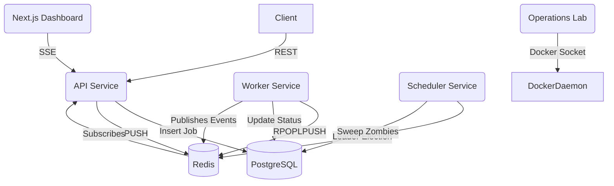

# Distributed Task Platform: Engineering Mastery Guide

This document is designed to serve as your ultimate reference point for recalling, defending, and explaining every architectural decision made in this repository. It is written to prepare you for Principal-level Distributed Systems interviews.

━━━━━━━━━━━━━━━━━━━━━━━━━━━━━━━━━━━━━━━━━━

## SECTION 1 — PROJECT IN ONE PAGE

### What the project is
A fault-tolerant, horizontally scalable distributed task orchestration platform that reliably executes background jobs asynchronously across multiple worker nodes, guaranteeing no data loss during infrastructure failures.

### Why it exists & Problem it solves
Modern APIs cannot afford to block HTTP requests while performing heavy I/O tasks (e.g., sending emails, resizing images, calling 3rd-party APIs). This platform offloads that work into a durable queue, ensures it gets executed exactly once (or at-least-once safely), and automatically recovers if the server processing it crashes mid-execution.

### Real-world equivalents
- **BullMQ / Celery / Sidekiq**: Application-level task queues.
- **Temporal**: Stateful workflow orchestration.
- **AWS SQS + Lambda / Google Cloud Tasks**: Managed serverless task queues.

### 30 Second Explanation
"I built a distributed task queue using Node.js, PostgreSQL, and Redis. It handles asynchronous background jobs with strict priority ordering. I engineered it for high availability, implementing Worker Heartbeats and a Dead Letter Queue for failure recovery, and used Optimistic Concurrency Control (OCC) to prevent duplicate execution. To prove its resilience, I built an interactive Operations Lab using Docker-out-of-Docker to visually demonstrate chaos testing and leader election failovers in real-time."

### 2 Minute Explanation
"My project is a robust background job processing platform designed to decouple heavy I/O operations from main API threads. The architecture is split into decoupled microservices: an API gateway, horizontally scalable Worker nodes, and highly available Scheduler nodes. 

PostgreSQL acts as the durable source of truth, while Redis handles ephemeral coordination like queuing, locking, and pub/sub telemetry. 

The hardest engineering challenge was ensuring fault tolerance. If a worker node crashes mid-execution, the job is orphaned. To solve this, I implemented a heartbeat mechanism. Workers constantly ping Redis. If a worker dies, its heartbeat expires. My Scheduler service runs a 'Zombie Sweeper' that detects these orphaned jobs and atomically requeues them. To prevent split-brain scenarios where multiple schedulers try to requeue the same job, I implemented Leader Election using Redis distributed locks, and fortified the database state transitions using Optimistic Concurrency Control via a version field."

### 10 Minute Deep Technical Explanation
*(Use the remaining sections of this document to drive this deep dive during systems design interviews, focusing on OCC, Leader Election, and Queue mechanics).*

━━━━━━━━━━━━━━━━━━━━━━━━━━━━━━━━━━━━━━━━━━

## SECTION 2 — ARCHITECTURE OVERVIEW

### Diagram

### Service Responsibilities
1. **API Service**: Ingress point. Validates requests, writes durable state to Postgres, pushes pointers to Redis queues, and streams live telemetry to clients via Server-Sent Events (SSE).
2. **Worker Service**: The engine. Uses polling to fetch jobs from Redis, executes business logic, updates Postgres with the final state, and emits telemetry events.
3. **Scheduler Service**: The janitor. Uses Leader Election to ensure only one instance runs. Sweeps the database for delayed jobs and dead workers, pushing them back into Redis.
4. **Lab Service**: The chaos monkey. Uses Docker-out-of-Docker to physically kill or pause containers to validate system resilience.
5. **Dashboard**: The operations console. Visualizes the distributed state.

**Why this design?**
By separating the API, Worker, and Scheduler, the system can scale asymmetrically. If job throughput spikes, we scale Workers. If HTTP ingress spikes, we scale the API. The Scheduler is kept separate to prevent heavy DB sweeping queries from impacting API latency.

━━━━━━━━━━━━━━━━━━━━━━━━━━━━━━━━━━━━━━━━━━

## SECTION 3 — EVERY SERVICE EXPLAINED

### API Service
- **Purpose**: Secure entry point for job creation and telemetry.
- **Internal Flow**: Validates via Zod -> Writes `PENDING` job to Postgres -> Pushes Job ID to Redis queue. 
- **Interview Question**: *Why write to Postgres before Redis?* Answer: To guarantee durability. If Redis drops the message, the DB still has the job as PENDING, which the Scheduler can eventually recover.

### Worker Service
- **Purpose**: Executes jobs.
- **Concurrency Model**: Uses Node.js asynchronous loops (`WORKER_CONCURRENCY`) to process multiple I/O bound jobs simultaneously within a single process.
- **Heartbeats**: Pings Redis every 5s with a 30s TTL.
- **OCC**: Increments a `version` field on every DB update to prevent duplicate executions.

### Scheduler Service
- **Purpose**: System recovery and maintenance.
- **Leader Election**: Uses `SETNX` on a Redis key with a TTL. Only the node holding the lock executes sweeps.
- **Zombie Recovery**: Finds jobs marked `RUNNING` but missing a valid Redis heartbeat.

### Dashboard
- **SSE**: Uses Server-Sent Events over WebSockets for unidirectional, real-time event streaming.
- **Visualization**: Renders Prometheus metrics and live cluster states.

### Lab Service
- **Purpose**: Proves the architecture works under duress.
- **Execution**: Mounts `/var/run/docker.sock` to dynamically restart sibling containers.

━━━━━━━━━━━━━━━━━━━━━━━━━━━━━━━━━━━━━━━━━━

## SECTION 4 — DATABASE DESIGN

### `Job` Table
- **Purpose**: Durable source of truth for all tasks.
- **Fields**: `id`, `status` (Enum), `payload`, `retryCount`, `nextRetryAt`, `workerId`.
- **`version` (OCC)**: Crucial integer field. Every `UPDATE` includes `WHERE id = X AND version = Y`. This prevents two processes from updating the same job simultaneously (e.g., if a network partition causes a worker to freeze, and the scheduler reassigns its job, the frozen worker cannot overwrite the new state upon waking up).

### Why PostgreSQL?
We need ACID transactions for state transitions. MongoDB lacks strict schema enforcement which is dangerous for state-machine data. We specifically avoided heavy row-level locking (`SELECT FOR UPDATE`) to maintain high throughput, relying on OCC (`version`) instead.

━━━━━━━━━━━━━━━━━━━━━━━━━━━━━━━━━━━━━━━━━━

## SECTION 5 — REDIS DEEP DIVE

### Keys
- `queue:critical`, `queue:high`, etc.: **Lists**. Contains Job IDs. 
- `processing-queue`: **List**. Holds in-flight jobs during `RPOPLPUSH`.
- `workers:active`: **Set**. Tracks all live worker IDs.
- `worker:{id}`: **String (with TTL)**. The heartbeat. Contains capacity metrics.
- `scheduler:leader`: **String (with TTL)**. The distributed lock.

### Why Redis?
PostgreSQL is too slow for high-throughput queue polling. Redis operates entirely in memory, offering atomic operations like `RPOPLPUSH` (Reliable Queue pattern) and `SETNX` (Locks).

━━━━━━━━━━━━━━━━━━━━━━━━━━━━━━━━━━━━━━━━━━

## SECTION 6 — DISTRIBUTED SYSTEMS CONCEPTS

- **Producer-Consumer**: The API produces jobs; Workers consume them. Decouples ingestion from execution.
- **Vertical vs Horizontal Scaling**: Vertical = increasing `WORKER_CONCURRENCY` in Node.js. Horizontal = adding more Docker containers.
- **Leader Election**: In a distributed system, you often need *exactly one* node to do a task (like sweeping the DB). We use Redis locks to elect a leader. If the leader dies, the lock expires, and another node takes over.
- **Optimistic Concurrency Control (OCC)**: Using a version integer to detect mid-air collisions in database writes, avoiding expensive database locks.
- **Dead Letter Queue (DLQ)**: A terminal state for jobs that fail repeatedly (e.g., bad payload). Prevents poison pills from clogging the queue infinitely.
- **Idempotency**: The ability to process the same job twice without breaking the system. Essential in at-least-once delivery systems.
- **Server-Sent Events (SSE)**: Unidirectional streaming. Better than WebSockets when the client only needs to *listen* to the server (telemetry), as it uses standard HTTP/2 multiplexing.

━━━━━━━━━━━━━━━━━━━━━━━━━━━━━━━━━━━━━━━━━━

## SECTION 7 — JOB LIFECYCLE

1. **Job Created**: API inserts `PENDING` job into Postgres (Version 1).
2. **Queued**: API `LPUSH`es Job ID into `queue:high`.
3. **Picked Up**: Worker executes `RPOPLPUSH queue:high processing-queue`.
4. **Claimed**: Worker updates Postgres to `RUNNING`, sets `workerId`, increments version to 2 (OCC).
5. **Processing**: Worker executes business logic.
6. **Completed**: Worker updates Postgres to `COMPLETED`, increments version to 3. Worker removes Job ID from `processing-queue`.

━━━━━━━━━━━━━━━━━━━━━━━━━━━━━━━━━━━━━━━━━━

## SECTION 8 — FAILURE SCENARIOS

### Worker Crash Mid-Job
- **Timeline**: Worker dies -> Redis heartbeat TTL expires (30s) -> Scheduler sweeps DB -> Finds `RUNNING` job without heartbeat.
- **Recovery**: Scheduler increments retry count, sets status to `PENDING`, pushes ID back to Redis.
- **Interview Explanation**: "I use a reliable queue pattern and heartbeat mechanism. If a worker fails to ping Redis, the scheduler assumes it's dead and safely requeues its assigned jobs."

### Scheduler Crash
- **Timeline**: Leader scheduler dies -> Redis `scheduler:leader` TTL expires (10s).
- **Recovery**: Next standby scheduler polling for the lock successfully acquires it via `SETNX` and resumes sweeping.

### Network Partition (Split Brain)
- **Timeline**: Worker A disconnects from network but keeps processing. Scheduler assumes Worker A is dead and requeues job to Worker B. Worker A reconnects and tries to mark job `COMPLETED`.
- **Recovery**: Worker A's database `UPDATE ... WHERE version = 2` fails because Worker B already incremented the version to 3. Worker A's zombie write is safely rejected.

━━━━━━━━━━━━━━━━━━━━━━━━━━━━━━━━━━━━━━━━━━

## SECTION 9 — TESTING

- **Zombie Integration Test**: Physically stops a worker process, advances time, and asserts that the Scheduler successfully detects and requeues the job.
- **Leader Failover Test**: Kills the leader scheduler and asserts that a standby acquires the lock within the TTL window.
- **Why it matters**: Distributed systems fail in unpredictable, time-based ways. Unit tests cannot catch concurrency bugs.

━━━━━━━━━━━━━━━━━━━━━━━━━━━━━━━━━━━━━━━━━━

## SECTION 10 — OPERATIONS LAB

**Why it was built**: Talk is cheap. Every candidate claims their system is fault-tolerant. The Lab visually *proves* it by mounting the Docker Socket (DooD) and programmatically murdering containers while jobs are processing, graphing the recovery in real-time.

**Interview talking point**: "I didn't just design for failure; I built a chaos engineering lab into the dashboard to physically kill my own worker nodes in real-time to prove the leader election and zombie-recovery algorithms actually work."

━━━━━━━━━━━━━━━━━━━━━━━━━━━━━━━━━━━━━━━━━━

## SECTION 11 — DESIGN DECISIONS & TRADEOFFS

- **Why Postgres over MongoDB?** We needed strict ACID compliance for OCC (`version` tracking). NoSQL eventual consistency is dangerous for state machines.
- **Why Redis over RabbitMQ?** Redis is multipurpose. It handles queues (`RPOPLPUSH`), locks (`SETNX`), and pub/sub in one binary, keeping infrastructure complexity low. RabbitMQ only does queues.
- **Why OCC instead of Row Locking?** `SELECT FOR UPDATE` holds database connections open and can cause deadlocks under high load. OCC allows high throughput; if a collision happens, the query simply returns 0 rows updated, and the worker can handle the rejection.
- **Why Polling in Scheduler?** Simplicity. True event-driven delays (like RabbitMQ delayed exchanges) require complex infrastructure. Polling Postgres for `nextRetryAt < NOW()` every 10 seconds is highly reliable, though it scales poorly past millions of rows.

━━━━━━━━━━━━━━━━━━━━━━━━━━━━━━━━━━━━━━━━━━

## SECTION 12 — KNOWN LIMITATIONS (BRUTALLY HONEST)

1. **Basic Leader Election**: `SETNX` is vulnerable to Redis master-failover split-brain. Production systems use Redlock or ZooKeeper/etcd for true consensus.
2. **No Backpressure**: The API accepts jobs infinitely. A flood of requests will OOM Redis or exhaust Postgres connections. It needs an API Gateway rate limiter or queue-depth rejection.
3. **Polling Bottleneck**: The Scheduler polling Postgres every 10s requires a full table scan if indexes on `status` and `nextRetryAt` aren't optimized.
4. **Redis Reliability**: `RPOPLPUSH` is great, but if Redis restarts and AOF fsync is delayed, in-flight queue pointers could be lost, requiring a manual DB reconciliation script.

━━━━━━━━━━━━━━━━━━━━━━━━━━━━━━━━━━━━━━━━━━

## SECTION 13 — INTERVIEW PREPARATION (Top Questions)

1. **Why not just use a CRON job instead of a worker queue?** 
   *Ans:* Cron is for time-based scheduling. Queues are for decoupling asynchronous load. Cron cannot handle unpredictable spikes in throughput or retry logic gracefully.
2. **Explain exactly how you prevented a job from running twice.**
   *Ans:* Optimistic Concurrency Control. I added a `version` integer to the database. Updates only succeed if the version matches what the worker originally read.
3. **What happens if your Redis instance crashes completely?**
   *Ans:* The API would fail to queue new jobs. However, because Postgres is written to *first*, all jobs are safely recorded as `PENDING`. Upon Redis recovery, a reconciliation script (or the scheduler) would re-sync the PENDING jobs into the queue. No data is lost.
4. **What is the difference between Vertical and Horizontal scaling in your workers?**
   *Ans:* Vertical means utilizing Node.js's async event loop to process multiple jobs simultaneously within one process (`WORKER_CONCURRENCY=10`). Horizontal means spinning up 5 separate Docker containers.
5. **Why did your throughput degrade when you added 8 horizontal workers locally?**
   *Ans:* CPU Context Switching and DB lock contention. Running 80 concurrent async loops on a single laptop destroys I/O throughput. Horizontal scaling is meant for physically separated hardware.

━━━━━━━━━━━━━━━━━━━━━━━━━━━━━━━━━━━━━━━━━━

## SECTION 14 — RESUME DEFENSE

### Strong Resume Bullet
"Architected a fault-tolerant distributed task queue using Node.js, PostgreSQL, and Redis. Engineered high-availability features including Leader Election, Optimistic Concurrency Control (OCC), and automated failover for dead worker nodes. Built an interactive React dashboard with real-time SSE telemetry to visualize chaos engineering tests (DooD)."

### How to explain in FAANG Interviews
Do not focus on the React frontend. Focus entirely on **Fault Domains**. Explain how you assumed the network was unreliable, workers would die, and Redis could drop keys. Explain OCC deeply, and explicitly state the limitations of your `SETNX` leader election compared to Chubby/ZooKeeper. They will respect the self-awareness.

━━━━━━━━━━━━━━━━━━━━━━━━━━━━━━━━━━━━━━━━━━

## SECTION 15 — CHEAT SHEET

### 5 Minute Revision
- **Stack**: Node.js, Postgres (truth), Redis (queues/locks/heartbeats).
- **OCC**: `version` field prevents duplicate execution (split brain).
- **Zombies**: Worker heartbeat dies -> Scheduler sweeps -> Requeues.
- **Leader Election**: `SETNX` lock prevents multiple schedulers from sweeping.
- **Lab**: Docker-out-of-Docker chaos tests.

### Biggest Strengths
You didn't just build a queue; you built the *recovery mechanisms* for when the queue fails, and an Operations Lab to mathematically *prove* the recovery works.

### Biggest Weakness (If asked)
"My leader election relies on a single Redis instance. If I were deploying this to production, I would use the Redlock algorithm across a Redis Cluster, or offload consensus to etcd, because a single-node `SETNX` is vulnerable to clock drift and master-failover replication lag."
