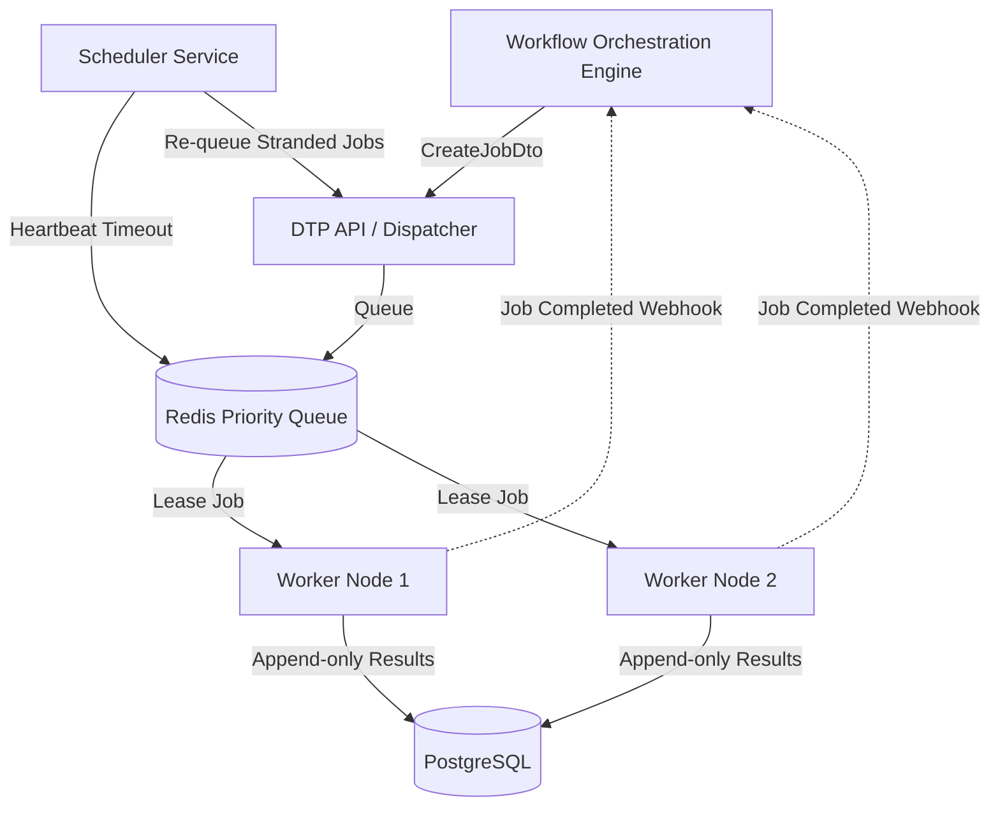

# Distributed Task Platform (DTP)


The **Distributed Task Platform (DTP)** serves as the **Execution/Data Plane** for distributed workflows. It treats every incoming request as an opaque `Job` containing a `type` and a `payload`. DTP does not understand DAGs or orchestration; its sole responsibility is reliable execution, priority queueing, optimistic concurrency control, and recovering from worker crashes.

---

## Architecture at a Glance



DTP provides **at-least-once execution with idempotent consumers (effectively-once)** semantics. Note that side-effects (like external HTTP calls) inside worker handlers may be repeated on retry at the effect boundary.

---

## Quick Start & Setup

### 1. Configure Environment
```bash
cp .env.example .env
```
Ensure you update any default credentials (like the seed admin in `seed-admin.ts`) before using in an exposed environment. The connection to the orchestrator uses a **single shared API key** architecture (per-identity keys are a future goal).

### 2. Run Full Stack via Docker Compose (Recommended)

To boot the entire execution platform (API, scheduler, workers, database, cache, dashboard, and observability stack) in one command:

```bash
docker compose up -d
```

**Port Mapping:**
- **DTP Dashboard**: `http://localhost:4002`
- **DTP API**: `http://localhost:4001`
- **Postgres**: `5434`
- **Redis**: `6380`
- **Grafana**: `http://localhost:3005`
- **Prometheus**: `http://localhost:9091`

*(Note: For evaluating fault tolerance scenarios, use the `docker-compose.lab.yml` stack instead, as described in the Lab Service section).*

### 3. Core Job API Routes
The internal DTP REST API mounts at `/jobs`.
- `POST /jobs` - Enqueue a new job.
- `GET /jobs/:jobId` - Check status.
- `GET /jobs/by-idempotency-key/:key` - Fetch by idempotency key.
- `POST /jobs/:jobId/cancel` - Halt execution if pending/running.
- `POST /jobs/:jobId/retry` - Force a retry (increments `retryCount`).

---

## Worker Handlers & Plugins
Workers execute untrusted payloads using registered handlers.
- **`core/script`**: Executes arbitrary JS. Secured via `isolated-vm`. Strict memory bounds. Fails closed if the native module is unavailable.
- **`core/http`**: Standard HTTP outbound requests. Implements basic SSRF protection.
- **`core/email`**: Sends emails using an Ethereal test transporter (stubbed, not production SMTP).
- **`core/ai`**: **Stubbed AI implementation** returning `[STUB] Mocked AI completion`.
- **Default fallback**: Unrecognized handlers will run a mock delay and return a generic success response.

---

## 🧪 Lab Service

The **Lab Service** (`services/lab-service`) is included to exercise the real DTP platform through controlled distributed systems scenarios.

### Using the Lab
Start the lab environment:
```bash
docker compose -f docker-compose.lab.yml up -d
```
Interact via the HTTP API: `POST /runs`
Accepts `{"scenario": "<name>"}` where `<name>` is exactly one of:

1. **`priority`**: Tests priority queueing (Low vs High) and verifies High priority jobs leapfrog the queue.
2. **`recovery`**: Kills a worker container mid-execution. Validates that the Scheduler Service detects the missed heartbeats and correctly requeues stranded jobs.
3. **`failover`**: Kills the leader scheduler. Validates distributed Redis locking and fast leader failover.
4. **`benchmark`**: A high-throughput stress test using the real platform components (Lab Service throughput metrics, not synthetic in-memory runtime benchmarks).

---

## Observability & Security
- **Security Limitation**: Current WOE ↔ DTP API uses a single shared `x-api-key`.
- **Tracing**: W3C distributed tracing spans across services are currently aspirational.
- **Metrics**: Synthetic in-memory runtime metrics exist in legacy text documentation, but true throughput is tested via the Lab Service.

## Contributing
See `CONTRIBUTING.md` for local development setup, testing guidelines, and PR processes. License: MIT.
