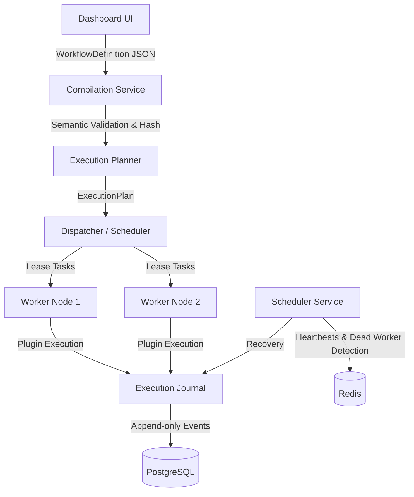
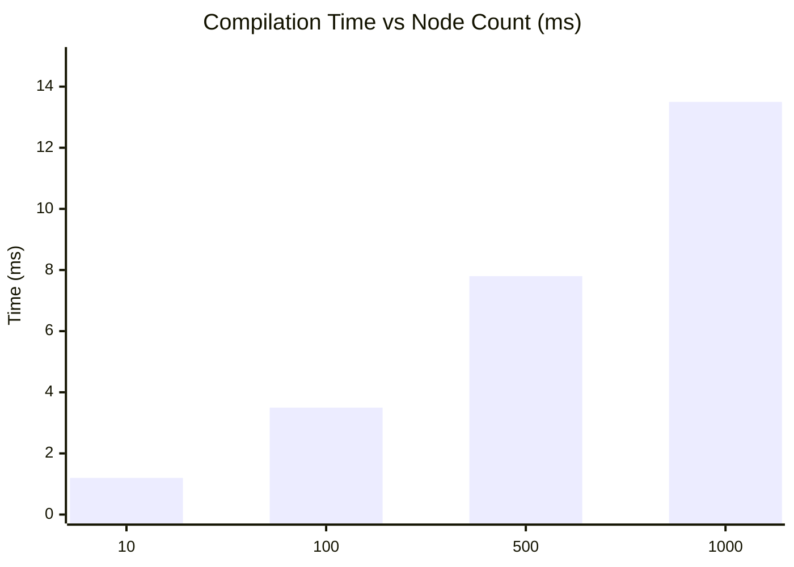
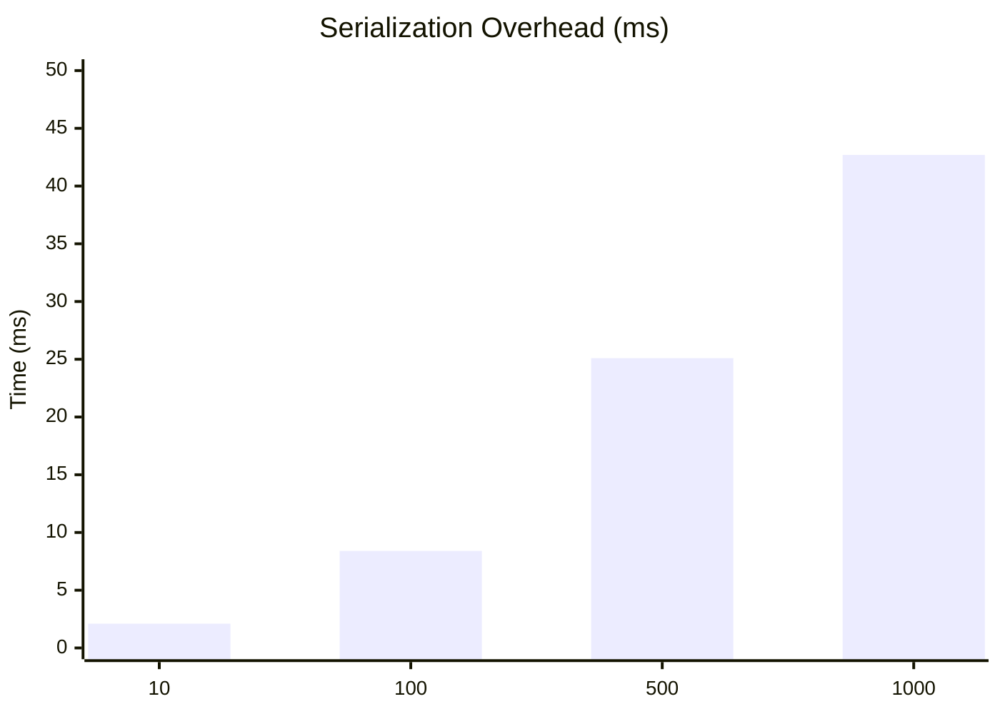

# Distributed Task Platform


A fault-tolerant, horizontally scalable distributed task orchestration platform with real-time observability and a visual workflow builder. Built to demonstrate production-grade distributed systems engineering.

---

## The Problem

Modern applications require executing complex, long-running workflows across disparate systems (AI inference, data pipelines, email blasts). Standard task queues (like Celery or BullMQ) lack workflow orchestration (DAGs, branching, conditional logic). Enterprise orchestration engines (like Airflow or Temporal) are often too heavy or abstract away the underlying execution.

**Distributed Task Platform** bridges this gap: It provides an intuitive **Visual Builder** to design declarative workflows and a **Robust Runtime Engine** that guarantees reliable, parallel execution with zero data loss, optimistic concurrency control, and deterministic replayability.

---

## Architecture



---

## Features

- **Visual Workflow Builder**: Declarative drag-and-drop editor for designing workflows without writing code.
- **Dynamic Plugin Architecture**: Add new task types (HTTP, Script, AI, Email) dynamically via a backend registry.
- **Parallel Execution & Joins**: True concurrent branch execution with deterministic synchronization.
- **Event Sourcing & Replay**: All state transitions are recorded as immutable events, allowing exact state reconstruction and time-travel debugging.
- **Optimistic Concurrency Control (OCC)**: Safe distributed state updates without database locking contention.
- **Dead Worker Recovery**: Leader-elected scheduler detects crashed workers via Redis heartbeats and gracefully re-queues orphaned tasks.
- **Execution Viewer**: Real-time Gantt charts, metrics, and timeline tracing.

---

## Quick Demo

*(Placeholder for Quick Demo GIF)*


---

## Quick Start

You can run the entire platform locally in under 5 minutes.

### 1. Clone the repository

```bash
git clone https://github.com/your-username/distributed-task-platform.git
cd distributed-task-platform
```

### 2. Configure Environment

```bash
cp .env.example .env
```

### 3. Start the Platform

```bash
docker compose up -d
```

This single command boots the API, Scheduler, Worker pool, Postgres, Redis, Prometheus, Grafana, and the Dashboard UI.

### 4. Open the Dashboard

Navigate to [http://localhost:3001](http://localhost:3001) in your browser.

- Import one of the sample workflows from the `/demo` folder.
- Click **Run** and watch the execution live in the Execution Viewer!

---

## Execution Flow

When a workflow is submitted:
1. **Compilation**: The builder sends a declarative `WorkflowDefinition`. The compiler verifies reachability, detects cycles, and generates a semantic hash.
2. **Planning**: The planner transforms the definition into an `ExecutionPlan` containing task dependency graphs.
3. **Scheduling**: The dispatcher identifies ready tasks and leases them to available worker nodes.
4. **Execution**: Workers execute the task via the Plugin System and append `TASK_COMPLETED` events to the Event Journal.
5. **State Advance**: The journal triggers the planner to unlock downstream tasks (e.g., resolving Join nodes or Conditional branches).

---

## Plugin Architecture

The system is highly extensible. Adding a new task type requires zero frontend changes.

```typescript
export const HTTPPlugin: PluginManifest = {
    id: 'core/http',
    name: 'HTTP Request',
    version: '1.0.0',
    schema: {
        url: { type: 'string', required: true },
        method: { type: 'select', options: ['GET', 'POST'] }
    },
    execute: async (context, config) => {
        const response = await fetch(config.url, { method: config.method });
        return response.json();
    }
};
```
*When registered, the Visual Builder dynamically renders the configuration panel and the Runtime routes execution to this handler.*

---

## Benchmarks

The runtime was built for high throughput and low overhead.





---

## Project Structure

```
distributed-task-platform/
├── apps/dashboard/          # Next.js 16 Visual Builder & Execution Viewer
├── demo/                    # Pre-built workflow JSONs for quick evaluation
├── docs/                    # Deep-dive architecture and subsystem documentation
├── runtime/                 # Core execution engine, compiler, and planner
├── services/                # Microservices (API, Worker, Scheduler)
└── docker-compose.yml       # Production-ready local infrastructure
```

---

## Roadmap

- **v1.0 (Current)**: Core execution engine, Visual Builder, Event Sourcing, Replay, CI/CD.
- **v1.1**: Kubernetes Helm Charts, Workflow Migration Engine.
- **v2.0**: Multi-tenancy, RBAC, API Rate Limiting, Plugin Marketplace.

---

## Contributing

See [CONTRIBUTING.md](CONTRIBUTING.md) for local development setup, testing guidelines, and PR processes.

## License

MIT License. See [LICENSE](LICENSE) for details.