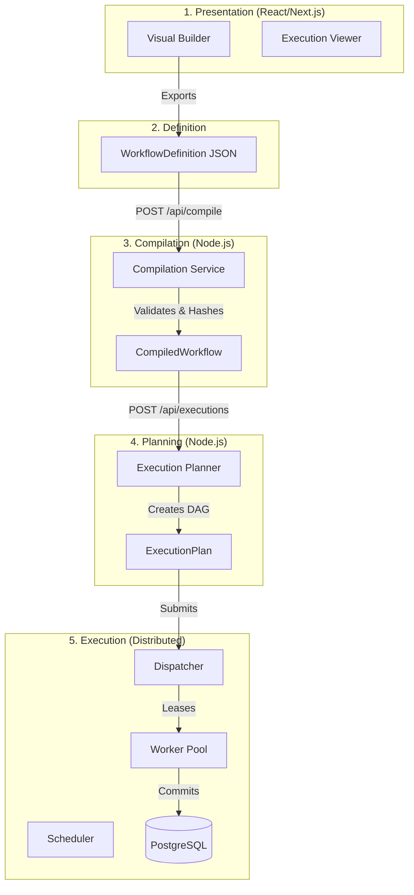

# System Architecture

The Distributed Task Platform is divided into five strictly decoupled layers: Presentation, Compilation, Planning, Execution, and Observability.

## Architecture Layers

### Layer Details

#### 1. Presentation
The Visual Builder acts as a pure, declarative JSON editor. It holds **no runtime logic** and has no concept of dependencies or compilation.

#### 2. Definition
The `WorkflowDefinition` is the public API contract. It describes nodes, properties, and un-validated routes.

#### 3. Compilation
The `CompilationService` bridges UI intent and runtime reality. It performs topological sorts, detects cycles using DFS coloring, strips UI metadata, and computes a deterministic semantic hash for caching.

#### 4. Planning
The `ExecutionPlanner` translates the `CompiledWorkflow` into an `ExecutionPlan`, creating a deterministic dependency graph ready for scheduling.

#### 5. Execution
The `TemporalScheduler` manages time-based triggers, while the `ExecutionDispatcher` assigns work (leases) to horizontally scaling worker nodes. State is managed via `InMemoryStateRepository` (or PostgreSQL in production).
