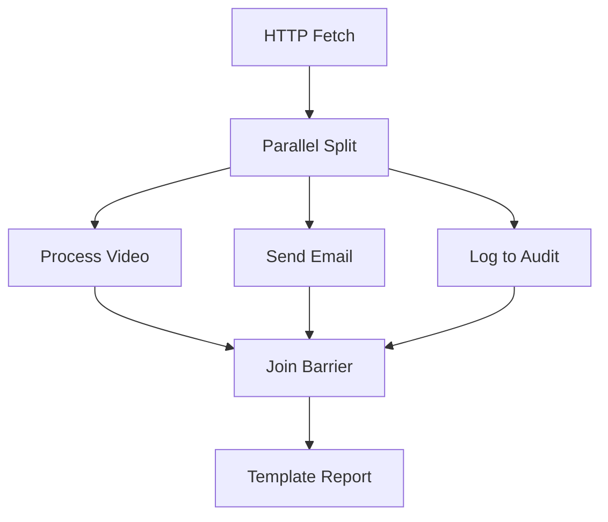

# Concurrency & Branching

The Distributed Task Platform natively supports parallel execution paths through the `Parallel` and `Join` plugins.

## Parallel Execution

When the `ExecutionPlanner` encounters a Parallel node, it creates distinct, concurrent sub-graphs.

### Determinism

The `Dispatcher` schedules `BranchA`, `BranchB`, and `BranchC` immediately upon completion of the `Parallel` node. All three tasks are placed in the ready queue and can be picked up by completely different worker nodes simultaneously.

### The Join Barrier

The `Join` node acts as a synchronization barrier. The `ExecutionPlanner` ensures a Join node's state is strictly `WAITING` until *all* of its upstream dependencies have reported a `TASK_COMPLETED` status. If any branch fails (and exhausts retries), the execution halts, preventing the Join from proceeding.
