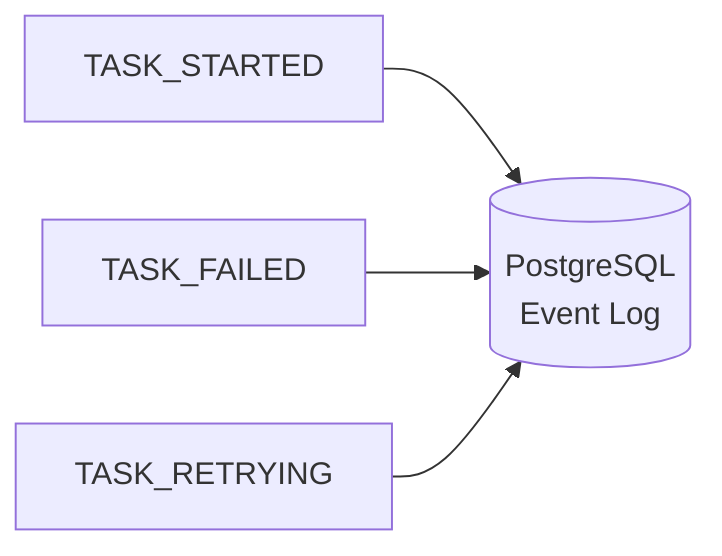

# Event Sourcing & Recovery

The execution engine avoids mutable state. Instead of constantly updating a single database row (e.g., `status = 'RUNNING'`), the platform utilizes **Event Sourcing** via the `ExecutionJournal`.

## Append-Only Event Log

Every state transition generates an immutable event:

- `WORKFLOW_STARTED`
- `TASK_SCHEDULED`
- `TASK_STARTED`
- `TASK_COMPLETED`
- `WORKFLOW_COMPLETED`

### Replay Engine

Because the entire history is stored as an ordered sequence of events, we can perfectly reconstruct the state of an execution at any point in time. The Replay Engine reads the event log and sequentially applies state transitions to an empty Execution Object, yielding a deterministic final state.

### Optimistic Concurrency Control (OCC)

To prevent race conditions when multiple workers attempt to update the same execution simultaneously (e.g., in highly parallel workflows), the platform uses OCC. 

Each commit to the Event Journal requires passing the last known `version` of the execution. If another worker has already appended an event (incrementing the version), the database rejects the commit, and the worker gracefully retries.
