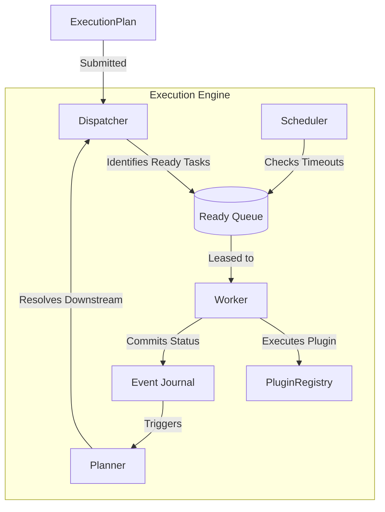

# Execution Flow

The platform separates the orchestration of *when* a task runs (Scheduler/Dispatcher) from *how* a task runs (Worker/Plugin).

## Dispatcher vs Planner

### Execution Lifecycle

1. **Submission**: The `ExecutionPlanner` submits an `ExecutionPlan` to the Engine.
2. **Dispatch**: The `ExecutionDispatcher` scans the plan for nodes with zero pending dependencies.
3. **Leasing**: Ready nodes are placed in a queue. Idle workers pull a "lease" for a task.
4. **Execution**: The worker invokes the specific `PluginHandler` (e.g., HTTP, Email) defined in the node.
5. **Commit**: The worker appends a `TASK_COMPLETED` or `TASK_FAILED` event to the `ExecutionJournal`.
6. **Resolution**: The Journal commit triggers the `ExecutionPlanner` to evaluate the graph. If a node completed successfully, its downstream edges are activated.
7. **Loop**: The Dispatcher sees new ready tasks and the cycle repeats until terminal nodes are reached.
