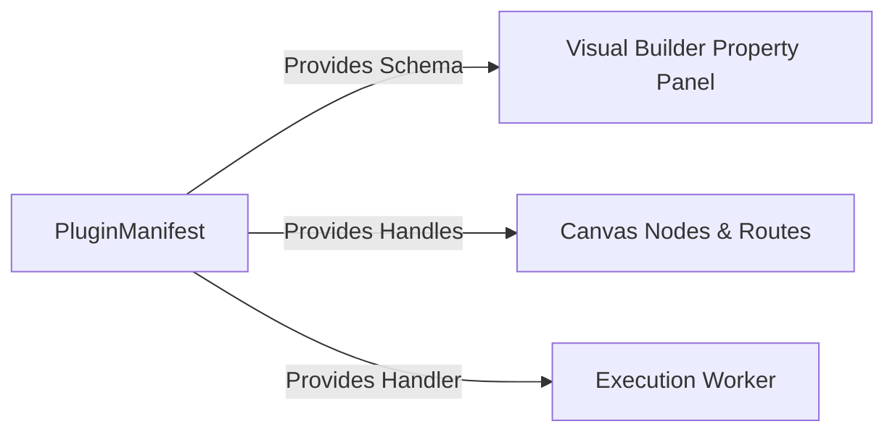

# Plugin Architecture

The system is built on a dynamic plugin architecture. Both the Visual Builder UI and the Execution Runtime derive their behavior strictly from `PluginManifest` definitions.

## The Plugin Registry



### Example Manifest

```typescript
import { PluginManifest } from '../types';

export const ScriptPlugin: PluginManifest = {
    id: 'core/script',
    name: 'JavaScript Runner',
    version: '1.0.0',
    description: 'Executes sandboxed JS code',
    schema: {
        script: {
            type: 'textarea',
            required: true,
            default: 'return { success: true };'
        }
    },
    execute: async (context, config) => {
        // Implementation
        const result = eval(config.script);
        return result;
    }
};
```

### Key Benefits

1. **Decoupled UI**: You never need to write React components to add a new task type. The `PropertyPanel` auto-generates forms based on the `schema`.
2. **Safe Extensibility**: Third-party developers can write plugins by conforming to the `PluginManifest` interface without modifying the core orchestrator.
3. **Capabilities**: (Coming Soon) Plugins will declare capabilities like `retryable: true` or `sideEffects: true` to inform the Planner.
