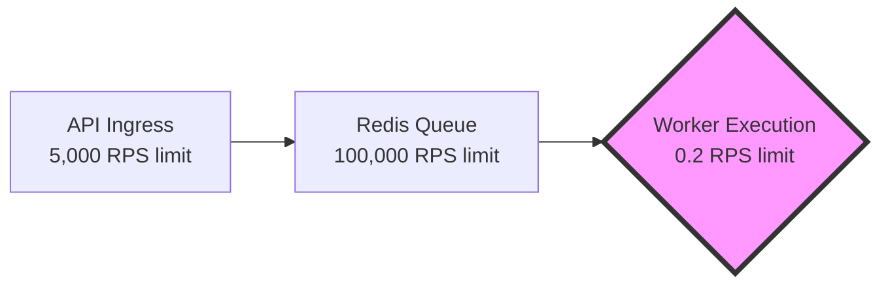

# Chapter 1: System Design Process

Before writing a single line of code, senior engineers spend a significant amount of time planning. In distributed systems, mistakes made at the architectural level are astronomically more expensive to fix than bugs in business logic. You can easily refactor a badly written loop; you cannot easily refactor a fundamentally flawed database schema once production data is flowing through it.

This chapter breaks down *how senior engineers think*. We will walk through the industry-standard System Design Process and explore how we arrived at the initial architecture for our Distributed Task Platform.

---

## 1. Understanding Requirements

The first step in any system design is defining what the system must actually do, and perhaps more importantly, what it *doesn't* have to do. We divide these into Functional and Non-Functional requirements.

### Functional Requirements
These are the business use-cases. What are the explicit features the system must provide?
- *Example:* "Users must be able to upload a video."

**📍 Our Project's Functional Requirements:**
1. A client can submit a background job via an API.
2. The client can view the status of their jobs.
3. The platform must execute the jobs asynchronously.

### Non-Functional Requirements (NFRs)
These define the *quality* of the system. How fast, secure, and reliable must it be?
- *Example:* "The video must finish uploading in under 5 seconds."

**📍 Our Project's Non-Functional Requirements:**
1. **High Availability:** The API must remain available to accept jobs even if all worker nodes are currently down.
2. **Reliability:** No jobs can be lost if a worker node crashes mid-execution (At-least-once delivery).
3. **Real-time Observability:** State changes must reflect in the UI with sub-second latency.

---

## 2. Capacity Estimation (Back-of-the-Envelope Math)

Before choosing databases, engineers estimate the sheer volume of data the system will handle. 

### Scale Changes Everything
Let's analyze how capacity estimation dictates architecture at different scales.

**At 100 Users (The Prototype):**
- 100 jobs / day.
- Throughput: 0.001 Requests Per Second (RPS).
- *Decision:* A SQLite database on a single $5/month DigitalOcean droplet is perfectly fine.

**At 10,000 Users (Our Target Scale):**
- 100,000 jobs / day.
- Storage: 100,000 * 13 KB = 1.3 GB/day (~475 GB/year).
- Throughput: ~1.15 RPS.
- *Decision:* 1.15 RPS is incredibly low. A single Node.js process and a single PostgreSQL instance will easily handle this traffic for years. No distributed NoSQL database is required.

**At 100 Million Users (Uber Scale):**
- 1 Billion jobs / day.
- Throughput: ~11,500 RPS.
- *Decision:* A single Postgres database will catch fire. You are forced into Database Sharding, Apache Kafka, and NoSQL solutions like Cassandra. 

*Conclusion:* Senior engineers do not over-engineer. They build for their calculated capacity tier, plus 1 order of magnitude.

---

## Architecture Decision Record (ADR): The Primary Database

### Problem
We need a durable store for our Job State Machine (PENDING -> RUNNING -> COMPLETED).

### Options Considered
- **Option A: MongoDB (NoSQL):** Flexible schemas, massive horizontal scale.
- **Option B: Cassandra (NoSQL):** Insane write throughput, masterless architecture.
- **Option C: PostgreSQL (SQL):** Strict relational schemas, strong ACID compliance.

### Decision
We chose **PostgreSQL**.

### Why this decision?
Our capacity estimation proved we will only hit 1.15 RPS. We do not need NoSQL's infinite write scalability. Our core NFR is *Reliability*. Background task platforms are strict state machines. We desperately need ACID compliance and relational integrity to prevent jobs from disappearing or transitioning illegally. 

### Trade-offs
PostgreSQL is harder to scale horizontally if our traffic suddenly spikes by 10,000x compared to MongoDB.

### What would make us choose differently?
If we pivot to becoming an IoT telemetry platform processing 100,000 sensor pings per second, we would drop PostgreSQL immediately for Cassandra.

---

## 3. Bottleneck Identification

Every system has a bottleneck. The goal of system design isn't to eliminate bottlenecks entirely (which is impossible), but to move them to acceptable places.

**Mental Model: Traffic on a Highway**
> If a 5-lane highway merges into a 1-lane tunnel, the tunnel is the bottleneck. Adding 10 more lanes to the highway does nothing to increase throughput. You must widen the tunnel.

Where is the bottleneck in our task platform?

If a job takes 5 seconds to process, 1 Worker can only handle 0.2 RPS. 
If our API accepts jobs at 1.15 RPS, the queue will grow infinitely. The Worker is our tunnel.

**The Solution:** We must scale the Worker execution.
By identifying the bottleneck early, we designed the Worker Service to be completely stateless, allowing us to spin up as many as we need to widen the tunnel and match the API ingress rate.

---

## Interview & Design Discussion

**Interview Question:** *"How would you design a system to generate PDF reports for our enterprise clients?"*

**Expected Discussion:**
The interviewer does not want you to start coding. They are looking for the System Design Process:
1. **Clarify Requirements:** Ask, "How many reports per day? How large is the PDF?"
2. **Estimate Capacity:** Calculate the RPS and total TB of storage needed per year.
3. **Identify Bottlenecks:** State explicitly, "PDF generation is CPU-bound. The worker nodes will be the bottleneck."
4. **Propose Architecture:** Introduce a Queue to protect the API from the heavy worker nodes.

**Strong Answer:** "Before I draw the architecture, let's establish the capacity. If we expect 10,000 PDFs a day, we can use a single Postgres DB and an SQS queue. But I'll design the workers to be stateless so we can horizontally scale them when PDF rendering bottlenecks our CPU."

---

## Lessons Learned

*If I were designing this platform again...*
I would spend less time worrying about how to scale the database to a million users, and more time focusing on exactly what data the business needs to report on. Changing a database schema to add an index is easy; migrating terabytes of data because you fundamentally misunderstood the business access patterns is a nightmare.

---

## Summary

Senior engineering is not just about writing code; it is about justifying *why* the code exists. By walking through Functional Requirements, Capacity Estimation, Bottleneck Identification, and ADRs, we have built a solid, defensible rationale for our architecture.

Next, we will look at the core problem our system is built to solve: why APIs shouldn't do heavy lifting, and the critical differences between synchronous and asynchronous execution.
