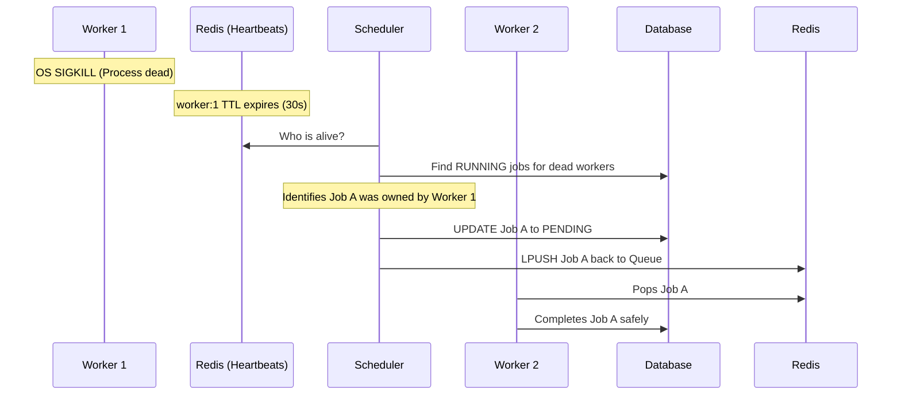

# Chapter 11: Failure Scenarios

"Everything fails, all the time." — Werner Vogels, CTO of Amazon.

A junior engineer designs for the "Happy Path." A senior engineer designs explicitly for failure. In this chapter, we will simulate catastrophic failures across our entire platform and trace exactly how the system recovers.

---

## 1. Worker Node Crashes (OOM / Power Failure)

**The Scenario:** 
Worker 1 pops Job A from Redis. It updates Postgres to `RUNNING`. Halfway through generating a massive PDF, Worker 1 runs out of memory (OOM) and the OS violently terminates the process.

**The Recovery:**

**Result:** No data loss. Self-healing achieved.

---

## 2. Duplicate Execution (Idempotency Failure)

**The Scenario:**
A Worker successfully calls the Stripe API to charge a customer $10. Before the worker can save the `COMPLETED` status to Postgres, the worker crashes.
The Scheduler recovers the job and gives it to a new Worker. The new Worker charges the customer $10 *again*.

### Architecture Decision Record (ADR): Handling Duplicates
**Problem:** Our queue guarantees At-Least-Once delivery, meaning duplicate executions will occasionally happen.
**Options Considered:**
- **Option A: Exactly-Once Queue:** Attempt to build a complex two-phase commit system to guarantee the worker only fires once.
- **Option B: Idempotent Consumer:** Force the business logic to handle duplicates safely.
**Decision:** We chose **Option B (Idempotency)**.
**Why:** Option A is mathematically impossible over an unreliable network without massive performance degradation. The true fix must be in the business logic. When the worker calls Stripe, it must include an `Idempotency-Key` (e.g., the `jobId`). If Stripe receives the same `jobId` twice, Stripe ignores the second request. *Distributed systems can orchestrate reliability, but business logic must orchestrate safety.*

---

## What Can Go Wrong? (Expanding the Failure Surface)

**What if the Scheduler crashes?**
The Redis `SETNX` lock expires after 15 seconds. Another Scheduler instance instantly grabs the lock and becomes the new Leader. Max downtime: 15 seconds.

**What if the Scheduler crashes *mid-sweep*?**
Because the Scheduler uses OCC to update the Database, and atomic `LPUSH` commands to Redis, if it dies halfway through processing 100 dead jobs, the ones it finished are safely in Redis. The ones it didn't finish will simply be picked up by the next Scheduler that takes over.

**What if Redis crashes completely?**
The API can no longer enqueue jobs (it throws 500 errors). Workers sit idle. The Scheduler loses its Leader lock. However, because Redis persists to disk (AOF), the queues are restored upon reboot. To protect jobs caught in transit, our Scheduler has a secondary sweep algorithm: Every 60 seconds, it queries Postgres for any job that has been `PENDING` for >5 minutes, and pushes it back into Redis.

---

## Interview & Design Discussion

**Interview Question:** *"Our primary PostgreSQL database just suffered a catastrophic hardware failure. It's completely dead. How do we recover?"*

**Expected Discussion:**
- **Junior:** "We wait for DevOps to reboot the server."
- **Senior:** "We should be using AWS RDS Multi-AZ. The infrastructure will automatically detect the failure and promote the Read Replica to become the new Primary database. The API will experience maybe 30-60 seconds of downtime during the DNS switchover."
- **Principal:** "The failover handles the infrastructure, but what about the data in flight? Any jobs that were committed to the Primary *right* before it died might not have been synchronously replicated to the Replica. When the Replica takes over, those jobs don't exist. Our Redis queue will try to update jobs that the new Database has never seen. We need a reconciliation script that cross-references Redis `processing-queue` items against the new Database to identify and handle these split-brain orphans."

---

## Summary

By anticipating failures at the CPU, Network, and Database levels, we designed a system that actively heals itself. However, a system that works perfectly is useless if it can be easily hacked. In the next chapter, we will explore Security.
