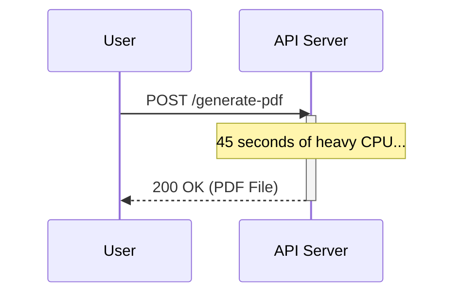
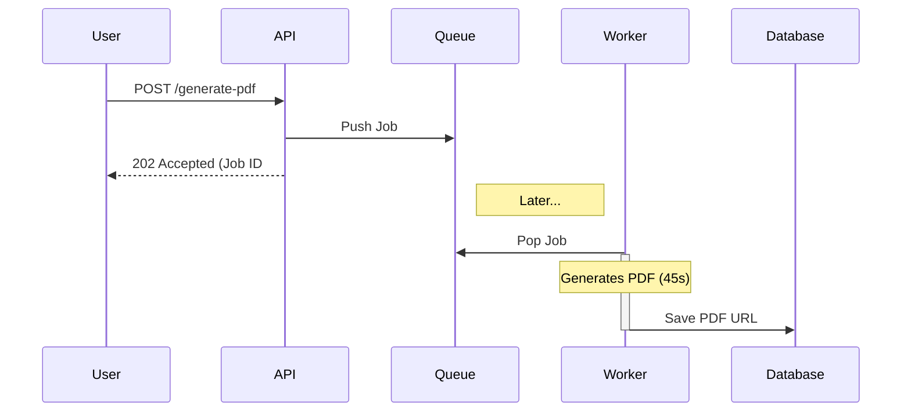

# Chapter 2: The Core Problem & Execution Models

To understand why we built this Distributed Task Platform, we must understand the fundamental limitations of the web. The web is built on the HTTP protocol, which enforces a strict **Request/Response lifecycle**. 

A client (browser) opens a connection, sends a request to a server, and waits. The server computes the answer and sends a response back down the exact same connection. 

This model works flawlessly when the server is fetching a user's profile from a database (which takes 5 milliseconds). But what happens when the request is to "Generate a 100-page PDF report"?

---

## 1. Synchronous vs Asynchronous Execution

### The Synchronous Trap
If the server attempts to generate the PDF *during* the HTTP request, it is executing **synchronously**. 

During this 45-second block:
1. The user is staring at a loading spinner.
2. If the user switches from Wi-Fi to Cellular, the connection drops, and the 45 seconds of server compute is entirely wasted.
3. If 1,000 users ask for PDFs simultaneously, the web server (like Express or Tomcat) runs out of worker threads and crashes.

### The Asynchronous Escape
To solve this, we decouple the *request* from the *execution*.

Behind the scenes, a completely separate process (a Worker) picks up ticket #12345, spends 45 seconds generating the PDF, and saves the file to S3.

**Mental Model: Fast Food vs Fine Dining**
> Synchronous execution is fine dining. The waiter takes your order and stands next to your table until the chef finishes cooking your steak.
> Asynchronous execution is McDonald's. You order at the register, they hand you a receipt with Order #45, and you step aside. You wait for the screen to ping #45.

---

## Architecture Decision Record (ADR): Asynchronous Infrastructure

### Problem
How do we decouple the API from the PDF generation?

### Options Considered
- **Option A: Spawn a Thread:** The API spins up a background thread (`new Thread(() -> generatePDF())`) and returns 202 instantly.
- **Option B: Cron Jobs:** The API saves the request to the DB. A Cron job runs every 5 minutes, finds new DB records, and processes them.
- **Option C: Message Queue:** The API pushes to Redis. Dedicated workers listen to Redis.

### Decision
We chose **Option C (Message Queue)**.

### Why this decision?
Option A (Threads) destroys the API server if traffic spikes. Option B (Cron) introduces up to 5 minutes of latency, which is terrible UX. A Message Queue gives us instant execution (low latency) while keeping the heavy compute completely isolated from the API servers.

### Trade-offs
We now have to run, monitor, and maintain a highly available Redis cluster and a fleet of worker containers, significantly increasing DevOps complexity.

---

## 2. CPU-Bound vs I/O-Bound Work

When designing worker systems, you must know what kind of work you are processing.

### CPU-Bound Work
The task requires heavy mathematical computation. The CPU is maxed out at 100%. (e.g., Video encoding, Cryptography).
- *Scalability Limit:* If you have a 4-core server, you can only process exactly 4 CPU-bound tasks simultaneously. 

### I/O-Bound Work (Input/Output)
The task spends most of its time *waiting* for the network or disk. (e.g., API calls, DB queries).
- *Scalability Limit:* A single CPU core can easily juggle 100 simultaneous network requests by utilizing an asynchronous event loop.

---

## 3. Queue-Based Architectures

To bridge the gap between the fast API and the slow Workers, we introduce a **Message Queue**.

The Queue acts as a massive shock absorber. If the API receives 10,000 requests in one minute, it simply dumps 10,000 messages into the Queue. The API survives. The Workers then drain those messages at their own steady, sustainable pace. 

### Evolution Timeline of Background Tasks
How did the industry solve this over time?
1. **1990s (Crontab):** OS-level scheduled scripts sweeping a database.
2. **2000s (RabbitMQ/ActiveMQ):** Heavy enterprise message brokers using the AMQP protocol.
3. **2010s (Redis / Sidekiq / Celery):** Lightweight, in-memory queues became the standard for web apps.
4. **2020s (Kafka / Temporal):** Event streaming and durable workflow orchestrators for massive distributed state.

---

## Interview & Design Discussion

**Interview Question:** *"We need to send 50,000 emails at midnight. Should we use an asynchronous queue or just execute it synchronously in a loop?"*

**Expected Discussion:**
- **Weak Answer:** "Just loop through them asynchronously in Node.js, it's non-blocking."
- **Strong Answer:** "If the server crashes on email 25,000, we have no way to know which emails were sent. We must enqueue 50,000 individual jobs into a Message Queue. This gives us individual retryability, dead-lettering for bad email addresses, and prevents the API memory from blowing up."

---

## Summary

APIs must remain fast and highly available. By decoupling long-running execution into asynchronous background workers via a message queue, we protect our user-facing servers from CPU exhaustion and connection timeouts.

In the next chapter, we will dive deeply into Queue Architectures, delivery guarantees, and why we chose Redis over Postgres for this critical infrastructure.
