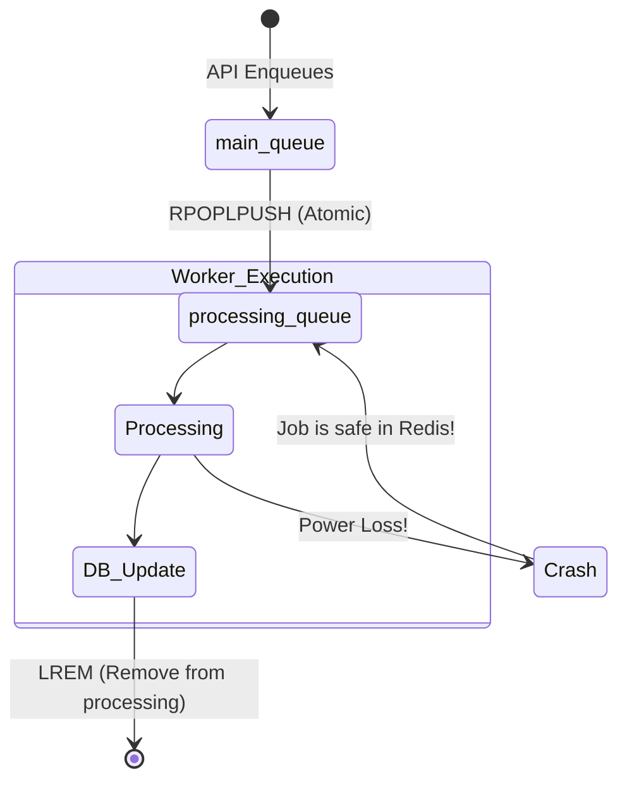

# Chapter 3: Queue Architecture

In Chapter 2, we established that a message queue is the shock absorber that decouples a fast API from a slow worker. But "Message Queue" is a broad term. Not all queues are created equal. 

In this chapter, we will dissect the theoretical guarantees a queue can offer, and the devastating bugs that occur when queues are implemented incorrectly.

---

## 1. Delivery Guarantees

When an API places a job in a queue, what guarantee does the API have that the worker will actually execute it? 

### At-Most-Once Delivery (Fire and Forget)
The message is delivered 0 or 1 times. It will *never* be delivered twice, but it might be lost entirely.

### At-Least-Once Delivery
The message is delivered 1, 2, or N times. It will *never* be lost, but it might be executed duplicates times. (This is what our platform uses).

### Common Misconception: "Exactly-Once Delivery"
**Myth:** "Kafka guarantees exactly-once delivery, so we don't have to worry about duplicates."
**Reality:** True Exactly-Once delivery over a network is mathematically impossible (The Two Generals' Problem). Systems that claim Exactly-Once actually provide *Effectively-Once* delivery by combining At-Least-Once delivery with **Idempotent Consumers**. You must *always* write your worker logic assuming it will receive the same message twice.

---

## Architecture Decision Record (ADR): The Queue Infrastructure

### Problem
We need a highly reliable broker to hold jobs between the API and the Workers.

### Options Considered
- **Option A: PostgreSQL:** Just use the database as a queue (`SELECT * FROM jobs WHERE status = 'PENDING'`).
- **Option B: RabbitMQ:** A traditional AMQP message broker.
- **Option C: Redis:** An in-memory data structure store.

### Decision
We chose **Option C (Redis)**.

### Why this decision?
PostgreSQL (Option A) is a terrible queue. Having 50 workers constantly polling `SELECT FOR UPDATE` on a single table causes massive row-lock contention and destroys the database CPU. RabbitMQ (Option B) is fantastic, but it is heavy and lacks native distributed locks (which we need for the Scheduler). Redis is lightning-fast, and its atomic list operations give us everything we need for both queuing and locking.

### Trade-offs
Redis holds data in RAM. If our queue grows to 100 million jobs, it will cost thousands of dollars in AWS ElastiCache memory. RabbitMQ pages to disk much more efficiently.

---

## 2. The Reliable Queue Pattern (RPOPLPUSH)

### The Naive Approach (`LPOP`)
A junior engineer might implement a Redis queue like this:
1. Worker pops job: `LPOP queue:main`
2. Worker processes job.

**What can go wrong?** If the worker process crashes (OOM, power failure) between step 1 and 2, the job is deleted from Redis, but it was never processed. This is *At-Most-Once Delivery*, resulting in catastrophic data loss.

### The Professional Approach (`RPOPLPUSH`)
To achieve At-Least-Once delivery, we use `RPOPLPUSH main-queue processing-queue`.

This command is **Atomic**. In one indivisible step, Redis pops the job and moves it to a safe list.

**The Magic:** If the worker crashes, the job *still exists* inside `processing-queue`. Our Scheduler Service can later scan `processing-queue` for stale jobs and push them back into `main-queue`.

---

## 3. Connection Starvation (The BRPOP Bug)

If we constantly ask Redis `RPOPLPUSH` and the queue is empty, we burn CPU cycles in an infinite `while(true)` loop.
To solve this, we use `BRPOPLPUSH` (Blocking). Redis puts the connection to sleep and wakes it up the exact millisecond a job arrives.

### What can go wrong? (A Real Bug)
Our workers send a "Heartbeat" to Redis every 5 seconds. However, they were using the exact same Redis connection that was Blocked by `BRPOPLPUSH`. 
Because the connection was asleep, the Heartbeat was never sent. The Scheduler assumed the worker was dead!

**The Fix:** We instantiated two separate Redis clients. `redisClient` handles heartbeats, while `redisBlockingClient` sits in the blocked state.

---

## Interview & Design Discussion

**Interview Question:** *"Why not use Kafka for a background job queue?"*

**Expected Discussion:**
- **Weak Answer:** "Kafka is too complicated to set up."
- **Strong Answer:** "Kafka is an append-only log, not a traditional queue. If a worker fails a job in Kafka, it cannot easily say 'put this specific message back in the queue with a 10-minute delay.' Kafka is built for high-throughput stream processing, whereas Redis/SQS is built for discrete task routing and selective retries. Using Kafka for a simple task queue is a major anti-pattern."

---

## Summary

By utilizing Redis's atomic `RPOPLPUSH` operations, we built a highly reliable queue that prevents data loss even when workers are violently terminated. In the next chapter, we will dive deep into the Worker Engine, exploring the Node.js event loop and how we achieve massive concurrency without CPU exhaustion.
