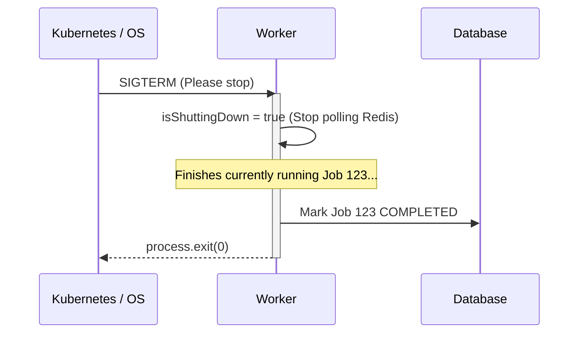

# Chapter 4: The Worker Engine

The queue exists merely to hold instructions. The worker is the engine that actually executes those instructions. Designing a worker engine requires a deep understanding of how the operating system handles CPU scheduling, memory, and concurrency.

---

## 1. Concurrency Models

How do modern frameworks handle 1,000 simultaneous tasks?

### Thread Pools (Java, C#, Python)
Traditional web servers use Thread Pools. When 100 requests arrive, the server grabs 100 threads from a pre-warmed pool.
- **Complexity Analysis:** Each thread consumes RAM (e.g., 1MB stack size). $O(N)$ space complexity per concurrent connection. 10,000 connections = 10GB RAM just for overhead. This is the famous **C10K Problem**.

### The Event Loop (Node.js)
Node.js solves the C10K problem using **Single-Threaded Asynchronous I/O**.
Node.js runs your JavaScript code on exactly one thread. If a task needs to make a database query (I/O), Node.js offloads it to the OS. The single thread immediately moves on to the next task. 

**Mental Model: Waiter vs Fast Food**
> A Thread Pool is having 100 waiters. A waiter takes your order, walks to the kitchen, and stands there staring at the chef until the food is done. 
> The Event Loop is having exactly 1 hyper-efficient cashier at McDonald's. They take your order, hand the ticket to the kitchen, and immediately take the next customer's order. When the kitchen finishes, they hand you the tray.

---

## Architecture Decision Record (ADR): Worker Concurrency Model

### Problem
How do we maximize the throughput of our Worker containers?

### Options Considered
- **Option A: Horizontal Scaling Only:** Run 1 job per container, scale to 50 containers.
- **Option B: Node.js Cluster Module:** Fork the Node process across multiple CPU cores.
- **Option C: Event Loop Concurrency:** Configure a single Node process to pull multiple jobs simultaneously using `Promise.all()`.

### Decision
We chose **Option C (Event Loop Concurrency) combined with Horizontal Scaling**.

### Why this decision?
Our jobs are purely I/O bound (calling APIs, writing to DB). The Node event loop is practically built for this. By setting `WORKER_CONCURRENCY = 10`, a single Node process seamlessly handles 10 jobs at once with near-zero memory overhead. 

---

## 2. CPU Context Switching (The Cost of Over-Scaling)

If `WORKER_CONCURRENCY=10` is fast, is `10,000` faster? No. It is catastrophically slower.

When multiple processes compete for a single CPU core, the OS must juggle them. It pauses Thread A, saves its memory state, loads Thread B's memory state, and runs Thread B. This is a **Context Switch**.

**Scale Changes Everything:**
- 10 Concurrent Jobs: Event loop manages network sockets perfectly.
- 10,000 Concurrent Jobs: The OS runs out of file descriptors (sockets) and spends 90% of its CPU time context-switching between TCP connections rather than executing business logic. 

---

## 3. Graceful Shutdown (SIGINT & SIGTERM)

What happens if a worker is halfway through a 10-minute job, and Kubernetes terminates the container to deploy a new version?

If the container dies instantly, the job is orphaned. Professional workers implement **Graceful Shutdown**.

By intercepting the OS signal, we allow in-flight jobs to safely finish, preventing the Scheduler from having to execute expensive Zombie Sweeps.

---

## Interview & Design Discussion

**Interview Question:** *"You wrote a Node.js worker that generates massive 1GB PDF files. In production, throughput is terrible. Why?"*

**Expected Discussion:**
- **Junior:** "We need more memory, upgrade the AWS instance."
- **Senior/Principal:** "PDF generation is heavily CPU-bound. Node.js is single-threaded. When the PDF library runs, it blocks the Event Loop completely. No other jobs can be processed, and heartbeats can't be sent. For CPU-bound tasks, we cannot use Node's async concurrency. We must use worker threads, or better yet, rewrite the PDF worker in a multi-threaded language like Go or Rust, and scale it horizontally (1 job per CPU core)."

---

## Summary

The Worker Engine is the heart of throughput. By utilizing the Node.js Event Loop, we achieved massive I/O concurrency. However, all this concurrent execution introduces a terrifying new problem: what happens when two workers try to update the exact same database row at the exact same time? 

In Chapter 5, we will establish our source of truth: Database & State Management.
