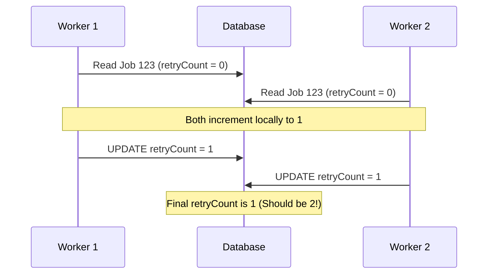
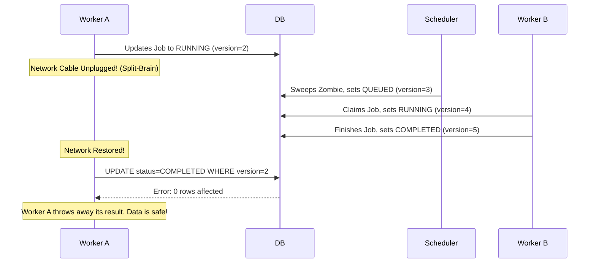

# Chapter 6: Optimistic Concurrency Control (OCC)

We now have Workers pulling jobs to process them and update PostgreSQL. But what happens if two workers accidentally pull the same job? Or worse, what if a worker crashes, the Scheduler gives its job to a new worker, and then the original worker wakes back up?

This is the most dangerous scenario in distributed systems: **The Split-Brain**. 

---

## 1. The Lost Update Problem

This is the anomaly that destroys task platforms. 



Worker 2's write overwrote Worker 1's write without knowing about it. The first update was permanently lost.

---

## Architecture Decision Record (ADR): Concurrency Strategy

### Problem
We must prevent Lost Updates when hundreds of workers access the database simultaneously.

### Options Considered
- **Option A: Serializable Isolation:** Tell the DB to run all queries sequentially. 
- **Option B: Pessimistic Locking:** Use `SELECT * FROM jobs FOR UPDATE`.
- **Option C: Optimistic Locking (OCC):** Use a `version` integer column.

### Decision
We chose **Option C (Optimistic Locking)**.

### Why not Pessimistic Locking?
If Worker A uses `FOR UPDATE`, it locks the database row. If Worker A then takes 10 seconds to generate a PDF, the row remains locked. If Worker A's network drops, the row remains locked indefinitely until a TCP timeout. This destroys database connection pools and severely limits throughput.

### How OCC Works
**Mental Model: Editing a Google Doc**
> Imagine you and a coworker open the same Google Doc. You type a paragraph and hit Save. The system sees you had version 1, and saves it as version 2. Your coworker, who was also looking at version 1, hits Save. Google Docs stops them: "Someone else edited this while you were looking at it. Please refresh before saving."

1. Worker 1 reads Job X (`version = 1`).
2. Worker 1 processes the job.
3. Worker 1 saves the job: 
```sql
UPDATE jobs SET status = 'COMPLETED', version = 2 
WHERE id = 123 AND version = 1;
```

If the `UPDATE` returns `1 row affected`, it was successful. If it returns `0 rows affected`, someone else modified the row (the version is no longer 1). Worker 1 safely aborts.

---

## 2. 📍 Our Project: OCC in Action

Let's look at exactly how OCC prevents the Split-Brain scenario in our platform.



---

## Interview & Design Discussion

**Interview Question:** *"When is Optimistic Concurrency Control a BAD choice?"*

**Expected Discussion:**
- **Weak Answer:** "OCC is always better because it doesn't use locks."
- **Strong Answer:** "OCC is terrible in environments with extremely high contention. If 1,000 workers are constantly trying to update the exact same database row, 999 of them will get OCC validation failures and have to retry. In a high-contention scenario (like a flash sale for concert tickets), Pessimistic Locking or queuing the requests through a single thread is actually more efficient because it prevents thousands of wasted retry computations."

---

## Summary

Optimistic Concurrency Control shifts the burden of synchronization away from the database engine and into the application logic. This allows for massive horizontal scale because workers never block each other. 

In the next chapter, we will look at Scheduling Algorithms.
