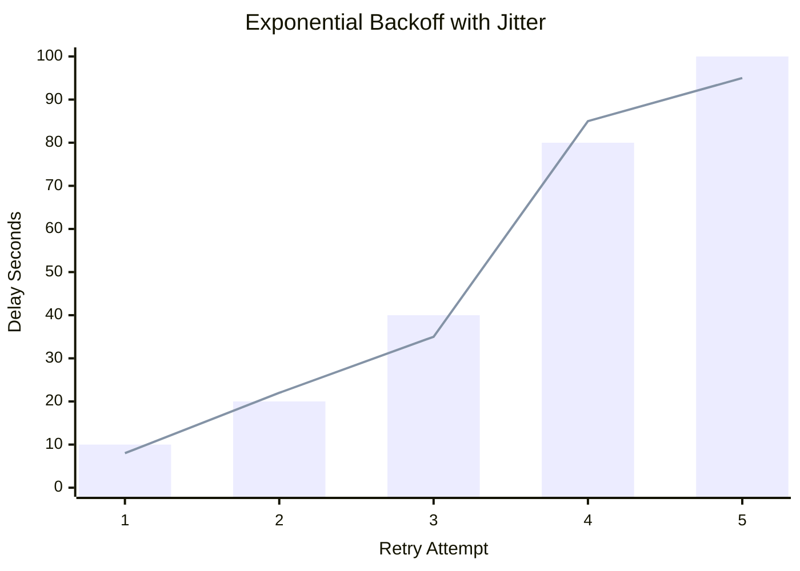

# Chapter 7: Scheduling Algorithms

In any system where work exceeds capacity, decisions must be made. Which job runs first? Which worker gets the job? When should a failed job be tried again? 

The component responsible for making these decisions is the Scheduler.

---

## 1. Task Scheduling Algorithms

### First-In, First-Out (FIFO)
Jobs are processed in the exact order they arrive.
- **Flaw:** Susceptible to "Head-of-Line Blocking." If the first job takes 20 minutes, the 100 fast jobs behind it must wait.

### Priority Scheduling
Jobs are assigned a priority (High, Medium, Low).
- **Flaw:** **Starvation**. If a constant stream of High-priority jobs arrives, the Low-priority jobs will *never* execute. 
- **📍 Our Project:** We explicitly use Priority Scheduling and accept the risk of starvation for `LOW` jobs, because critical system jobs must never be delayed.

---

## Architecture Decision Record (ADR): Worker Assignment

### Problem
How does the Scheduler physically get the job to the Worker?

### Options Considered
- **Option A: The Push Model (Centralized Dispatch):** The Scheduler tracks the CPU load of all workers and pushes jobs directly to the emptiest worker (e.g., Kubernetes).
- **Option B: The Pull Model (Work Stealing):** The Scheduler drops jobs in a Queue. Workers monitor their own CPU and pull jobs when they are ready.

### Decision
We chose **Option B (Pull Model)**.

### Why this decision?
The Push model requires the Scheduler to become a massive computational bottleneck, constantly calculating the state of the cluster. The Pull model creates perfect, automatic load balancing. A slow worker naturally pulls fewer jobs. A fast worker naturally pulls more.

### Scale Changes Everything
If we scaled to an architecture where certain jobs required GPUs (Machine Learning tasks), a pure Pull model from a single queue fails. We would need to introduce specialized queues (e.g., `queue:gpu`) or revert to a complex Push model (like Kubernetes node selectors) to route specific tasks to specific hardware.

---

## 2. Handling Failure: Exponential Backoff

When a job fails (e.g., an external API returns a 500 error), we want to retry it. But if 10,000 jobs fail because a downstream service went offline, and our workers instantly retry all 10,000 jobs, we will accidentally launch a DDoS attack against the struggling service.

### The Algorithm
We use **Exponential Backoff**. Every time a job fails, the wait time grows exponentially.
Formula: `delay = base_delay * (multiplier ^ retry_count)`

### Adding Jitter
Exponential backoff creates the "Thundering Herd" problem. If 1,000 jobs fail at exactly 12:00:00, they will all retry at exactly 12:00:10, fail again, and all retry at 12:00:30. 

To break this wave, we add **Jitter**—a small randomized variance to the delay.

*(The bar is the calculated delay; the line represents the actual randomized execution time).*

---

## Interview & Design Discussion

**Interview Question:** *"Our payment processor API is down. Thousands of our background jobs are failing and retrying in a tight loop. How do we fix this?"*

**Expected Discussion:**
- **Junior:** "Add a `setTimeout` of 5 seconds before retrying."
- **Senior:** "Use Exponential Backoff with Full Jitter so we don't hammer the payment API when it tries to come back online."
- **Principal:** "Exponential backoff protects the *downstream* service, but our workers are still wasting CPU cycles waking up just to fail. We should implement a **Circuit Breaker** on the payment API client. If it fails 5 times, we trip the circuit. The workers instantly fail the job without making the network call, saving our internal cluster resources until the circuit closes again."

---

## Summary

Scheduling is the art of matching work to resources over time. By utilizing a Pull model, we removed the burden of load balancing from our Scheduler. By implementing Exponential Backoff, we protect our external dependencies from cascading failures. 

In Chapter 8, we will explore Communication Between Services.
