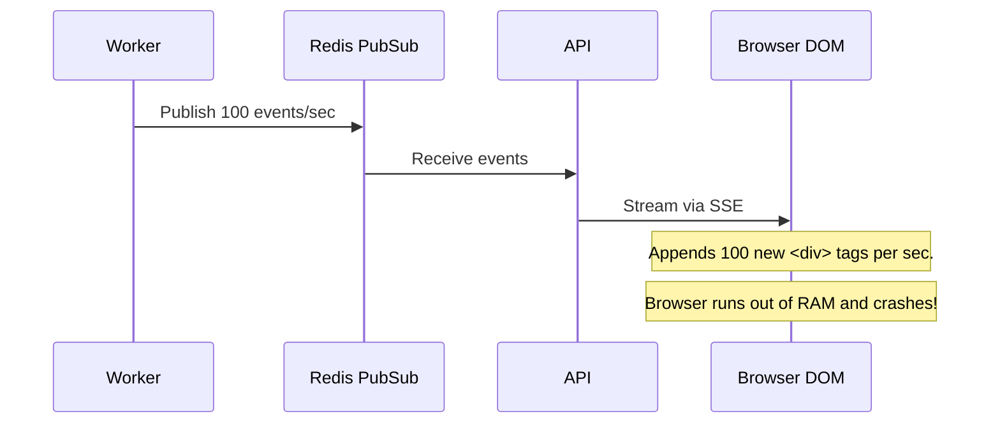

# Chapter 8: Communication Between Services

A distributed system is defined by the spaces between its components. How the API talks to the Database, how the Worker talks to the Queue, and how the Server talks to the Browser dictates the latency and coupling of the entire platform.

---

## 1. Synchronous Protocols

### REST (Representational State Transfer)
The undisputed king of the modern web, formatting data as JSON.
- **Why not gRPC?** Modern microservices heavily use gRPC (Protocol Buffers) because it serializes data into highly compressed binary, making it blazing fast. However, it is not natively supported by web browsers. Because our internal services don't talk directly to each other (they communicate via Redis), we didn't need the internal speed boost of gRPC. REST is perfectly adequate for our client dashboard.

---

## 2. Server-to-Client Real-Time Communication

When a background job finishes, how does the user's browser know? It could poll the REST API (`GET /job/123`) every 2 seconds, but this wastes massive bandwidth. We need the Server to push the update.

**Mental Model: Phone Calls vs Radio Broadcasts**
> A **WebSocket** is a phone call. Both people can talk and listen at the exact same time (Bidirectional). It requires a dedicated, open line.
> **Server-Sent Events (SSE)** is a radio broadcast. The radio station (Server) broadcasts music. You (Client) can turn on your radio and listen, but you cannot talk back to the DJ over the radio. (Unidirectional).

---

## Architecture Decision Record (ADR): Real-time Telemetry

### Problem
The Next.js dashboard needs sub-second updates when a job transitions from RUNNING to COMPLETED.

### Options Considered
- **Option A: REST Polling:** Client fires `GET` every 3 seconds.
- **Option B: WebSockets:** Bidirectional persistent TCP connection.
- **Option C: Server-Sent Events (SSE):** Unidirectional persistent HTTP connection.

### Decision
We chose **Option C (SSE)**.

### Why this decision?
Our Dashboard only needs to *listen* to telemetry. When the Dashboard needs to *send* data (create a job), it uses a standard REST POST request. Therefore, WebSockets would be overkill. SSE is built entirely on standard HTTP, making it trivial to pass through corporate firewalls and load balancers, and it natively supports automatic reconnection if the network drops.

### Trade-offs
Because SSE is strictly Server -> Client, if we ever wanted to build a real-time collaborative feature (like two users editing a job payload simultaneously), SSE would fail us, and we would have to rewrite the layer to use WebSockets.

---

## 3. The SSE DOM Explosion Bug

During development, we encountered a severe bug when load-testing SSE. 

**The Fix:** We implemented a rolling window on the client side: `events.slice(-500)`. This ensured the UI only ever rendered the 500 most recent events, preventing memory leaks while maintaining the illusion of an infinite stream.

---

## Interview & Design Discussion

**Interview Question:** *"If we use SSE, what happens if our API is behind an AWS Application Load Balancer (ALB) configured with a 60-second idle timeout?"*

**Expected Discussion:**
- **Junior:** "SSE stays open forever, so it will just work."
- **Senior:** "The ALB will kill the SSE connection after 60 seconds if no jobs finish, because the TCP connection is idle. To fix this, the API must implement a 'Keep-Alive' ping. The server must push an empty comment `:\n\n` down the SSE stream every 30 seconds to trick the ALB into thinking the connection is active."

---

## Summary

By carefully selecting communication protocols based on their specific strengths, we created a highly responsive system that avoids the overhead of overly complex tech like gRPC or WebSockets where they aren't strictly needed.

In the next chapter, we will explore Distributed Systems Patterns—the standardized architectural blueprints used to keep chaotic systems stable.
