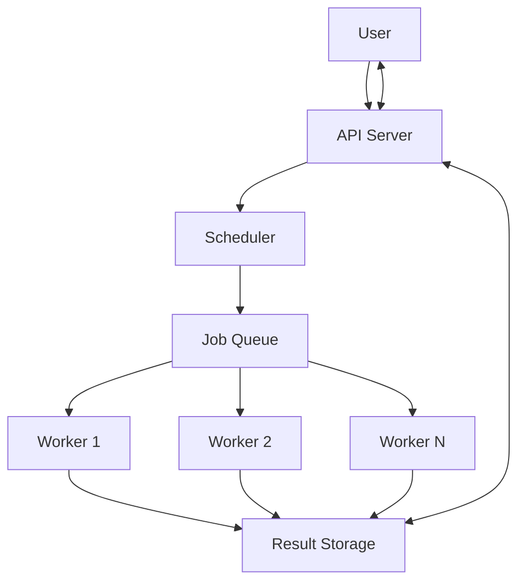

## Components

### API Server
- Authenticates users
- Validates requests
- Creates jobs
- Returns job IDs

### Scheduler
- Manages job assignment
- Handles retries
- Monitors workers

### Job Queue
- Stores pending jobs
- Provides durable job storage

### Workers
- Execute jobs
- Update progress
- Store results

### Result Storage
- Stores outputs
- Stores failure reasons
- Stores execution history