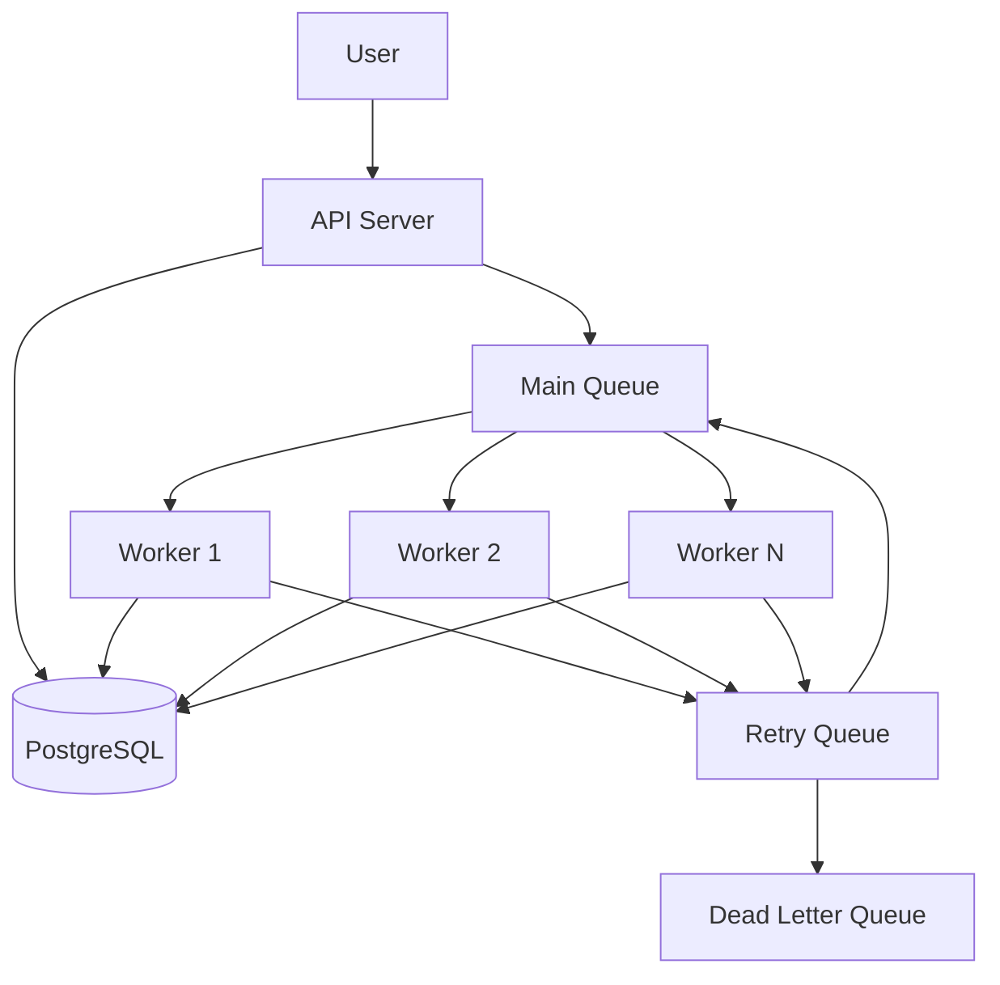
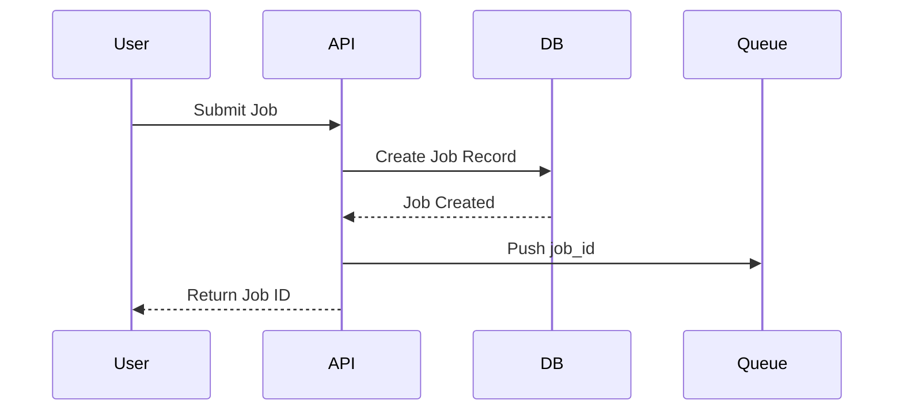
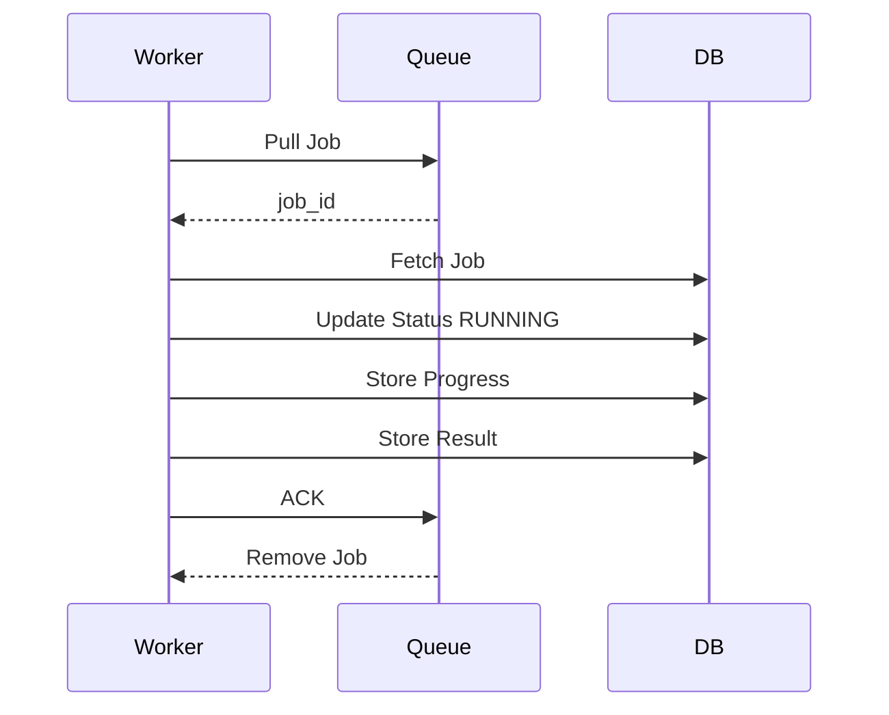
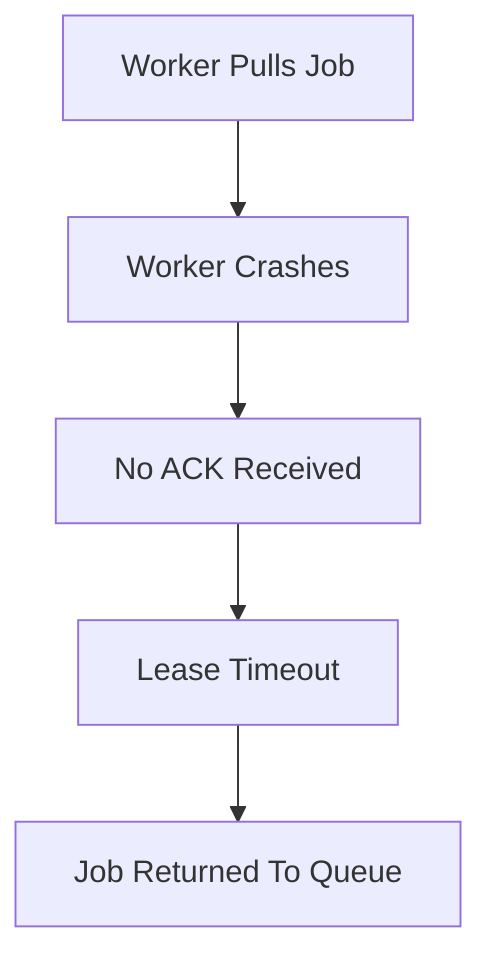
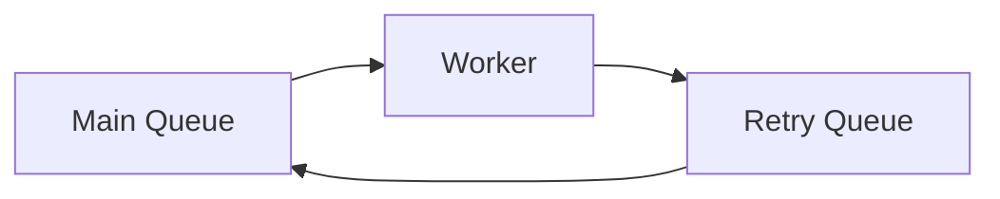
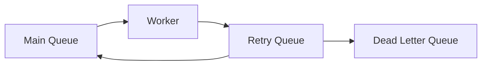
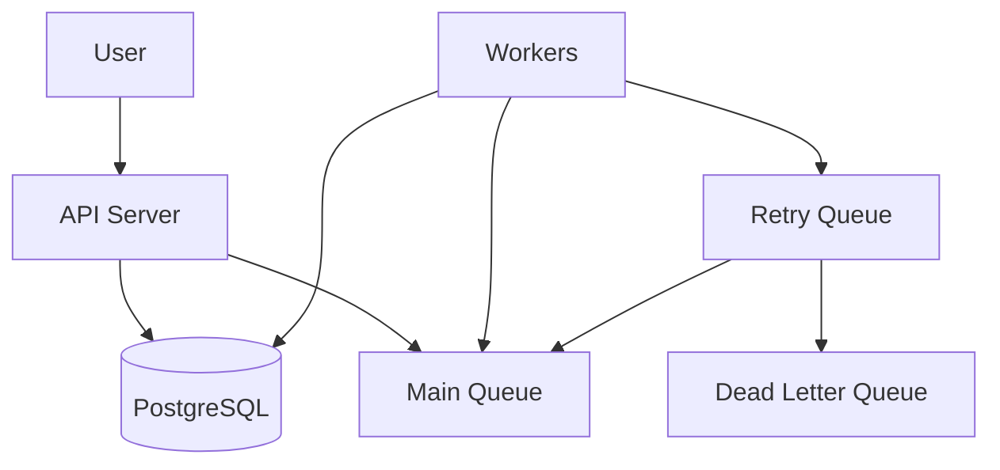

Queue Design

Overview

The queue acts as an intermediary layer between job producers (API Server) and job consumers (Workers).

Its primary purpose is to decouple job submission from job execution, allowing the system to process large numbers of jobs asynchronously while maintaining reliability and scalability.

---

Objectives

The queue must satisfy the following requirements:

- Reliable job storage
- Asynchronous processing
- Horizontal scalability
- Failure recovery
- Retry support
- Prevention of job loss
- Efficient worker utilization

---

High Level Architecture

Queue Strategy

Pull-Based Processing

Workers pull jobs from the queue when they are ready.

Advantages

- Simplifies queue logic
- Enables horizontal scaling
- Prevents worker overload
- Naturally balances workload

Workflow

sequenceDiagram

participant Worker
participant Queue

Worker->>Queue: Request Job
Queue-->>Worker: Return job_id

---

Queue Message Format

The queue stores only:

job_id

Example:

12345

Reasoning

The database remains the single source of truth.

Benefits

- Smaller queue size
- Easier retries
- No duplicate job state
- Simplified updates

---

Job Submission Flow

---

Job Processing Flow

---

Reliable Delivery

The system uses acknowledgement-based processing.

Reserved / In-Flight State

When a worker pulls a job:

Job Status = Reserved

The job is temporarily hidden from other workers.

The job is removed permanently only after successful acknowledgement.

---

Worker Failure Recovery

Retry Mechanism

Some failures are temporary:

- Network issues
- External API downtime
- Service restarts

Such jobs should be retried automatically.

---

Retry Queue

Failed jobs are moved to a retry queue.

---

Retry Policy

Attempt| Delay
Retry 1| 10 Seconds
Retry 2| 30 Seconds
Retry 3| 60 Seconds
Retry 4| 120 Seconds

Maximum Retry Count:

4

---

Dead Letter Queue (DLQ)

Jobs exceeding the retry limit are moved to a Dead Letter Queue.

Reasons

- Prevent infinite retry loops
- Preserve failure information
- Enable debugging

---

DLQ Workflow

---

Failure Handling Strategy

Failure Type| Action
Worker Crash| Requeue Job
Temporary API Failure| Retry
Network Failure| Retry
Invalid Input| Move To DLQ
Retry Limit Exceeded| Move To DLQ

---

Final Queue Architecture

---

Design Decisions

1. Pull-based job retrieval.
2. Queue stores only job IDs.
3. PostgreSQL is the source of truth.
4. ACK-based message processing.
5. Reserved/In-Flight job state.
6. Retry queue with delayed retries.
7. Dead Letter Queue for permanent failures.
8. Maximum retry count of 4.
9. Horizontal worker scalability.

---

Summary

The queue acts as a reliable buffer between job producers and workers. It ensures jobs are not lost, supports retries, enables horizontal scaling, and provides fault tolerance through acknowledgement-based processing, retry queues, and dead letter queues.