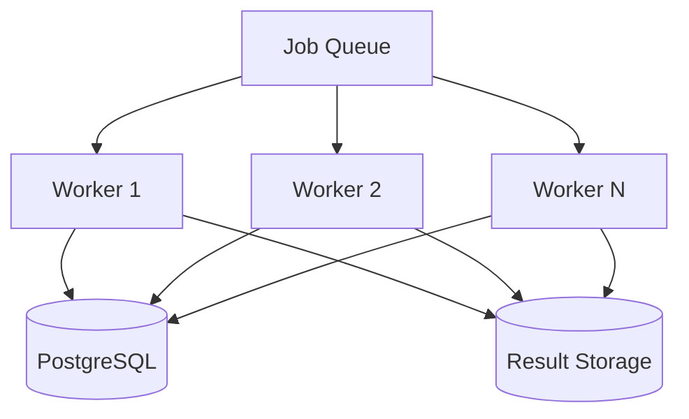
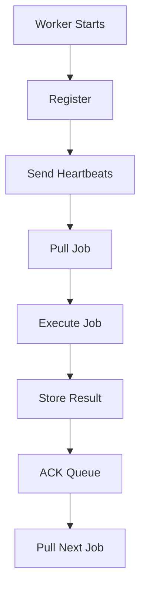
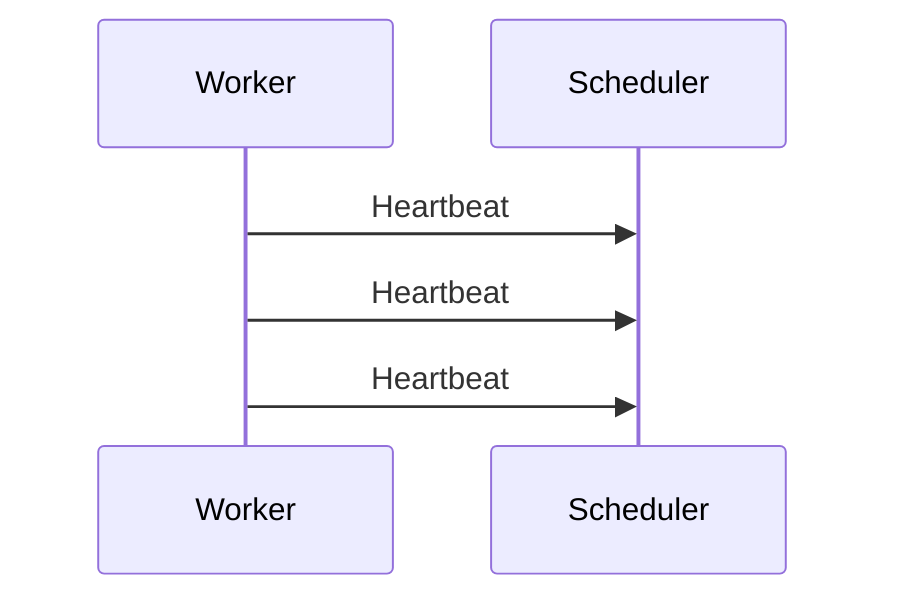
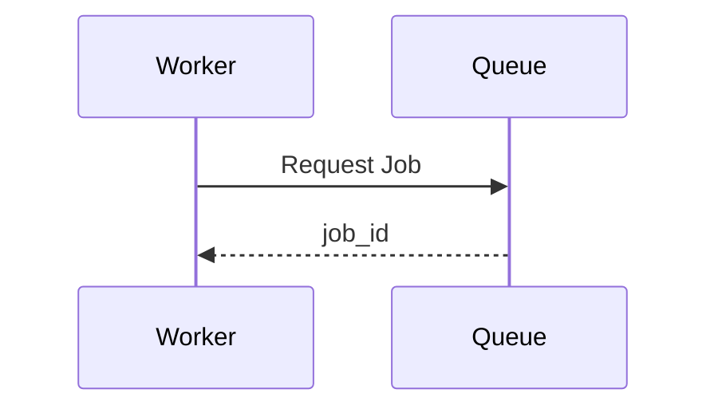
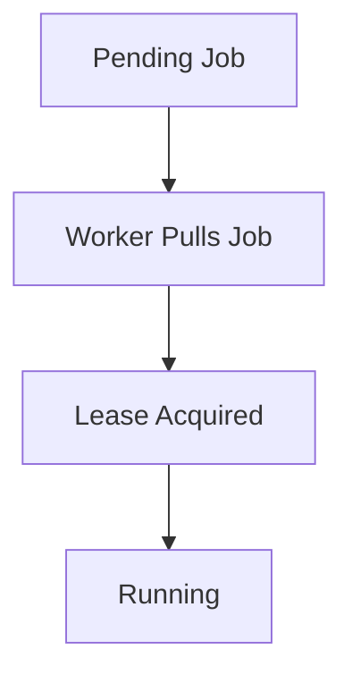
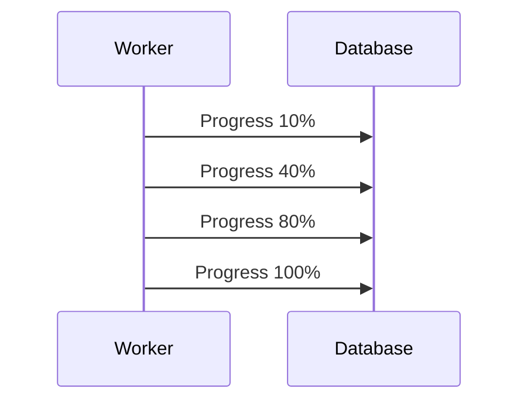
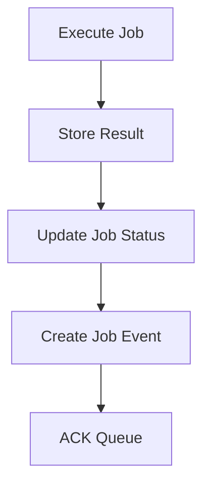
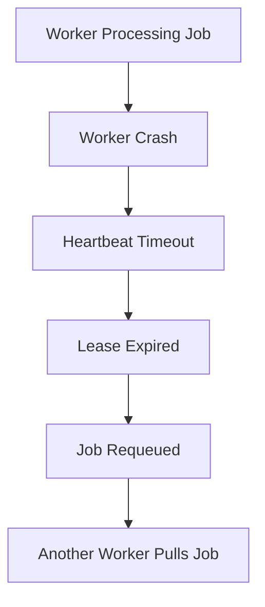
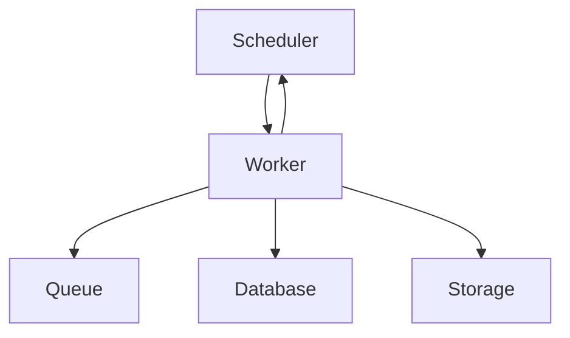

Worker Design

Overview

Workers are the execution engines of the platform.

They continuously pull jobs from the queue, execute them, report progress, store results, and acknowledge completion.

Workers are designed to be stateless and horizontally scalable, allowing the system to increase processing capacity by simply adding more workers.

---

Objectives

The worker subsystem must provide:

- Reliable job execution
- Horizontal scalability
- Failure recovery
- Progress tracking
- Result storage
- Load balancing
- Fault tolerance
- High availability

---

High Level Architecture

---

Worker Responsibilities

Each worker is responsible for:

1. Registering itself
2. Advertising capacity
3. Sending heartbeats
4. Pulling jobs
5. Executing jobs
6. Reporting progress
7. Saving checkpoints
8. Storing results
9. Acknowledging completion
10. Recovering from failures

---

Worker Lifecycle

---

Worker Registration

When a worker starts, it registers with the scheduler.

Example:

{
  "workerId": "worker-17",
  "status": "active",
  "capacity": 3,
  "currentLoad": 0
}

---

Registration Information

Each worker advertises:

Field| Purpose
workerId| Unique worker identifier
status| Active / Busy / Offline
capacity| Maximum parallel jobs
currentLoad| Current jobs being processed
lastHeartbeat| Failure detection

---

Runtime Entity Design

Workers are runtime entities.

They are not permanently stored in PostgreSQL.

Reasons:

- Workers are frequently created and destroyed
- Autoscaling causes worker counts to change
- Worker information is temporary
- Persistent storage would accumulate stale entries

Worker metadata can be stored in:

- Redis
- Service Registry
- In-memory Scheduler State

---

Capacity Tracking

Workers advertise their capacity.

Example:

Worker Capacity = 3

Current Load = 2

Available Slots = 1

The scheduler can use this information to distribute work efficiently.

---

Heartbeats

Workers periodically send heartbeats.

Example:

Every 5 Seconds

Heartbeat message:

{
  "workerId": "worker-17",
  "status": "active",
  "currentLoad": 2
}

---

Heartbeat Flow

---

Failure Detection

Workers are not declared dead after one missed heartbeat.

Example:

Heartbeat Interval = 5 Seconds

Timeout = 15 Seconds

Missed Heartbeats = 3

If no heartbeat is received before timeout:

Worker Status = DEAD

---

Job Retrieval

Workers use a pull-based model.

Benefits:

- Better scalability
- Natural load balancing
- Simpler architecture
- Reduced worker overload

---

Job Pull Flow

---

Lease-Based Ownership

When a worker receives a job:

Job Status = RUNNING
Owner = worker-17
Lease Expiry = 15 Seconds

The lease prevents multiple workers from processing the same job.

---

Lease Workflow

---

Progress Reporting

Workers periodically update progress.

Example:

10%
25%
40%
60%
80%
100%

Progress is stored in the Job table.

Benefits:

- User visibility
- Monitoring
- Failure recovery
- Checkpointing

---

Progress Update Flow

---

Checkpointing

Workers periodically save execution state.

Example:

Progress = 80%

Worker Crashes

Another worker can resume from:

80%

instead of restarting from:

0%

---

Result Storage

After successful execution, workers store results.

Examples:

- PDF
- Image
- Video
- ZIP File
- AI Response

Workers store:

Result URL
Metadata
File Size

The actual files are stored in object storage.

Examples:

- S3
- MinIO
- Cloud Storage

---

Completion Workflow

Workers must store results before acknowledging the queue.

---

Why Store Results Before ACK?

Correct Order:

Store Result
     ↓
ACK Queue

If the worker crashes before ACK:

Result Already Stored

No data is lost.

Incorrect Order:

ACK Queue
     ↓
Store Result

If the worker crashes:

Job Removed
Result Lost

This creates permanent data loss.

---

Worker Failure Recovery

If a worker crashes:

1. Heartbeats stop
2. Lease expires
3. Scheduler detects failure
4. Job is requeued
5. Another worker resumes processing

---

Recovery Flow

---

Final Worker Architecture

---

Design Decisions

1. Workers are runtime entities.
2. Workers register on startup.
3. Workers advertise capacity and load.
4. Workers send heartbeats every few seconds.
5. Pull-based job retrieval is used.
6. Lease-based ownership prevents duplicate execution.
7. Progress is reported periodically.
8. Checkpointing supports recovery.
9. Results are stored before acknowledgement.
10. Failed jobs are requeued after lease expiration.
11. Workers are horizontally scalable.

---

Summary

Workers are responsible for executing jobs reliably and efficiently. They register with the scheduler, pull jobs from the queue, track progress, store results, and recover from failures. Through heartbeats, leases, checkpointing, and acknowledgement-based processing, the worker subsystem provides fault-tolerant and scalable job execution.