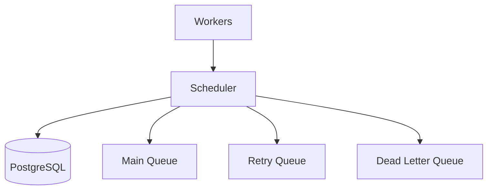
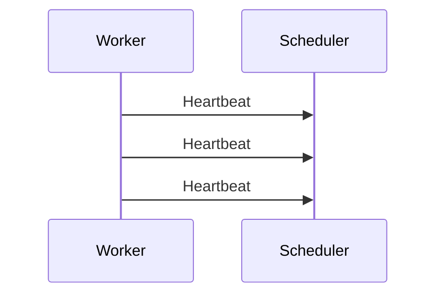
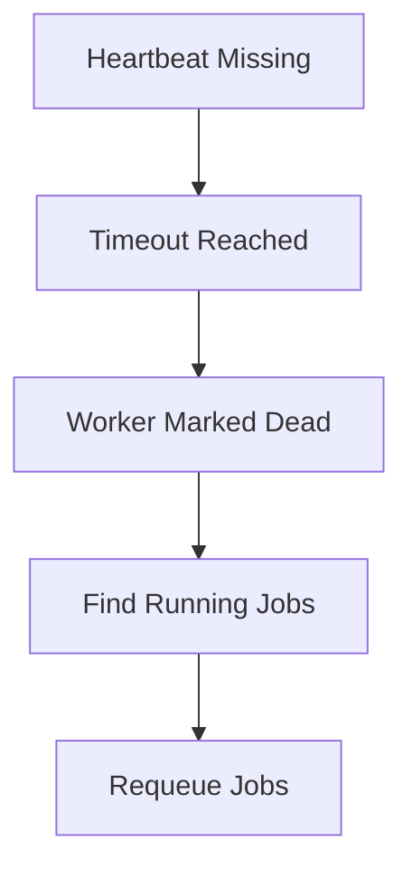
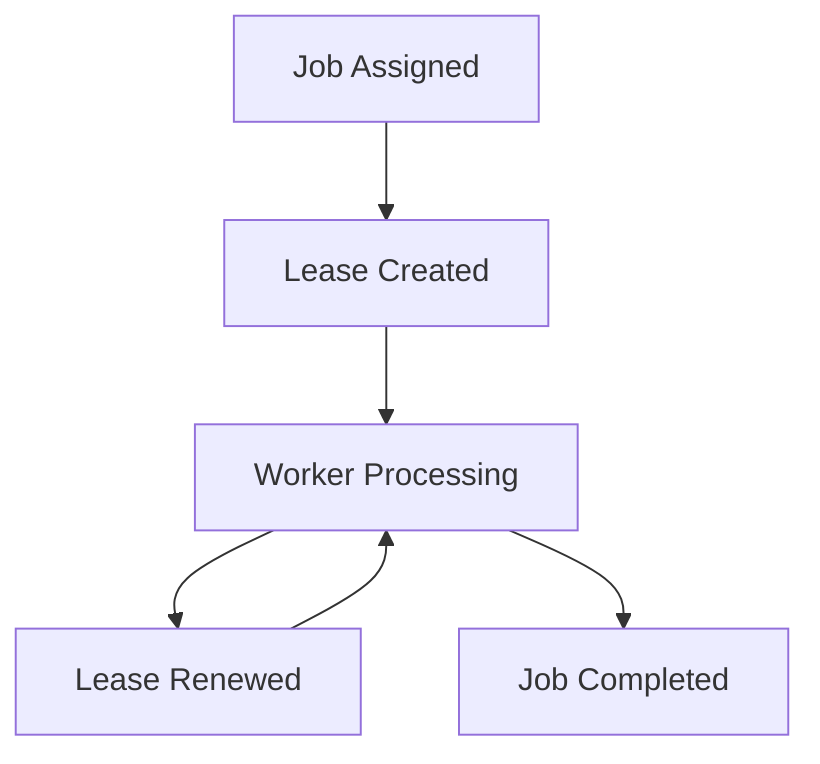
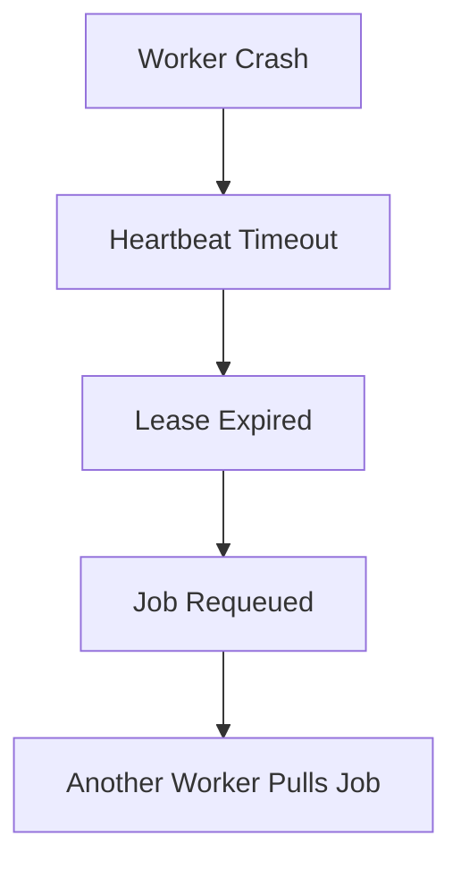
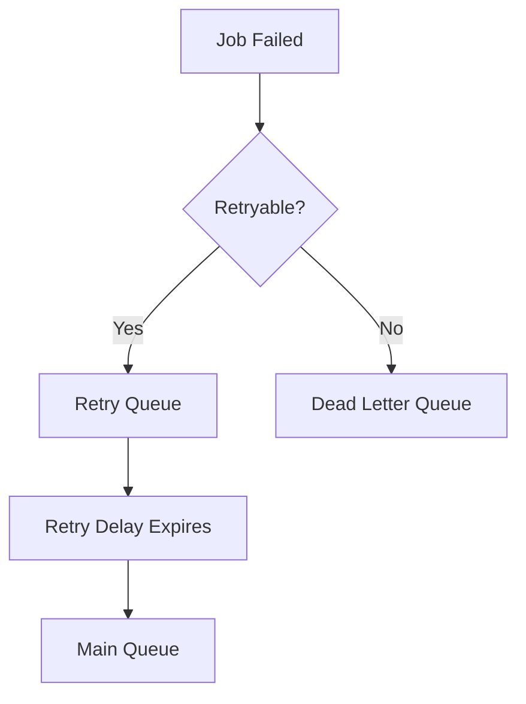
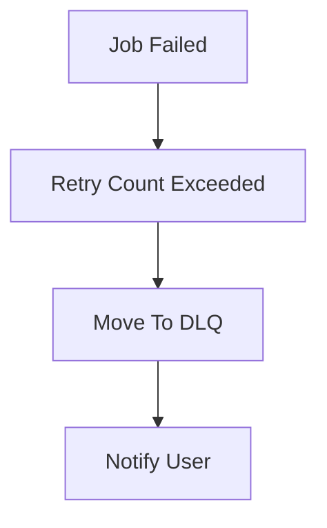
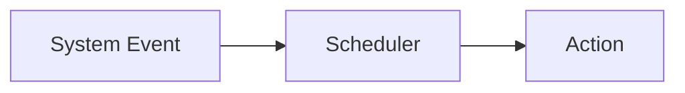
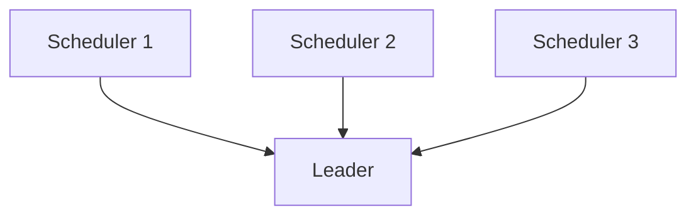
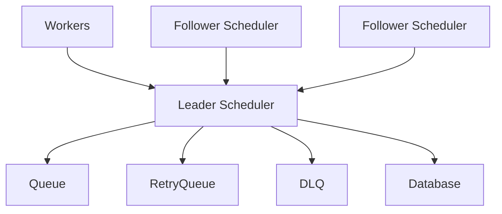

Scheduler Design

Overview

The Scheduler is the coordination layer of the platform.

Unlike workers, the scheduler does not execute jobs. Instead, it monitors workers, manages retries, handles lease expiration, recovers failed jobs, and ensures reliable execution across the cluster.

The scheduler acts as the control plane of the distributed task processing platform.

---

Objectives

The scheduler must provide:

- Worker monitoring
- Failure detection
- Lease management
- Retry management
- DLQ management
- Event processing
- High availability
- Fault tolerance

---

High Level Architecture

---

Scheduler Responsibilities

The scheduler is responsible for:

1. Tracking active workers
2. Monitoring heartbeats
3. Detecting worker failures
4. Managing leases
5. Requeueing expired jobs
6. Managing retries
7. Classifying failures
8. Moving jobs to DLQ
9. Processing system events
10. Coordinating scheduler instances

---

Worker Registration Tracking

When workers start, they register with the scheduler.

Example:

{
  "workerId": "worker-17",
  "capacity": 3,
  "currentLoad": 0,
  "status": "active"
}

The scheduler maintains metadata about active workers.

---

Worker Monitoring

The scheduler tracks:

- Worker status
- Worker capacity
- Current load
- Last heartbeat

Example:

Worker| Capacity| Current Load
Worker-1| 3| 2
Worker-2| 5| 5
Worker-3| 2| 1

This information helps monitor cluster health.

---

Heartbeat Monitoring

Workers periodically send heartbeats.

---
Failure Detection

Workers are not considered dead after a single missed heartbeat.

Example:

Heartbeat Interval = 5 Seconds

Missed Heartbeats Allowed = 3

Timeout = 15 Seconds

If no heartbeat is received within the timeout window:

Worker Status = DEAD

---

Worker Failure Recovery

---

Lease Management

Each running job is protected by a lease.

Example:

Job ID = job-123

Worker = worker-17

Lease Expiry = 10:30:00

The scheduler monitors lease expiration to recover abandoned jobs.

---

Lease Lifecycle

---

Expired Lease Recovery

If a worker crashes, the lease eventually expires.

The scheduler then requeues the job.

---

Retry Management

Workers report failures.

Example:

{
  "jobId": "123",
  "status": "FAILED",
  "reason": "API_TIMEOUT"
}

The scheduler determines whether the job should be retried.

Workers never make retry decisions.

---

Failure Classification

Retryable Failures

API_TIMEOUT

NETWORK_ERROR

SERVICE_UNAVAILABLE

RATE_LIMITED

Action:

Retry Job

---

Non-Retryable Failures

INVALID_INPUT

FILE_NOT_FOUND

UNSUPPORTED_FORMAT

AUTHORIZATION_FAILED

Action:

Move To DLQ

---

Retry Workflow

---

Retry Policy

Attempt| Delay
Retry 1| 10 Seconds
Retry 2| 30 Seconds
Retry 3| 60 Seconds
Retry 4| 120 Seconds

Maximum Retry Count:

4

---

Dead Letter Queue (DLQ)

Jobs exceeding retry limits or experiencing permanent failures are moved to the Dead Letter Queue.

Reasons:

- Invalid input
- Unsupported format
- Authorization failure
- Retry limit exceeded

---

DLQ Workflow

---

Event-Driven Scheduling

The scheduler reacts to events instead of continuously scanning the database.

Examples:

Worker Registered

Heartbeat Received

Heartbeat Timeout

Lease Expired

Job Failed

Retry Ready

Job Completed

---

Event Processing Flow

---

Why Not Database Polling?

Bad Approach:

SELECT *
FROM Jobs;

every few seconds.

Problems:

- Expensive
- Poor scalability
- Wasted resources

---

Better Approach:

Event Occurs
      ↓
Scheduler Reacts

This scales significantly better.

---

High Availability

A single scheduler creates a Single Point of Failure.

To avoid this, multiple scheduler instances are deployed.

Example:

Scheduler-1

Scheduler-2

Scheduler-3

---

Leader Election

Only one scheduler acts as leader.

Leader Responsibilities:

- Lease recovery
- Retry processing
- DLQ processing
- Requeue operations

Followers remain on standby.

---

Majority Consensus

Leader election requires majority agreement.

Example:

3 Schedulers

Majority = 2

Result:

Scheduler-1 → Leader

Scheduler-2 → Follower

Scheduler-3 → Follower

This prevents multiple leaders from existing simultaneously.

---

Split-Brain Prevention

Without leader election:

Scheduler-1 Requeues Job-123

Scheduler-2 Requeues Job-123

Result:

Duplicate Processing

Leader election prevents conflicting decisions.

---

Final Scheduler Architecture

---

Design Decisions

1. Scheduler acts as the system coordinator.
2. Workers pull jobs independently.
3. Scheduler tracks worker heartbeats.
4. Scheduler manages job leases.
5. Expired jobs are automatically requeued.
6. Retry logic is centralized.
7. Failure classification determines retryability.
8. Event-driven scheduling is preferred over polling.
9. Multiple scheduler instances provide high availability.
10. Leader election prevents split-brain scenarios.
11. Majority consensus selects the leader.

---

Summary

The Scheduler serves as the control plane of the distributed task processing platform. It monitors workers, manages leases, coordinates retries, handles failures, processes events, and ensures reliable recovery from crashes. Through leader election, heartbeat monitoring, lease management, and event-driven coordination, the scheduler provides fault-tolerant and scalable orchestration of the entire system.