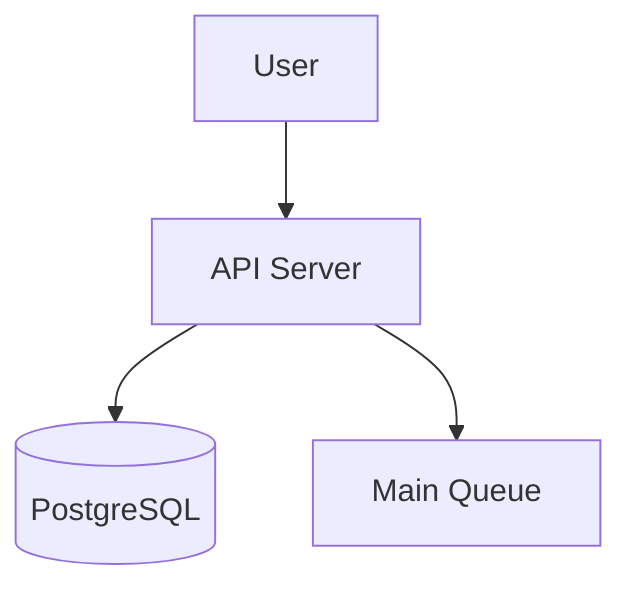
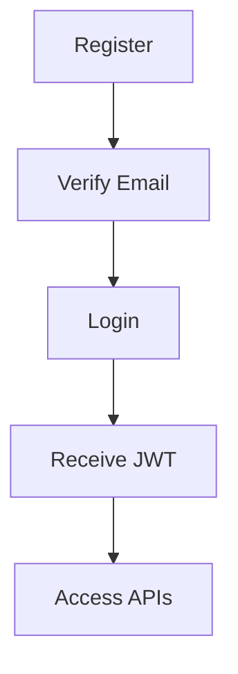
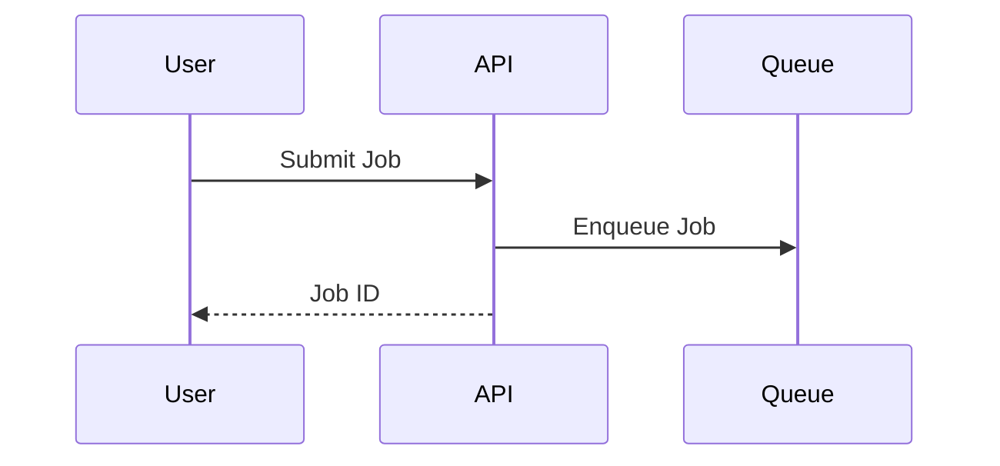
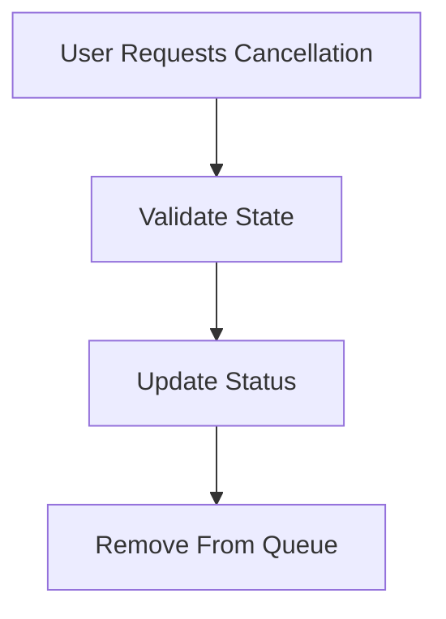
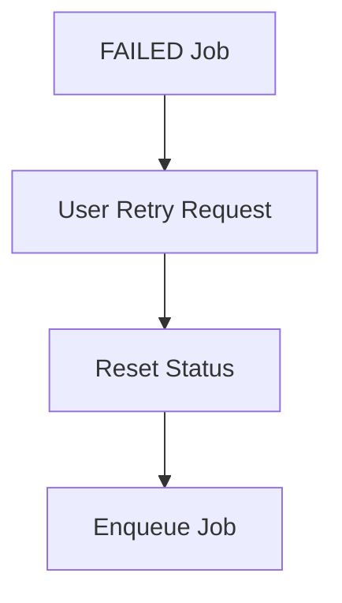
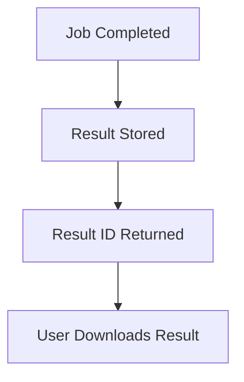
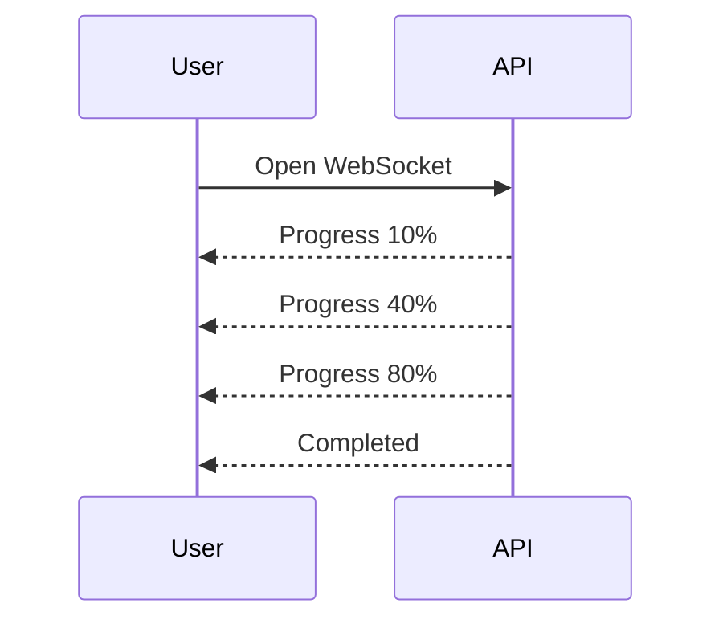
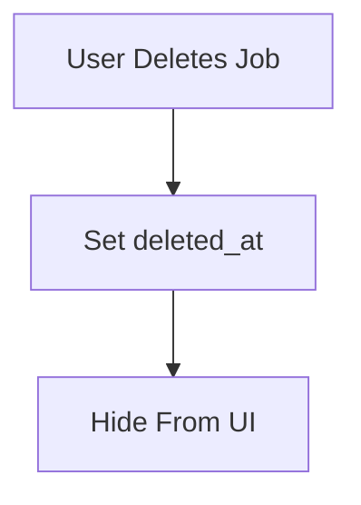

API Design

Overview

The API Server is the entry point for users interacting with the Distributed Task Processing Platform.

Responsibilities:

- Authentication
- Job Submission
- Job Tracking
- Result Retrieval
- Job Cancellation
- Manual Retry
- Real-Time Updates

---

High Level API Flow

---

Authentication

All API endpoints require authentication.

Authentication Method:

JWT Bearer Token

Flow:

---

Authentication APIs

Register

POST /auth/register

Request:

{
  "email": "user@example.com",
  "password": "password123"
}

Response:

{
  "message": "Verification email sent"
}

---

Verify Email

POST /auth/verify-email

---

Login

POST /auth/login

Request:

{
  "email": "user@example.com",
  "password": "password123"
}

Response:

{
  "accessToken": "jwt-token"
}

---

Job APIs

Submit Job

POST /jobs

Request:

{
  "jobType": "PDF_GENERATION",
  "payload": {
    "documentUrl": "file.pdf"
  }
}

Response:

{
  "jobId": "job-123",
  "status": "PENDING"
}

---

Job Submission Flow

---

Get Job Status

GET /jobs/{jobId}

Response:

{
  "jobId": "job-123",
  "status": "RUNNING",
  "progress": 60
}

---

List Jobs

GET /jobs?cursor=abc123&limit=20

Response:

{
  "jobs": [],
  "nextCursor": "xyz456"
}

---

Pagination

Pagination Strategy:

Cursor Pagination

Reason:

- Better scalability
- Faster than offset pagination
- Suitable for large datasets

---

Job Cancellation

Allowed States:

PENDING
QUEUED
RETRYING

Endpoint:

POST /jobs/{jobId}/cancel

Response:

{
  "status": "CANCELLED"
}

---

Cancellation Flow

---

Manual Retry

Users can retry failed jobs.

Endpoint:

POST /jobs/{jobId}/retry

Conditions:

Job Must Be FAILED
User Must Own Job

Response:

{
  "jobId": "job-123",
  "status": "PENDING"
}

---

Retry Flow

---

Result APIs

Results are stored separately from jobs.

---

Get Result

GET /results/{resultId}

Response:

{
  "resultId": "result-456",
  "resultUrl": "/storage/result.pdf"
}

---

Result Retrieval Flow

---

Real-Time Updates

Two approaches are supported.

Polling

GET /jobs/{jobId}

Used by:

- Mobile apps
- CLI clients
- Third-party integrations

---

WebSocket

/ws/jobs/{jobId}

Used for:

- Live dashboards
- Real-time progress updates

---

WebSocket Flow

---

Soft Delete

Jobs are not permanently deleted.

Database Fields:

deleted_at

Flow:

---

Security

Security Measures:

- JWT Authentication
- Email Verification
- Input Validation
- Authorization Checks
- Rate Limiting
- HTTPS
- Request Logging

---

API Design Decisions

1. JWT Authentication
2. Email Verification
3. Async Job Submission
4. Cursor Pagination
5. Polling Support
6. WebSocket Support
7. Separate Result Storage
8. Manual Retry Support
9. Cancellation for Pending Jobs
10. Soft Delete
11. Rate Limiting

---

Summary

The API layer provides secure access to the Distributed Task Processing Platform. It supports asynchronous job submission, job tracking, result retrieval, cancellation, retries, and real-time updates while maintaining scalability, security, and fault tolerance.