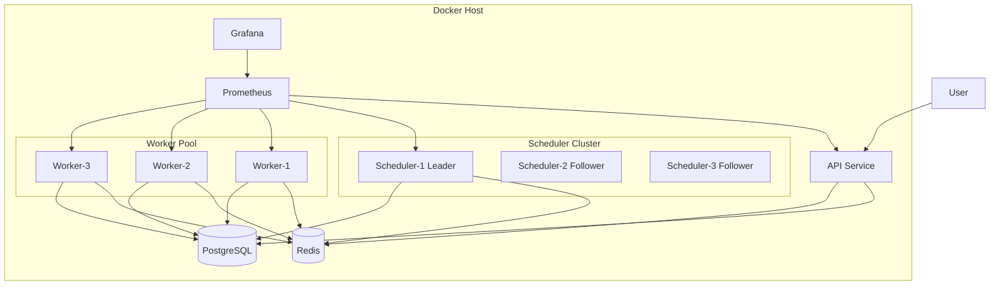
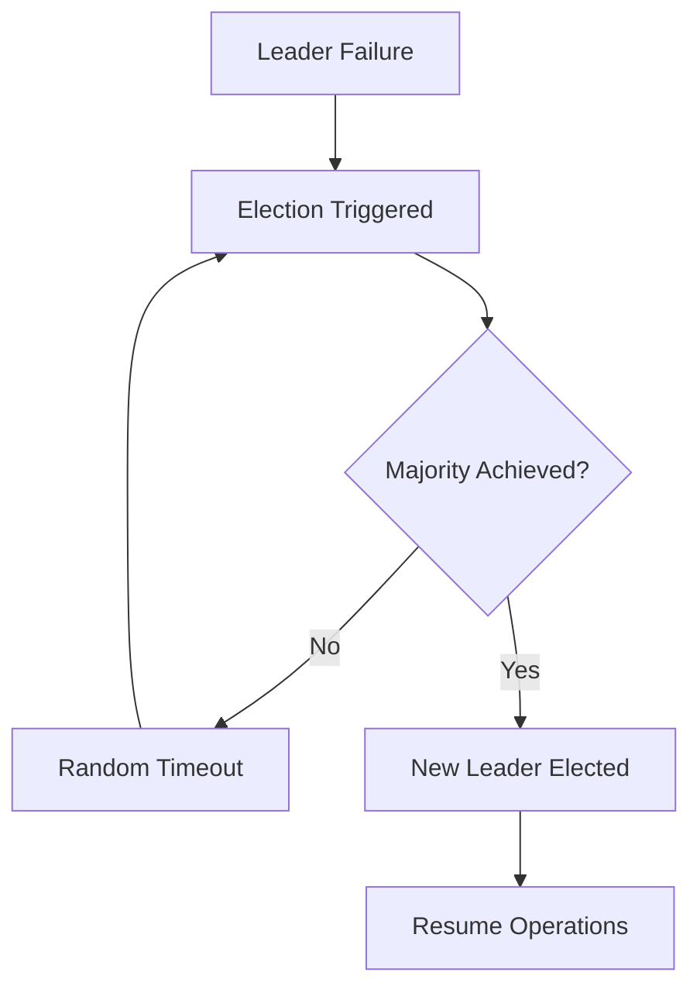
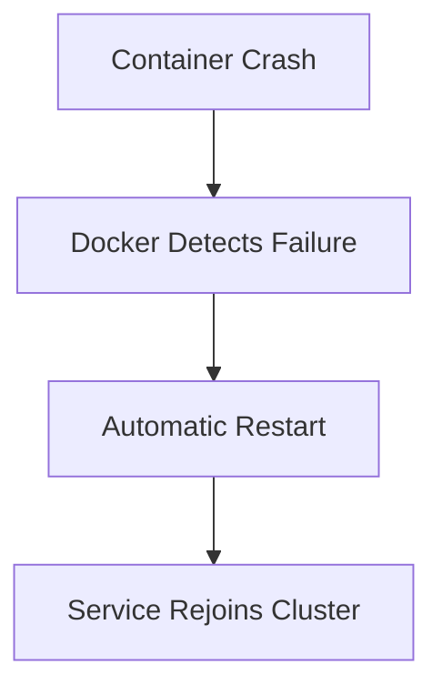
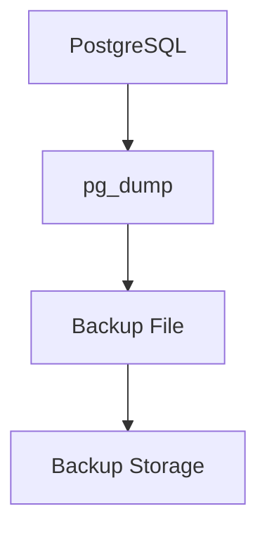

Overview

The Distributed Task Processing Platform is deployed using Docker containers on a single host machine. The deployment is designed to be cost-effective, easy to manage, and capable of demonstrating production-grade concepts such as fault tolerance, monitoring, automated recovery, and service isolation.

The system uses a microservices architecture where API, Scheduler, and Worker services are deployed independently while sharing common infrastructure components.

---

Deployment Goals

The deployment architecture aims to achieve:

- Service Isolation
- Easy Deployment
- Fault Tolerance
- Horizontal Worker Scaling
- Monitoring and Observability
- Automated Recovery
- Simple Maintenance
- Low Cost Deployment

---

Deployment Architecture

---

Container Layout

The deployment consists of the following containers:

Container| Purpose
API Service| User-facing APIs
Scheduler-1| Leader scheduler
Scheduler-2| Follower scheduler
Scheduler-3| Follower scheduler
Worker-1| Job processing
Worker-2| Job processing
Worker-3| Job processing
Redis| Queue infrastructure
PostgreSQL| Source of truth
Prometheus| Metrics collection
Grafana| Monitoring dashboards

---

Containerization Strategy

The platform uses Docker containers for all services.

Benefits:

- Environment consistency
- Easy deployment
- Service isolation
- Simplified scaling
- Portable infrastructure

Each service contains:

Application Code
Runtime Dependencies
Configuration

and can be deployed independently.

---

Service Discovery

Containers communicate through Docker's internal DNS system.

Example:

DB_HOST=postgres
REDIS_HOST=redis

Instead of relying on fixed IP addresses, services resolve each other using Docker service names.

Benefits:

- No hardcoded addresses
- Container restart safety
- Easy scaling
- Simplified configuration

---

Scheduler Deployment

The platform deploys three scheduler instances.

Scheduler-1
Scheduler-2
Scheduler-3

At any time:

One Leader
Two Followers

Responsibilities of the leader:

- Lease monitoring
- Retry management
- DLQ handling
- Worker monitoring
- Job recovery

Followers remain standby and participate in leader elections.

---

Leader Election

Leader election uses majority consensus.

Recovery flow:

If the leader crashes, followers elect a new leader automatically.

---

Worker Deployment

Workers are deployed as independent containers.

Worker-1
Worker-2
Worker-3

Benefits:

- Parallel job execution
- Fault isolation
- Easy scaling

Additional workers can be created using:

docker compose up --scale worker=5

---

Configuration Management

Application configuration is provided through environment variables.

Example:

PORT=5000
DATABASE_URL=...
REDIS_URL=...
JWT_SECRET=...
MAX_RETRIES=4

Benefits:

- Environment-specific configuration
- Improved security
- Easy deployment
- Twelve-factor compliance

---

Automatic Recovery

Containers use Docker restart policies.

Example:

restart: unless-stopped

Recovery flow:

Benefits:

- Reduced downtime
- Automatic recovery
- Minimal operational effort

---

Monitoring and Observability

The platform uses:

Prometheus
Grafana

Prometheus Responsibilities

- Collect metrics
- Store time-series data
- Enable alerting

Grafana Responsibilities

- Dashboards
- Visualization
- System monitoring

Monitored Metrics

Queue Length
Worker Count
Job Throughput
Failure Rate
Retry Rate
CPU Usage
Memory Usage
API Latency

---

Logging Strategy

Current version uses structured application logs.

Example:

{
  "jobId":"job-123",
  "workerId":"worker-2",
  "status":"FAILED",
  "reason":"API_TIMEOUT"
}

Benefits:

- Easy debugging
- Lightweight deployment
- Low operational overhead

Future enhancement:

Grafana Loki
Centralized Log Aggregation

---

Backup Strategy

The platform performs daily PostgreSQL backups.

Backup flow:

Benefits:

- Disaster recovery
- Data protection
- Low operational complexity

Recovery process:

Database Failure
↓
Restore Latest Backup
↓
Resume Operations

---

Deployment Orchestration

The platform uses Docker Compose.

Responsibilities:

- Container lifecycle management
- Networking
- Volume management
- Environment configuration

Benefits:

- Easy setup
- Single command deployment
- Suitable for single-host deployments
- Low operational complexity

Deployment command:

docker compose up -d

---

Future Enhancements

Potential production upgrades include:

Kubernetes Deployment
Multi-Host Clusters
Database Replication
Automatic Failover
Auto Scaling Workers
Centralized Logging
Distributed Tracing
Object Storage For Results

---

Summary

The deployment architecture provides:

Docker-Based Deployment
Microservices Architecture
Leader Election
Fault Tolerance
Automatic Recovery
Monitoring
Daily Backups
Environment-Based Configuration
Horizontal Worker Scaling

while maintaining a cost-effective single-host deployment suitable for development, portfolio demonstration, and future production expansion.