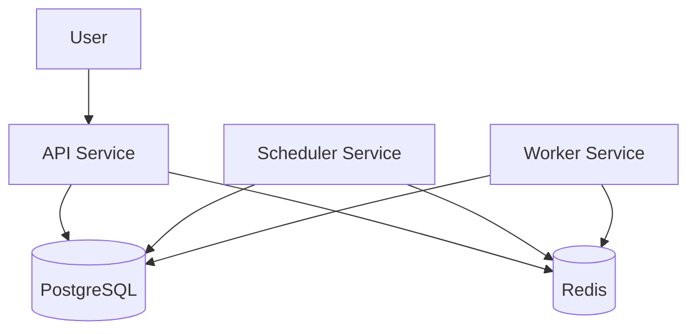
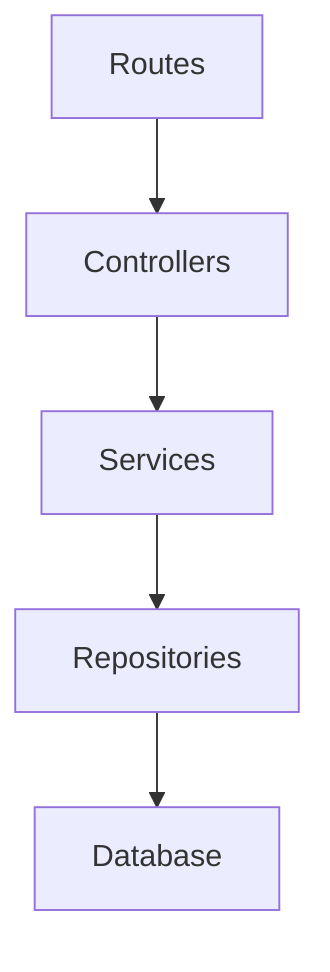
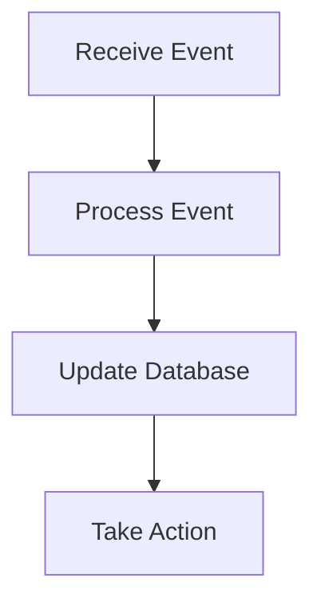
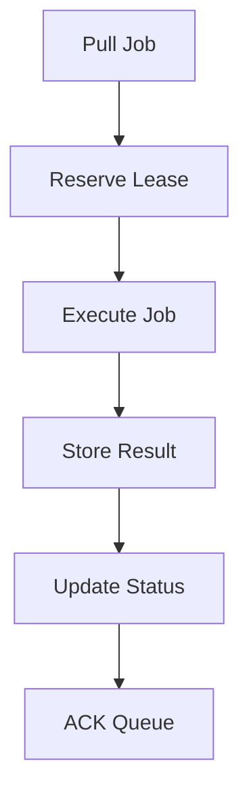
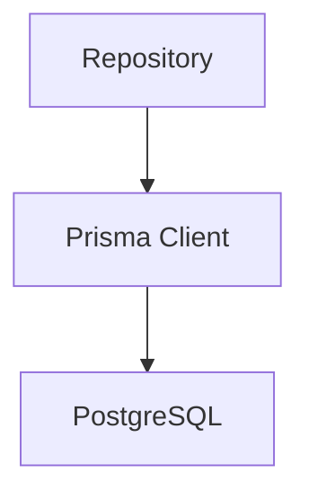
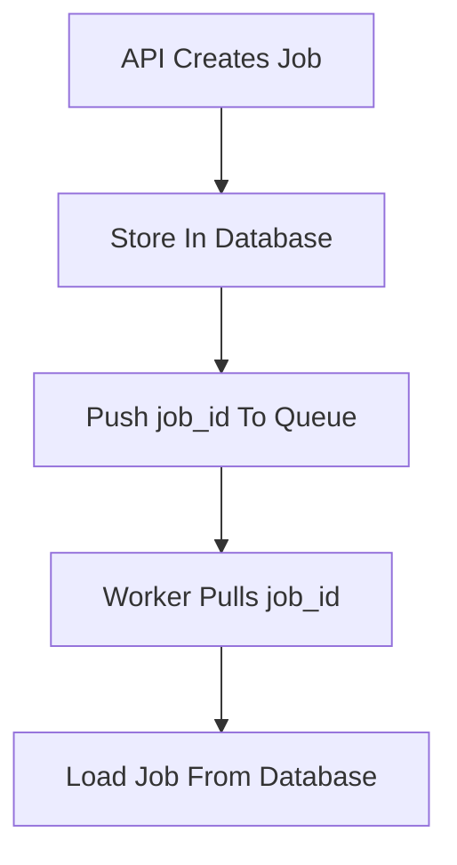
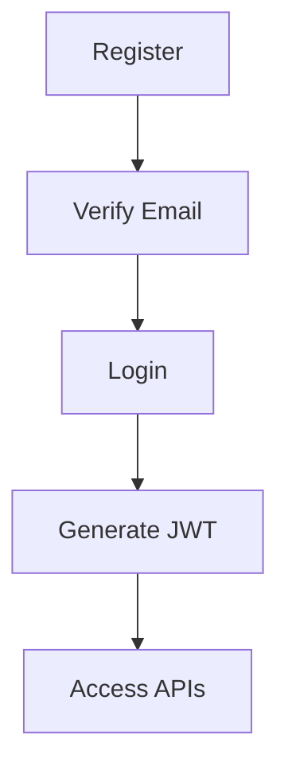

## Overview

The Distributed Task Processing Platform follows a microservices architecture where each service is independently deployable and responsible for a specific business function.

The implementation focuses on:

- Service Separation
- Layered Architecture
- Maintainability
- Scalability
- Fault Tolerance
- Code Reusability

The platform is implemented using Node.js, Express, PostgreSQL, Prisma, Redis, and Docker.

---

## Technology Stack

### Backend

```text
Node.js
Express.js
TypeScript
```

### Database

```text
PostgreSQL
Prisma ORM
Prisma Migrate
```

### Queue System

```text
Redis
```

### Authentication

```text
JWT
```

### Monitoring

```text
Prometheus
Grafana
```

### Deployment

```text
Docker
Docker Compose
```

---

## High-Level Service Architecture



---

## Repository Structure

```text
distributed-task-platform/
│
├── services/
│   │
│   ├── api-service/
│   ├── scheduler-service/
│   └── worker-service/
│
├── shared/
│
├── infrastructure/
│
├── docs/
│
├── docker-compose.yml
├── .env
└── README.md
```

---

# API Service

## Responsibilities

The API Service handles all user-facing requests.

Responsibilities:

```text
Authentication
Job Submission
Job Management
Result Retrieval
Notifications
```

---

## Layered Architecture



---

## Folder Structure

```text
api-service/
│
├── src/
│   ├── routes/
│   ├── controllers/
│   ├── services/
│   ├── repositories/
│   ├── middleware/
│   ├── validators/
│   ├── config/
│   └── server.ts
│
└── Dockerfile
```

---

# Scheduler Service

## Responsibilities

The Scheduler Service acts as the system coordinator.

Responsibilities:

```text
Leader Election
Worker Monitoring
Lease Tracking
Retry Processing
DLQ Processing
Job Recovery
Heartbeat Monitoring
```

---

## Folder Structure

```text
scheduler-service/
│
├── src/
│   ├── services/
│   ├── leader-election/
│   ├── lease-manager/
│   ├── retry-manager/
│   ├── dlq/
│   ├── event-handlers/
│   └── scheduler.ts
│
└── Dockerfile
```

---

## Scheduler Workflow



Events handled:

```text
Worker Registered
Heartbeat Timeout
Lease Expired
Job Failed
Retry Ready
Job Completed
```

---

# Worker Service

## Responsibilities

Workers execute background jobs.

Responsibilities:

```text
Job Execution
Progress Updates
Result Generation
Heartbeat Reporting
Job Recovery
```

---

## Folder Structure

```text
worker-service/
│
├── src/
│   ├── processors/
│   ├── queue/
│   ├── heartbeat/
│   ├── services/
│   └── worker.ts
│
└── Dockerfile
```

---

## Worker Execution Flow



---

# Shared Module

The shared module contains reusable code used by all services.

## Folder Structure

```text
shared/
│
├── database/
├── redis/
├── logger/
├── constants/
├── contracts/
├── events/
└── utils/
```

---

## Shared Components

### Database

```text
Prisma Client
Database Utilities
```

### Contracts

```text
Job Status
Queue Messages
DTOs
API Responses
```

### Events

```text
WorkerRegistered
LeaseExpired
JobCompleted
JobFailed
RetryRequested
```

### Logger

```text
Structured Logging
Error Logging
Request Logging
```

---

# Database Access Layer

The platform uses Prisma ORM.

## Benefits

```text
Type Safety
Migration Support
Auto Generated Types
Developer Productivity
```

---

## Database Flow



---

# Queue Implementation

Redis acts as the transport layer.

## Queue Data

Queue stores:

```text
job_id
```

Only.

The database remains the source of truth.

---

## Queue Flow



---

# Authentication

Authentication is JWT based.

## Authentication Flow



---

# Error Handling

Centralized error handling is implemented in every service.

Example:

```text
Validation Errors
Database Errors
Authentication Errors
Queue Errors
Internal Server Errors
```

Benefits:

```text
Consistency
Maintainability
Debugging
```

---

# Logging Strategy

Structured JSON logs are used.

Example:

```json
{
  "service":"worker",
  "jobId":"job-123",
  "workerId":"worker-2",
  "status":"FAILED",
  "reason":"API_TIMEOUT"
}
```

Benefits:

```text
Searchability
Debugging
Observability
```

---

# Development Roadmap

## Phase 1

```text
PostgreSQL
Prisma
Redis
Docker Compose
```

---

## Phase 2

```text
Authentication
Job APIs
Result APIs
```

---

## Phase 3

```text
Worker Execution
Queue Processing
Progress Updates
```

---

## Phase 4

```text
Scheduler
Retries
DLQ
Lease Recovery
```

---

## Phase 5

```text
Leader Election
Multiple Workers
Failure Recovery
```

---

## Phase 6

```text
Prometheus
Grafana
Monitoring
```

---

## Phase 7

```text
Frontend Dashboard
```

---

# Summary

The implementation follows:

```text
Microservices Architecture
Layered Architecture
Prisma ORM
Redis Queue
PostgreSQL Database
JWT Authentication
Docker Deployment
Prometheus Monitoring
Grafana Dashboards
```

The design prioritizes maintainability, scalability, fault tolerance, and ease of development while remaining suitable for a portfolio-quality distributed systems project.